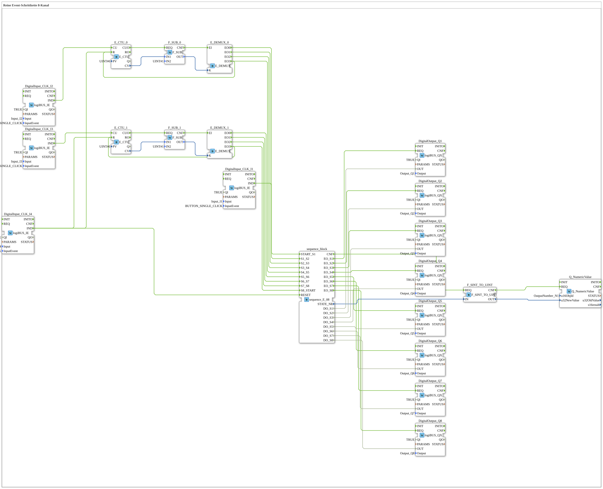

# Uebung_059: Reine Event-Schrittkette 8-Kanal

Dieser Artikel beschreibt die logiBUS®-Übung `Uebung_059`. Wir bauen eine rein ereignisgesteuerte Schrittkette.

----

## Ziel der Übung

Realisierung einer Abfolge von 8 Ausgängen (Q1, Q2, Q3, Q4, Q5, Q6, Q7, Q8), bei der jeder Schritt ausschließlich durch ein externes Ereignis (Tasterdruck) weitergeschaltet wird - keine automatische Zeitsteuerung.

-----

## Beschreibung und Komponenten

Die Subapplikation `Uebung_059` nutzt den Sequenzer `sequence_E_08`, der 8 Zustände rein ereignisgesteuert durchläuft.

Da nur die physischen Taster `I1`-`I4` zur Verfügung stehen, aber bis zu 8 Übergänge benötigt werden, zählt je ein `E_CTU`-Zähler die Betätigungen von `I2`/`I3` und ein nachgeschalteter `E_DEMUX` fächert das Zählergebnis auf die einzelnen `Sx_Sy`-Übergänge des Sequenzers auf - so lassen sich mit 2 Tastern 8 Zustandsübergänge auslösen, ohne für jeden Schritt einen eigenen Taster zu benötigen.

- **`Q_NumericValue`**: Zeigt die aktuelle Schrittnummer auf dem ISOBUS-Terminal an.

-----

## Funktionsweise

1. Start durch Taster `I1` -> Sequenz springt zu `S1`, Ausgang `Q1` wird aktiv.
2. Jeder weitere Tasterdruck schaltet zum nächsten Schritt weiter.
3. Nach dem letzten Schritt bleibt die Sequenz stehen, bis sie zurückgesetzt wird.
4. Reset durch den letzten Taster -> Alles aus.
