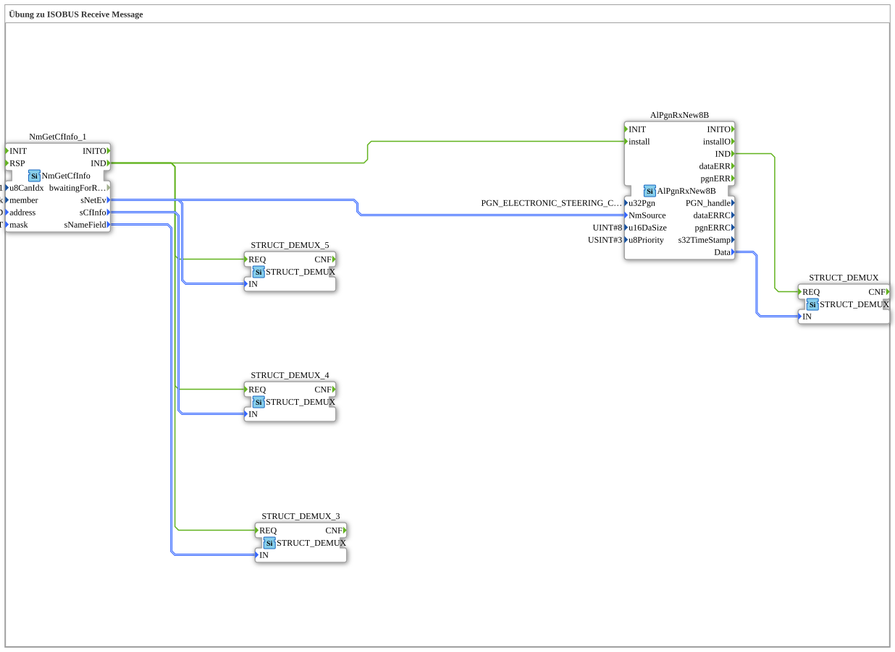

# Uebung_135: Übung zu ISOBUS Receive Message

Dieser Artikel beschreibt die logiBUS®-Übung `Uebung_135`. Wir empfangen eine ISOBUS-Nachricht (PGN) und zerlegen die enthaltenen Strukturdaten in ihre Einzelfelder.

----

## Ziel der Übung

Anmeldung eines Steuergeräts (CF) auf dem ISOBUS-Netzwerk verfolgen, dessen zugehörige Empfangs-PGN abonnieren und die empfangenen Rohdaten (`8B`, 8 Byte) in einzelne Felder zerlegen.

-----

## Beschreibung und Komponenten

- **`NmGetCfInfo_1`**: `isobus::pgn::NmGetCfInfo`, verfolgt die Netzwerk-Anmeldung eines Steuergeräts (`address = PRIM_TECU_ADD`, `mask = PRIM_TECU_FLT`) und liefert dessen Namens-, Kennungs- und Netzwerkereignis-Strukturen.
- **`AlPgnRxNew8B`**: `isobus::pgn::rx::AlPgnRxNew8B`, abonniert eine konkrete PGN (`u32Pgn = PGN_ELECTRONIC_STEERING_CONTROL`) für das erkannte Steuergerät und empfängt deren 8-Byte-Rohdaten.
- **`STRUCT_DEMUX`** (mehrfach instanziiert): `eclipse4diac::convert::STRUCT_DEMUX`, zerlegt eine Struktur in ihre einzelnen Felder.

-----

## Funktionsweise

1. `NmGetCfInfo_1` meldet (`IND`), sobald das gesuchte Steuergerät im Netzwerk erkannt wurde.
2. Die gelieferten Strukturen (Name, Kennung, Netzwerkereignis) werden über drei `STRUCT_DEMUX`-Instanzen in ihre Einzelfelder zerlegt.
3. Parallel installiert `NmGetCfInfo_1.IND` den PGN-Empfang `AlPgnRxNew8B` für dieses Steuergerät.
4. Empfängt `AlPgnRxNew8B` eine neue Nachricht (`IND`), wird deren 8-Byte-Rohdatum ebenfalls per `STRUCT_DEMUX` in seine Einzelfelder zerlegt.
