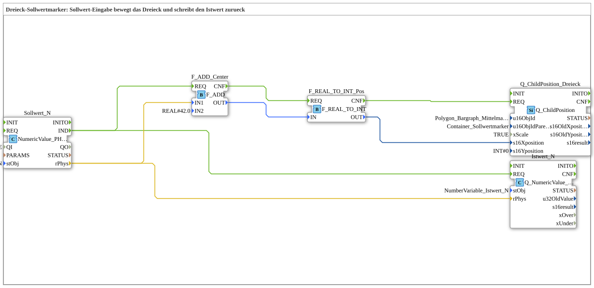

# Uebung_225: Dreieck-Sollwertmarker

* * * * * * * * * *

## Einleitung

Diese Übung positioniert ein kleines Dreieck (Mittelmarker) innerhalb eines Containers auf dem Virtual Terminal, abhängig von einem über ein Eingabefeld eingegebenen Sollwert (ISO 11783-6 Annex F.16, Change Child Position). Zusätzlich wird derselbe Sollwert unverändert als Istwert zurückgeschrieben, sodass Eingabefeld und Bargraph-Zeiger synchron denselben Wert anzeigen.

## Verwendete Funktionsbausteine (FBs)

- **Sollwert_N**: Terminal-Eingabe (Typ: `isobus::UT::io::NumericValue::NumericValue_PHYS`)
    - **Parameter**: `QI = TRUE`, `stObj = NumberVariable_Sollwert_N`
    - **Erklärung**: Liest Änderungen des über `InputNumber_Sollwert` (VT-Objekt 9000) eingegebenen Werts. Das VT meldet Wertänderungen eines an eine `NumberVariable` gebundenen Eingabefelds unter der Objekt-ID der Variable (`NumberVariable_Sollwert`, 21000), nicht unter der ID des Eingabefelds selbst. Liefert den physikalischen Wert (bereits um -42 versetzt, Bereich -42…+42) als `REAL` über `rPhys`.
- **F_ADD_Center**: Addition (Typ: `iec61131::arithmetic::F_ADD`)
    - **Parameter**: `IN2 = REAL#42.0`
    - **Erklärung**: Addiert den Center-Offset von 42 auf den Sollwert, um ihn auf die tatsächliche Pixel-X-Position (0…84) innerhalb des Containers umzurechnen.
- **F_REAL_TO_INT_Pos**: Typkonvertierung (Typ: `iec61131::conversion::F_REAL_TO_INT`)
    - **Parameter**: keine
    - **Erklärung**: Wandelt den berechneten `REAL`-Positionswert in einen `INT`-Pixelwert um.
- **Q_ChildPosition_Dreieck**: Objektpositionierung (Typ: `isobus::UT::Q::Q_ChildPosition`)
    - **Parameter**: `u16ObjId = Polygon_Bargraph_Mittelmarker` (Kind-Objekt, Dreieck), `u16ObjIdParent = Container_Sollwertmarker` (Parent-Objekt), `xScale = TRUE`, `s16Yposition = 0`
    - **Erklärung**: Schreibt die neue X-Position des Dreiecks innerhalb des Containers per Change-Child-Position-Kommando. `xScale = TRUE` sorgt dafür, dass der Pixel-Offset zusätzlich mit dem DataMask-Skalierungsfaktor multipliziert wird. Y bleibt konstant 0.
- **Istwert_N**: Terminal-Ausgabe (Typ: `isobus::UT::Q::Q_NumericValue_PHYS`)
    - **Parameter**: `stObj = NumberVariable_Istwert_N`
    - **Erklärung**: Schreibt denselben physikalischen Sollwert unverändert als Istwert zurück; dadurch aktualisieren sich sowohl `InputNumber_Istwert` als auch der bestehende Bargraph-Positionszeiger.

### Sub-Bausteine: keine

## Programmablauf und Verbindungen

1. Ändert der Bediener `InputNumber_Sollwert`, feuert `Sollwert_N.IND` und liefert den physikalischen Wert über `Sollwert_N.rPhys`.
2. Das Ereignis `Sollwert_N.IND` löst zwei parallele Ketten aus: einerseits `F_ADD_Center.REQ` (Positionsberechnung), andererseits direkt `Istwert_N.REQ` (Istwert-Rückschreibung).
3. `Sollwert_N.rPhys` wird auf `F_ADD_Center.IN1` geführt; `F_ADD_Center` addiert `REAL#42.0` und gibt das Ergebnis über `OUT` weiter, sobald `F_ADD_Center.CNF` `F_REAL_TO_INT_Pos.REQ` auslöst.
4. `F_REAL_TO_INT_Pos` wandelt den `REAL`-Wert in `INT` um; sein `CNF`-Ereignis löst `Q_ChildPosition_Dreieck.REQ` aus, während der Datenwert über `OUT` auf `s16Xposition` geführt wird.
5. `Q_ChildPosition_Dreieck` schreibt die neue Dreieck-Position auf das VT.
6. Parallel dazu wird `Sollwert_N.rPhys` unverändert auf `Istwert_N.rPhys` geführt und bei `Istwert_N.REQ` als Istwert zurückgeschrieben.

## Zusammenfassung

Die Übung demonstriert die klassische, Schritt-für-Schritt verdrahtete Umsetzung einer Virtual-Terminal-Objektpositionierung: Sollwert lesen, auf Pixelkoordinaten umrechnen (Offset-Addition + Typkonvertierung), Position schreiben und parallel den Istwert zurückmelden. Für die vollständig über Adapter verdrahtete Variante siehe `Uebung_225_AX` in `test_AX`, die dieselbe Funktion mit einer reinen AR/AI-Adapterkette statt einzelner Event-/DataConnections umsetzt.

---

### 🌐 Passende Themen-Unterseiten auf ms-muc-docs.de

- [🌐 Eclipse 4diac IDE & Farb-Referenz auf ms-muc-docs.de](https://www.ms-muc-docs.de/iec-61499/eclipse-4diac/)
