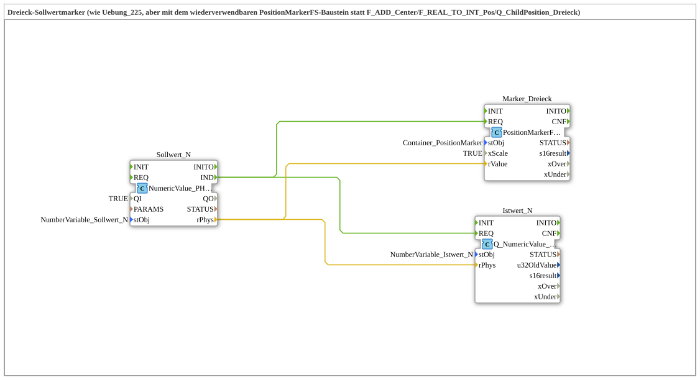

# Uebung_225b: Dreieck-Sollwertmarker mit PositionMarkerFS

* * * * * * * * * *

## Einleitung

Diese Übung ist funktional identisch zu `Uebung_225`, ersetzt aber die dort einzeln verdrahteten Bausteine `F_ADD_Center`/`F_REAL_TO_INT_Pos`/`Q_ChildPosition_Dreieck` durch den neuen, wiederverwendbaren Baustein `PositionMarkerFS` (`isobus::UT::Q`). `Uebung_225` selbst bleibt dabei unverändert als eigenständige Referenz bestehen.

## Verwendete Funktionsbausteine (FBs)

- **Sollwert_N**: Terminal-Eingabe (Typ: `isobus::UT::io::NumericValue::NumericValue_PHYS`)
    - **Parameter**: `QI = TRUE`, `stObj = NumberVariable_Sollwert_N`
    - **Erklärung**: Liest Änderungen des über `InputNumber_Sollwert` (VT-Objekt 9000) eingegebenen Werts und liefert ihn als physikalischen `REAL`-Wert über `rPhys` (Bereich -42…+42).
- **Marker_Dreieck**: Positionsmarker (Typ: `isobus::UT::Q::PositionMarkerFS`)
    - **Parameter**: `stObj = Container_PositionMarker`, `xScale = TRUE`
    - **Erklärung**: Übernimmt die komplette Bewegung des Dreiecks: addiert intern den Center-Offset, klammert das Ergebnis auf den gültigen Bewegungsbereich (mit `xOver`/`xUnder`-Rückmeldung), rechnet `REAL` → `INT` um und schreibt die Position per Change Child Position auf das Polygon-Objekt. Kind-ID, Parent-ID, Bewegungsbereich und Center-Offset kommen gebündelt aus der Konstante `Container_PositionMarker` (Typ `PositionMarker_S`), die automatisch aus der `.jop`-Geometrie erzeugt wird. `xScale = TRUE` aktiviert die Multiplikation des Pixel-Offsets mit dem DataMask-Skalierungsfaktor.
- **Istwert_N**: Terminal-Ausgabe (Typ: `isobus::UT::Q::Q_NumericValue_PHYS`)
    - **Parameter**: `stObj = NumberVariable_Istwert_N`
    - **Erklärung**: Schreibt denselben physikalischen Sollwert unverändert als Istwert zurück; aktualisiert `InputNumber_Istwert` und den bestehenden Bargraph-Positionszeiger.

### Sub-Bausteine: keine

Der Baustein `PositionMarkerFS` selbst ist kein Composite-SubApp in dieser Übung, sondern eine vorgefertigte Bibliothekskomponente (`Ventilsteuerung\4diacIDE-workspace\.lib\isobus-3.0.0\typelib\UT\Q\PositionMarkerFS.fbt`).

## Programmablauf und Verbindungen

1. Ändert der Bediener `InputNumber_Sollwert`, feuert `Sollwert_N.IND` und liefert den physikalischen Wert über `Sollwert_N.rPhys`.
2. Das Ereignis `Sollwert_N.IND` triggert parallel `Marker_Dreieck.REQ` und `Istwert_N.REQ`.
3. `Sollwert_N.rPhys` wird direkt auf `Marker_Dreieck.rValue` geführt; `PositionMarkerFS` berechnet intern Offset, Klammerung und Pixelposition und schreibt sie auf das Dreieck-Objekt.
4. Parallel dazu wird `Sollwert_N.rPhys` unverändert auf `Istwert_N.rPhys` geführt und dort als Istwert zurückgeschrieben.

## Zusammenfassung

Die Übung zeigt, wie sich eine wiederkehrende Aufgabe (Sollwertmarker positionieren, inklusive Klammerung und Bereichsüberwachung) in einem einzigen wiederverwendbaren Baustein (`PositionMarkerFS`) kapseln lässt, anstatt sie – wie in `Uebung_225` – jedes Mal aus Einzelbausteinen neu zusammenzusetzen. Für die vollständig über AR-Adapter verdrahtete Variante siehe `Uebung_225b_AX` in `test_AX`.

---

### 🌐 Passende Themen-Unterseiten auf ms-muc-docs.de

- [🌐 Eclipse 4diac IDE & Farb-Referenz auf ms-muc-docs.de](https://www.ms-muc-docs.de/iec-61499/eclipse-4diac/)
