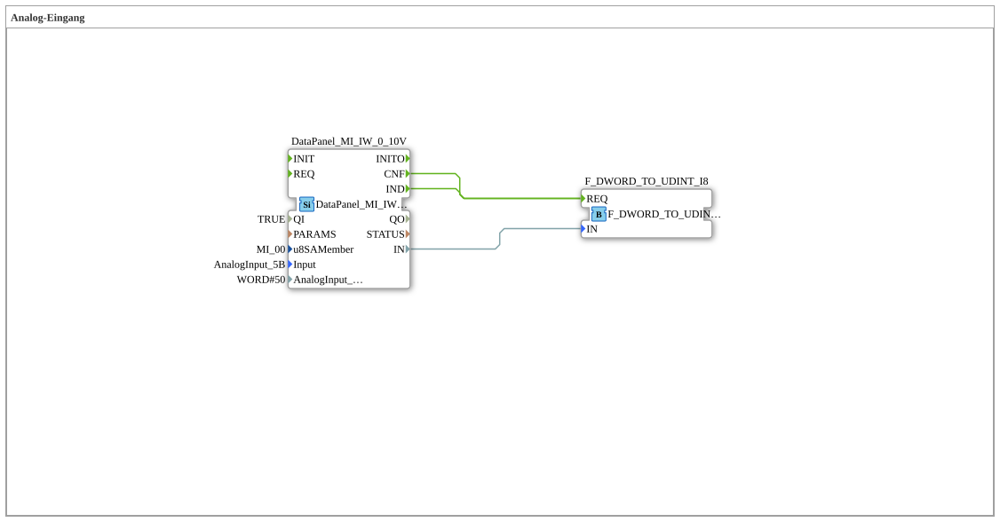

# Uebung_230: Analog-Eingang

Dieser Artikel beschreibt die logiBUS®-Übung `Uebung_230`. Wir lesen einen analogen 0-10V-Eingang auf dem DataPanel ein und wandeln den Rohwert in einen nutzbaren Zahlenwert um.

----

## Ziel der Übung

Einen analogen Spannungseingang (`AnalogInput_5B`) auf dem DataPanel einlesen und den Rohwert (DWORD) in einen UDINT-Zahlenwert umwandeln, mit Hysterese gegen Signalrauschen.

-----

## Beschreibung und Komponenten

- **`DataPanel_MI_IW_0_10V`**: `DataPanel::io::MI::AI::DataPanel_MI_IW_0_10V`, liest einen analogen 0-10V-Eingang auf dem DataPanel-Erweiterungsmodul (`u8SAMember = MI_00`, `Input = AnalogInput_5B`, `AnalogInput_hysteresis = 50`).
- **`F_DWORD_TO_UDINT_I8`**: `iec61131::conversion::F_DWORD_TO_UDINT`, wandelt den rohen DWORD-Messwert in einen UDINT-Zahlenwert um.

-----

## Funktionsweise

1. `DataPanel_MI_IW_0_10V` liest laufend die analoge Eingangsspannung ein, gefiltert über eine Hysterese von 50, um kleine Signalschwankungen zu unterdrücken.
2. Sowohl bei jeder Wertänderung (`IND`) als auch bei jeder Bestätigung (`CNF`) wird `F_DWORD_TO_UDINT_I8` angestoßen.
3. `F_DWORD_TO_UDINT_I8` wandelt den DWORD-Rohwert in einen UDINT-Zahlenwert um, der für die Weiterverarbeitung nutzbar ist.
