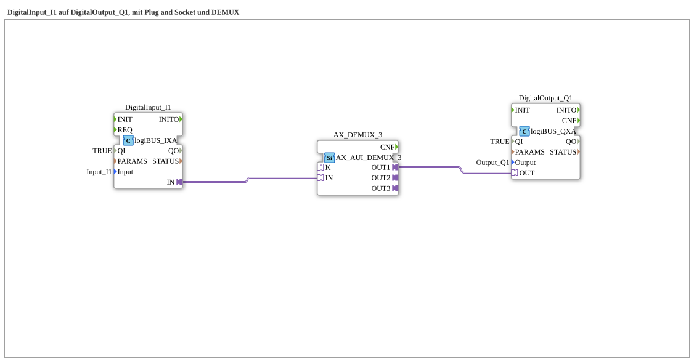

# Versuch_103c3: DigitalInput auf DigitalOutput über AX-Demultiplexer-Adapter

* * * * * * * * * *

## Einleitung

Gegenstück zu `Versuch_103c2`: statt eines Multiplexers (`AX_AUI_MUX_3`) wird hier ein 3-fach-Demultiplexer-Adapter (`AX_AUI_DEMUX_3`) verwendet, der ein Eingangssignal auf einen von mehreren möglichen Ausgängen verteilt.

## Verwendete Funktionsbausteine (FBs)

- **DigitalInput_I1** – Typ: `logiBUS::io::DI::logiBUS_IXA`
    - Parameter: `QI = TRUE`, `Input = Input_I1`
- **AX_DEMUX_3** – Typ: `adapter::selection::unidirectional::AX_AUI_DEMUX_3`
    - Funktionsweise: 3-fach-Demultiplexer-Adapter (unidirektional) - verteilt ein Eingangssignal auf bis zu drei Ausgänge. Hier ist nur der erste Ausgang (`OUT1`) beschaltet.
- **DigitalOutput_Q1** – Typ: `logiBUS::io::DQ::logiBUS_QXA`
    - Parameter: `QI = TRUE`, `Output = Output_Q1`

## Programmablauf und Verbindungen

Adapterverbindungen: `DigitalInput_I1.IN` → `AX_DEMUX_3.IN`, `AX_DEMUX_3.OUT1` → `DigitalOutput_Q1.OUT`. Der physische Eingang `Input_I1` wird über den Demultiplexer-Adapter auf dessen ersten Ausgangszweig geleitet und schaltet den physischen Ausgang `Output_Q1`.

## Zusammenfassung

Zeigt die einfachste Beschaltung eines `AX_AUI_DEMUX_3`-Adapters mit nur einem aktiven Ausgangszweig - das Gegenstück zu `Versuch_103c2`s Multiplexer-Verschaltung.
