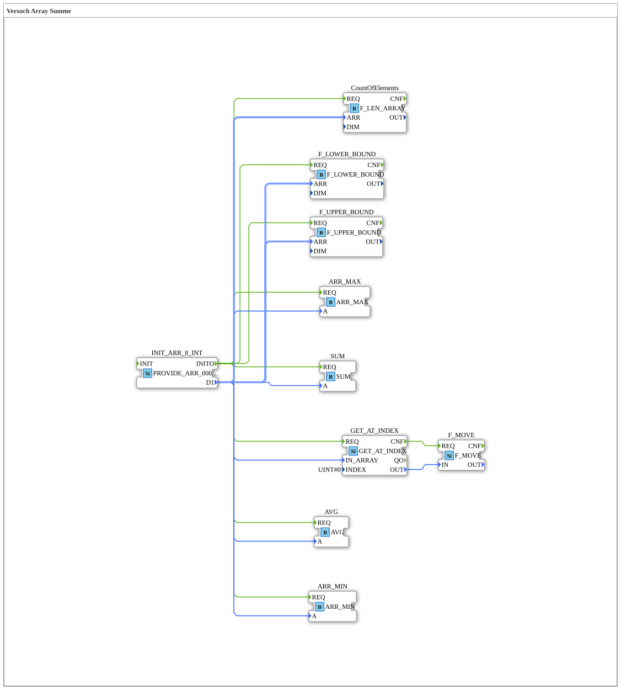

# Versuch_401: Array-Statistik mit Grenzwerten

* * * * * * * * * *

## Einleitung

Vollständigste Ausbaustufe der Array-Statistik-Versuchsreihe: ergänzt `Versuch_406` um die Bestimmung der Array-Indexgrenzen (`F_UPPER_BOUND`/`F_LOWER_BOUND`) - insgesamt acht parallele Auswertungen desselben Arrays.

## Verwendete Funktionsbausteine (FBs)

- **INIT_ARR_8_INT** – Typ: `eclipse4diac::convert::providers::PROVIDE_ARR_0008_INT`
    - Parameter: `D1 = [44, 0, 5, 0, 7, 8, 0, 0]`
- **GET_AT_INDEX** – Typ: `eclipse4diac::convert::GET_AT_INDEX`
    - Parameter: `INDEX = 0` (Element `44`)
- **F_MOVE** – Typ: `iec61131::selection::F_MOVE`, Attribut: `DataType = INT`
- **ARR_MIN** / **ARR_MAX** / **AVG** / **SUM** – Typ: `logiBUS::utils::dyn_arr::*` (siehe `Versuch_406`)
- **CountOfElements** – Typ: `eclipse4diac::utils::arrays::F_LEN_ARRAY`
- **F_UPPER_BOUND** – Typ: `iec61131::arrays::F_UPPER_BOUND` – oberer Indexgrenzwert des Arrays (hier: 7).
- **F_LOWER_BOUND** – Typ: `iec61131::arrays::F_LOWER_BOUND` – unterer Indexgrenzwert des Arrays (hier: 0).

## Programmablauf und Verbindungen

`INIT_ARR_8_INT.INITO` löst alle acht Konsumenten (`SUM`, `GET_AT_INDEX`, `CountOfElements`, `ARR_MAX`, `AVG`, `ARR_MIN`, `F_UPPER_BOUND`, `F_LOWER_BOUND`) gleichzeitig aus, jeder erhält dasselbe Array über `D1`. `GET_AT_INDEX` liest Index 0 (`44`) und gibt den Wert über `F_MOVE` weiter.

## Zusammenfassung

Die umfassendste Statistik-Variante dieser Versuchsreihe: Summe, Min, Max, Mittelwert, Elementanzahl, Indexgrenzen und gezielter Indexzugriff - alle acht Auswertungen parallel aus einer einzigen Array-Quelle.
