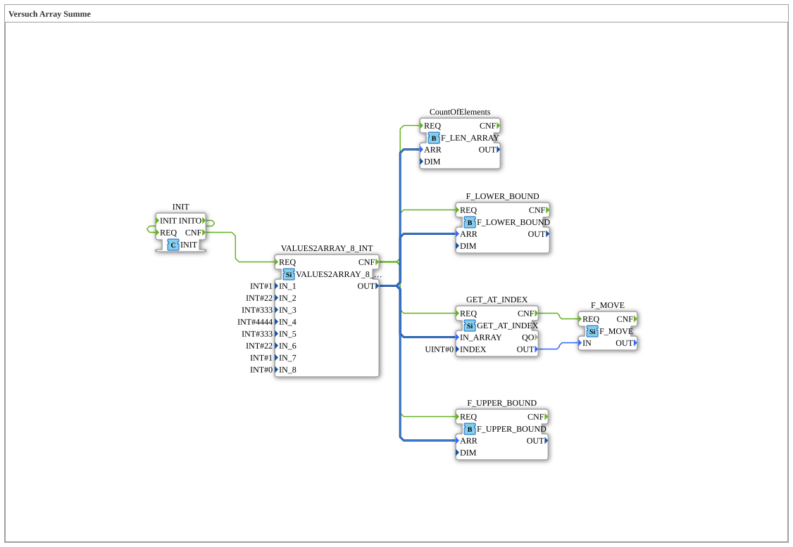

# Versuch_402: Array aus Einzelwerten zusammensetzen

* * * * * * * * * *

## Einleitung

Anders als die vorigen Versuche (feste Array-Konstante über `PROVIDE_ARR_0008_INT`) wird das Array hier aus acht einzelnen Skalarwerten zusammengesetzt (`VALUES2ARRAY_8_INT`), ausgelöst durch einen sich selbst wiederholt auslösenden `INIT`-Baustein.

## Verwendete Funktionsbausteine (FBs)

- **INIT** – Typ: `iec61131::booleanOperators::INIT`
    - Funktionsweise: feuert beim Start `INITO`, das direkt auf den eigenen `REQ`-Eingang zurückgeführt ist - löst dadurch die Verarbeitungskette an.
- **VALUES2ARRAY_8_INT** – Typ: `eclipse4diac::convert::VALUES2ARRAY_8_INT`
    - Parameter: `IN_1..IN_8 = 1, 22, 333, 4444, 333, 22, 1, 0`
    - Funktionsweise: setzt aus acht einzelnen Skalarwerten ein 8‑elementiges Array zusammen.
- **GET_AT_INDEX** – Typ: `eclipse4diac::convert::GET_AT_INDEX`, Parameter: `INDEX = 0` (Element `1`)
- **F_MOVE** – Typ: `iec61131::selection::F_MOVE`, Attribut: `DataType = INT`
- **CountOfElements** – Typ: `eclipse4diac::utils::arrays::F_LEN_ARRAY`
- **F_UPPER_BOUND** – Typ: `iec61131::arrays::F_UPPER_BOUND`
- **F_LOWER_BOUND** – Typ: `iec61131::arrays::F_LOWER_BOUND`

## Programmablauf und Verbindungen

`INIT.CNF` löst `VALUES2ARRAY_8_INT.REQ` aus, das die acht Einzelwerte zu einem Array zusammensetzt. Dessen `CNF` löst gleichzeitig drei Konsumenten aus (`GET_AT_INDEX`, `CountOfElements`, `F_LOWER_BOUND`, `F_UPPER_BOUND`), die alle das gerade erzeugte Array über `OUT` erhalten. `GET_AT_INDEX` liest Index 0 und gibt den Wert über `F_MOVE` weiter.

## Zusammenfassung

Zeigt die alternative Array-Erzeugung aus Einzelwerten (`VALUES2ARRAY_8_INT`) statt aus einer Array-Konstante, plus Auswertung von Elementanzahl und Indexgrenzen.
