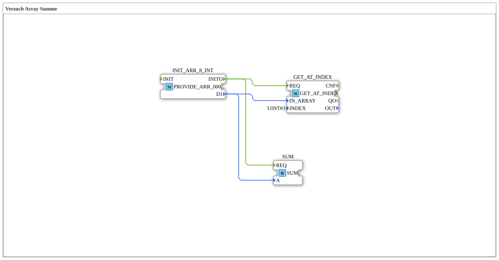

# Versuch_404: Array-Summe und Einzelzugriff

* * * * * * * * * *

## Einleitung

Erweitert `Versuch_409` um einen zweiten, parallelen Konsumenten: neben der Summenbildung wird nun auch ein einzelnes Array-Element per Index gelesen.

## Verwendete Funktionsbausteine (FBs)

- **INIT_ARR_8_INT** – Typ: `eclipse4diac::convert::providers::PROVIDE_ARR_0008_INT`
    - Parameter: `D1 = [0, 1, 22, 333, 4444, 333, 22, 1]`
- **GET_AT_INDEX** – Typ: `eclipse4diac::convert::GET_AT_INDEX`
    - Parameter: `INDEX = 3`
    - Eingänge: `REQ`, `IN_ARRAY`; Ausgang: `OUT`
    - Funktionsweise: liest das Element an Index 3 des Arrays (hier: `333`).
- **SUM** – Typ: `logiBUS::utils::dyn_arr::SUM`
    - Funktionsweise: summiert alle Array-Elemente.

## Programmablauf und Verbindungen

`INIT_ARR_8_INT.INITO` löst beide Konsumenten gleichzeitig aus: `GET_AT_INDEX.REQ` und `SUM.REQ`. Beide erhalten das gleiche Array über `D1`. `GET_AT_INDEX` liest Index 3 (`333`), `SUM` bildet die Gesamtsumme - beide Zweige laufen unabhängig voneinander parallel zueinander.

## Zusammenfassung

Zeigt, dass mehrere Konsumenten dasselbe Array-Signal gleichzeitig (parallel) verarbeiten können, ohne sich gegenseitig zu beeinflussen.
