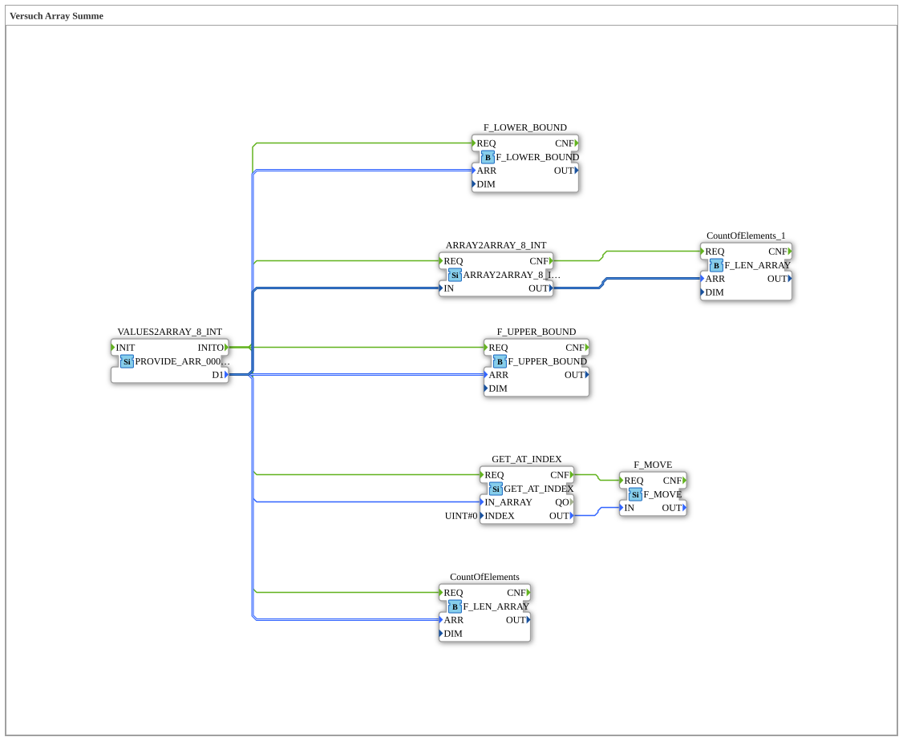

# Versuch_405: Array-Kopie mit Nullwerten (Konstanten-Variante von Versuch_403)

* * * * * * * * * *

## Einleitung

Strukturell identisch zu `Versuch_403` (Array-Kopie über `ARRAY2ARRAY_8_INT`, Indexzugriff, Elementanzahl, Grenzwerte), aber mit einer festen Array-Konstante (`PROVIDE_ARR_0008_INT`) statt der aus Einzelwerten zusammengesetzten Variante - direkt ausgelöst über deren eigenes `INITO`, ohne den zusätzlichen `INIT`-Baustein aus `Versuch_402`/`Versuch_403`.

**Hinweis:** Der Baustein trägt hier den Instanznamen `VALUES2ARRAY_8_INT`, ist aber tatsächlich vom Typ `eclipse4diac::convert::providers::PROVIDE_ARR_0008_INT` - vermutlich ein Kopfressourcen-Name aus `Versuch_402`/`Versuch_403`, der beim Bausteintyp-Wechsel nicht mehr angepasst wurde. Die folgende Beschreibung richtet sich nach dem tatsächlichen Typ.

## Verwendete Funktionsbausteine (FBs)

- **VALUES2ARRAY_8_INT** (Instanzname) – Typ: `eclipse4diac::convert::providers::PROVIDE_ARR_0008_INT`
    - Parameter: `D1 = [0, 0, 0, 0, 0, 0, 0, 0]`
- **GET_AT_INDEX** – Typ: `eclipse4diac::convert::GET_AT_INDEX`, Parameter: `INDEX = 0`
- **F_MOVE** – Typ: `iec61131::selection::F_MOVE`, Attribut: `DataType = INT`
- **CountOfElements** – Typ: `eclipse4diac::utils::arrays::F_LEN_ARRAY`
- **F_UPPER_BOUND** / **F_LOWER_BOUND** – Typ: `iec61131::arrays::F_UPPER_BOUND`/`F_LOWER_BOUND`
- **ARRAY2ARRAY_8_INT** – Typ: `eclipse4diac::convert::ARRAY2ARRAY_8_INT` – kopiert das Array in eine unabhängige zweite Instanz.
- **CountOfElements_1** – Typ: `eclipse4diac::utils::arrays::F_LEN_ARRAY` – Länge der Kopie.

## Programmablauf und Verbindungen

`INITO` löst direkt alle fünf Konsumenten gleichzeitig aus (`GET_AT_INDEX`, `CountOfElements`, `F_LOWER_BOUND`, `F_UPPER_BOUND`, `ARRAY2ARRAY_8_INT`); `ARRAY2ARRAY_8_INT.CNF` löst wiederum `CountOfElements_1.REQ` aus (Länge der Kopie).

## Zusammenfassung

Gleiche Struktur wie `Versuch_403`, aber mit einer festen Array-Konstante statt einer aus Einzelwerten zusammengesetzten - und ohne den zusätzlichen `INIT`-Selbstauslöser.
