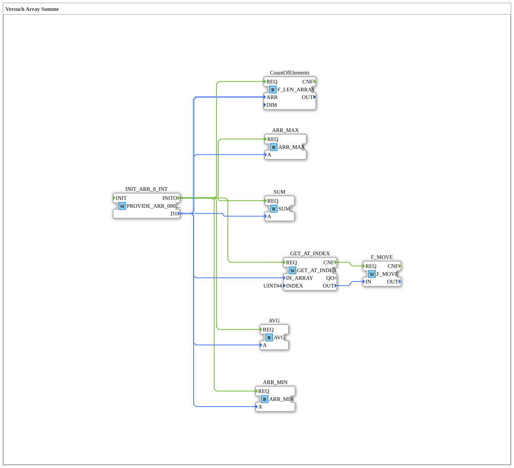

# Versuch_406: Array-Statistik (Summe, Min, Max, Mittelwert, Länge)

* * * * * * * * * *

## Einleitung

Baut die parallele Auswertung eines Arrays (siehe `Versuch_404`) zu einer vollständigen Statistik aus: Summe, Minimum, Maximum, Mittelwert, Elementanzahl und ein gezielter Indexzugriff werden alle gleichzeitig aus demselben Array berechnet.

## Verwendete Funktionsbausteine (FBs)

- **INIT_ARR_8_INT** – Typ: `eclipse4diac::convert::providers::PROVIDE_ARR_0008_INT`
    - Parameter: `D1 = [0, 1, 22, 333, 4444, 333, 22, 1]`
- **GET_AT_INDEX** – Typ: `eclipse4diac::convert::GET_AT_INDEX`
    - Parameter: `INDEX = 4` (Element `4444`)
- **F_MOVE** – Typ: `iec61131::selection::F_MOVE`
    - Attribut: `DataType = INT`
    - Funktionsweise: übernimmt den von `GET_AT_INDEX` gelesenen Wert (reine Weitergabe/Typkonvertierung).
- **ARR_MIN** – Typ: `logiBUS::utils::dyn_arr::ARR_MIN` – ermittelt das kleinste Element.
- **ARR_MAX** – Typ: `logiBUS::utils::dyn_arr::ARR_MAX` – ermittelt das größte Element.
- **AVG** – Typ: `logiBUS::utils::dyn_arr::AVG` – berechnet den Mittelwert.
- **SUM** – Typ: `logiBUS::utils::dyn_arr::SUM` – berechnet die Summe.
- **CountOfElements** – Typ: `eclipse4diac::utils::arrays::F_LEN_ARRAY` – ermittelt die Elementanzahl.

## Programmablauf und Verbindungen

`INIT_ARR_8_INT.INITO` löst alle sechs Konsumenten (`SUM`, `CountOfElements`, `ARR_MAX`, `ARR_MIN`, `AVG`, `GET_AT_INDEX`) gleichzeitig aus - jeder erhält das gleiche Array über `D1`. `GET_AT_INDEX` liest Index 4 (`4444`) und gibt den Wert über `F_MOVE` weiter. Alle sechs Auswertungen laufen unabhängig und parallel.

## Zusammenfassung

Zeigt die vollständige, parallele Standard-Statistik über ein Array (Summe/Min/Max/Mittelwert/Länge) plus gezielten Indexzugriff - Vorstufe zu `Versuch_401`, das zusätzlich die Array-Grenzen (`F_UPPER_BOUND`/`F_LOWER_BOUND`) mit einbezieht.
