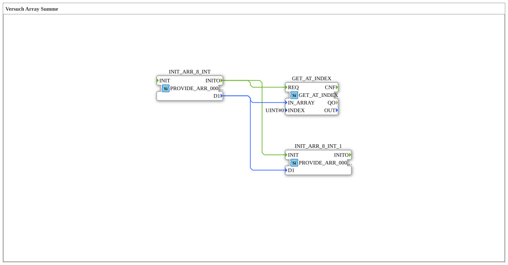

# Versuch_407: Indexzugriff und Weiterreichen an einen zweiten Array-Provider

* * * * * * * * * *

## Einleitung

Zeigt zwei unabhängige Verwendungen desselben Array-Signals: einen lesenden Indexzugriff und die Weiterleitung des kompletten Arrays an eine zweite `PROVIDE_ARR_0008_INT`-Instanz, die hier nicht als Konstanten-Quelle, sondern als externer angesteuerter Empfänger genutzt wird.

## Verwendete Funktionsbausteine (FBs)

- **INIT_ARR_8_INT** – Typ: `eclipse4diac::convert::providers::PROVIDE_ARR_0008_INT`
    - Parameter: `D1 = [0, 1, 22, 333, 4444, 333, 22, 1]`
    - Funktionsweise: Array-Quelle, feuert beim Start `INITO`.
- **GET_AT_INDEX** – Typ: `eclipse4diac::convert::GET_AT_INDEX`
    - Parameter: `INDEX = 0` (Element `0`)
- **INIT_ARR_8_INT_1** – Typ: `eclipse4diac::convert::providers::PROVIDE_ARR_0008_INT` (zweite Instanz, ohne eigenen `D1`-Parameter)
    - Funktionsweise: erhält hier - anders als sonst in dieser Versuchsreihe üblich - Array und Ereignis von außen (`D1`/`INIT` sind hier Eingänge, die von `INIT_ARR_8_INT` gespeist werden), statt selbst als feste Konstantenquelle zu dienen.

## Programmablauf und Verbindungen

`INIT_ARR_8_INT.INITO` löst zwei Ziele gleichzeitig aus: `GET_AT_INDEX.REQ` (liest Index 0) und `INIT_ARR_8_INT_1.INIT` (reicht das komplette Array an die zweite Provider-Instanz weiter). Beide Datenpfade werden aus `INIT_ARR_8_INT.D1` gespeist.

## Zusammenfassung

Ungewöhnliche, aber lehrreiche Variante: derselbe `PROVIDE_ARR_...`-Bausteintyp kann sowohl als reine Konstantenquelle (`INIT_ARR_8_INT`) als auch als von außen angesteuerter Empfänger (`INIT_ARR_8_INT_1`) auftreten.
