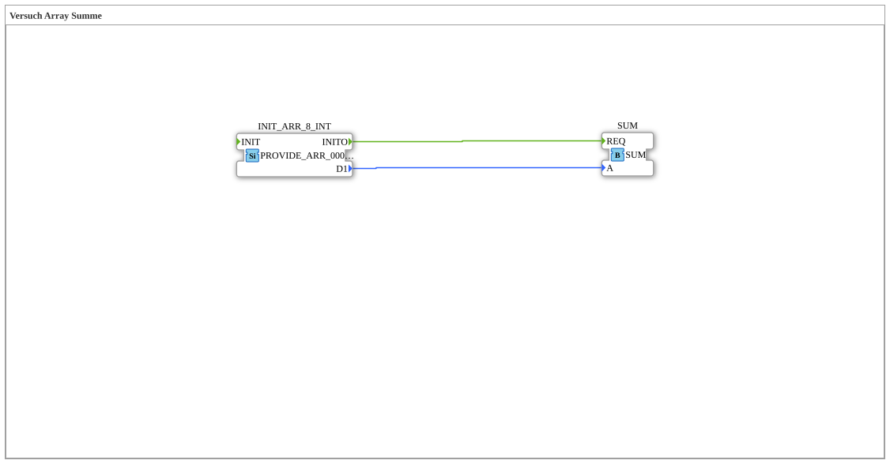

# Versuch_409: Array-Summe

* * * * * * * * * *

## Einleitung

Erste Erweiterung von `Versuch_400`: das bereitgestellte 8‑elementige Array wird nun tatsächlich verarbeitet - über die Summenbildung mittels `SUM`.

## Verwendete Funktionsbausteine (FBs)

- **INIT_ARR_8_INT** – Typ: `eclipse4diac::convert::providers::PROVIDE_ARR_0008_INT`
    - Parameter: `D1 = [44, 0, 5, 0, 7, 8, 0, 0]`
    - Funktionsweise: stellt das feste 8‑elementige Array bereit und feuert beim Start `INITO`.
- **SUM** – Typ: `logiBUS::utils::dyn_arr::SUM`
    - Eingänge: `REQ`, `A` (Array)
    - Funktionsweise: summiert alle Elemente des übergebenen Arrays.

## Programmablauf und Verbindungen

1. **Initialisierung**: `INIT_ARR_8_INT` feuert beim Start `INITO` und stellt sein Array am Ausgang `D1` bereit.
2. **Summenbildung**: `INITO` löst `SUM.REQ` aus, `SUM` erhält das Array über `D1` → `A` und berechnet die Summe aller acht Elemente (44+0+5+0+7+8+0+0 = 64).

## Zusammenfassung

Zeigt die einfachste Form der Array-Aggregation: ein Array-Provider, ein Konsument (`SUM`). Baut direkt auf `Versuch_400` auf.
