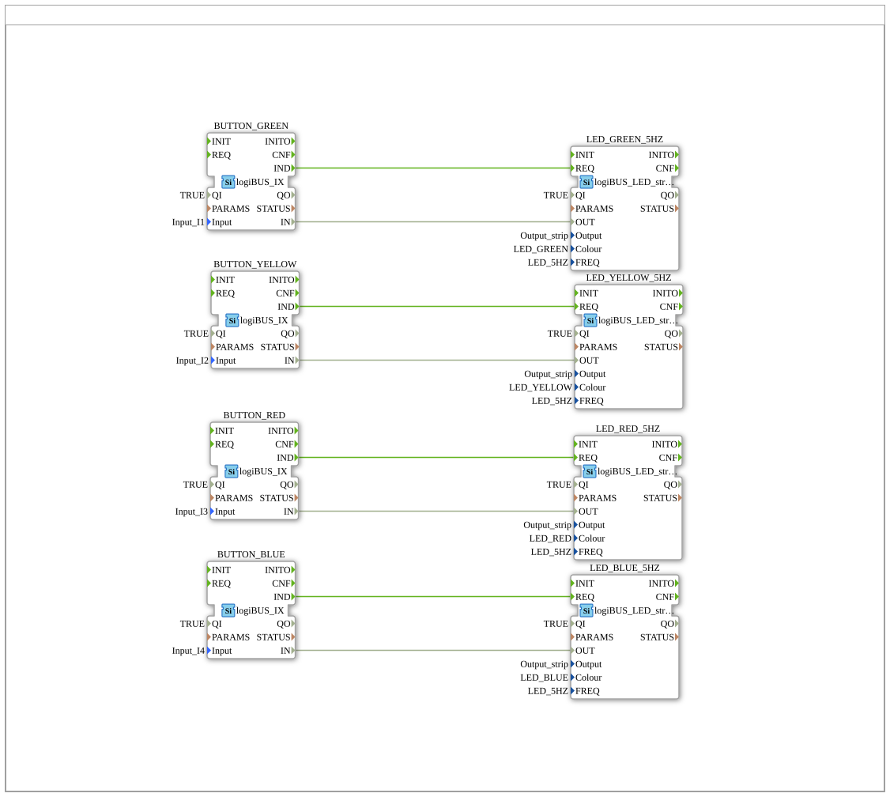

# Training_01_PUBLISH_SUBSCRIBE: Vier verteilte Taster→LED-Kopplungen per Multicast

* * * * * * * * * *

## Einleitung

`Training_01_PUBLISH_SUBSCRIBE` ist die einfachste der drei Verteilungs-
Übungen unter `test_VV/sys/`: vier unabhängige Taster→LED-Streifen-Paare
(Grün/Gelb/Rot/Blau), jeweils über ein eigenes `PUBLISH_1`/`SUBSCRIBE_1`-
Portpaar per FORTE-eigenem Multicast auf zwei Geräte verteilt — **nicht**
über OPC-UA (das zeigen `Training_01_CLIENT_SERVER`/`Training_02_OPC_UA_RES`
als Alternativen für dasselbe Grundmuster). Auf dieses Multicast-Vorbild
verweist `Training_02_OPC_UA_RES` selbst als "bereits gezeigt" für den
Mapping-übergreifenden Verbindungsmechanismus.

## Verwendete Funktionsbausteine (FBs)

| Instanz | Ort | Typ | Zweck |
|---|---|---|---|
| `BUTTON_GREEN`/`_YELLOW`/`_RED`/`_BLUE` | Application (`App_PUBLISH_SUBSCRIBE`) | `logiBUS::io::DI::logiBUS_IX` | Liest `Input_I1`…`I4` |
| `LED_GREEN_5HZ`/`_YELLOW_5HZ`/`_RED_5HZ`/`_BLUE_5HZ` | Application | `logiBUS::io::DO_LED::logiBUS_LED_strip_QX` | Schaltet `Output_strip` in der jeweiligen Farbe, 5 Hz Blinkfrequenz |
| `PUBLISH_BUTTON_*` | Resource `EMB_RES_PUBLISH` (`FORTE_PC_PUBLISH`) | `iec61499::net::PUBLISH_1` | Sendet den Tasterzustand per Multicast, je Kanal ein fester Port (`PORT_0`…`PORT_3`) |
| `SUBSCRIBE_BUTTON_*` | Resource `EMB_RES_SUBSCRIBE` (`FORTE_PC_SUBSCRIBE`) | `iec61499::net::SUBSCRIBE_1` | Empfängt den passenden Port, treibt direkt die zugehörige LED |

Die Application selbst kennt kein Netzwerk: `BUTTON_*.IND`/`.IN` →
`LED_*.REQ`/`.OUT`, das rein logische Grundmuster, identisch für alle vier
Farbkanäle. Erst das `Mapping` verteilt Taster auf `FORTE_PC_PUBLISH` und
LEDs auf `FORTE_PC_SUBSCRIBE`.

## Programmablauf und Verbindungen

1. **Application**: vier parallele, völlig unabhängige Taster→LED-Paare,
   kein Datenaustausch zwischen den Farbkanälen.
2. **Mapping**: alle vier `BUTTON_*` → `FORTE_PC_PUBLISH.EMB_RES_PUBLISH`,
   alle vier `LED_*_5HZ` → `FORTE_PC_SUBSCRIBE.EMB_RES_SUBSCRIBE`.
3. **Resource `EMB_RES_PUBLISH`**: `App_PUBLISH_SUBSCRIBE.BUTTON_*.IND`
   (dotted-path über die Mapping-Grenze) → `PUBLISH_BUTTON_*.REQ`, dazu
   `BUTTON_*.IN` → `PUBLISH_BUTTON_*.SD_1` — jeder Taster sendet seinen
   Zustand auf seinem eigenen Multicast-Port (`PORT_0` Grün … `PORT_3` Blau).
4. **Resource `EMB_RES_SUBSCRIBE`**: `SUBSCRIBE_BUTTON_*.IND` →
   `App_PUBLISH_SUBSCRIBE.LED_*_5HZ.REQ`, `SUBSCRIBE_BUTTON_*.RD_1` →
   `LED_*_5HZ.OUT` — spiegelbildlich, wieder direkte dotted-path-Verbindung
   über die Mapping-Grenze, ohne Zwischenbaustein.
5. **Laufzeit**: die eigentliche Übertragung zwischen `PUBLISH_BUTTON_*` und
   `SUBSCRIBE_BUTTON_*` existiert nicht als Modellverbindung — sie läuft
   ausschließlich als FORTE-Multicast über den gemeinsamen Port zur Laufzeit.

## Technische Besonderheiten

- **Vier unabhängige Kanäle, ein Port je Kanal**: jedes Taster/LED-Paar
  bekommt seinen eigenen `PORT_n` (`VV::const::ports::myPorts`) — kein
  gemeinsamer Kanal, keine Verwechslungsgefahr zwischen den Farben.
- **Grundmuster für die Schwester-Übungen**: dieselbe
  Taster→LED-Struktur kehrt in `Training_01_CLIENT_SERVER` (Request/Reply
  statt Multicast) und `Training_02_OPC_UA_RES` (OPC-UA statt FORTE-eigenem
  Netzwerk) wieder — hier in der einfachsten, unidirektionalen Variante.

## Lernziele

- Grundmuster FORTE-eigenes Publish/Subscribe (`PUBLISH_1`/`SUBSCRIBE_1`)
  als einfachste Form verteilter IEC-61499-Kommunikation.
- Mapping-übergreifende Verbindung eines Application-FB-Pins mit einem
  Resource-FB-Pin per dotted-path-Referenz.
- Mehrkanal-Kommunikation über feste, pro Kanal eigene Ports.

**Schwierigkeitsgrad**: Einfach
**Vorkenntnisse**: Grundlagen Taster→LED-Kopplung, IEC-61499-Mapping-Konzept.

## Zusammenfassung

`Training_01_PUBLISH_SUBSCRIBE` verteilt vier unabhängige Taster→LED-Paare
per FORTE-eigenem Multicast auf zwei Geräte und dient als einfachstes
Vorbild für die beiden anderen Verteilungsmuster (Request/Reply, OPC-UA)
in den Schwester-Übungen dieses Verzeichnisses.

---

### 🌐 Passende Themen-Unterseiten auf ms-muc-docs.de

- [🌐 Eclipse 4diac IDE & Farb-Referenz auf ms-muc-docs.de](https://www.ms-muc-docs.de/iec-61499/eclipse-4diac/)
