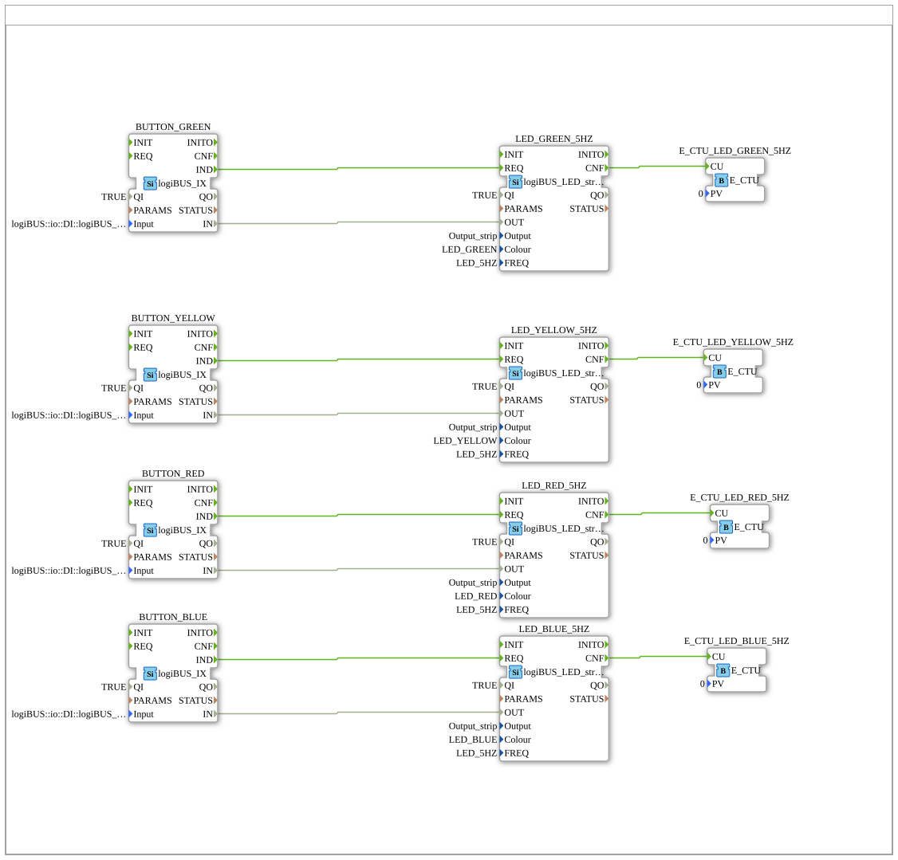

# Training_01_CLIENT_SERVER: Taster→LED per Request/Reply mit Aktivierungszähler

* * * * * * * * * *

## Einleitung

`Training_01_CLIENT_SERVER` überträgt dasselbe Vier-Kanal-Taster→LED-Muster
aus `Training_01_PUBLISH_SUBSCRIBE` auf `CLIENT_1`/`SERVER_1` (Request/
Reply) statt `PUBLISH_1`/`SUBSCRIBE_1` (Multicast). Anders als bei
Multicast liefert der Server hier eine echte Antwort zurück: er zählt, wie
oft jede LED aktiviert wurde, und meldet den aktuellen Zählerstand an den
Client zurück.

## Verwendete Funktionsbausteine (FBs)

| Instanz | Ort | Typ | Zweck |
|---|---|---|---|
| `BUTTON_GREEN`/`_YELLOW`/`_RED`/`_BLUE` | Application (`App_CLIENT_SERVER`) | `logiBUS::io::DI::logiBUS_IX` | Liest `Input_I1`…`I4` |
| `LED_GREEN_5HZ`/`_YELLOW_5HZ`/`_RED_5HZ`/`_BLUE_5HZ` | Application | `logiBUS::io::DO_LED::logiBUS_LED_strip_QX` | Schaltet `Output_strip`, 5 Hz Blinkfrequenz |
| `CLIENT_BUTTON_*` | Resource `EMB_RES_CLIENT` (`FORTE_PC_CLIENT`) | `iec61499::net::CLIENT_1` | Sendet die Aktivierungsanfrage, empfängt den Zählerstand als Antwort |
| `UINT2UINT_0`…`_3` | Resource `EMB_RES_CLIENT` | `iec61131::selection::F_MOVE` (UINT) | Nimmt die Antwort (`RD_1`) entgegen — Endpunkt ohne weitere Verwendung im Modell |
| `SERVER_BUTTON_*` | Resource `EMB_RES_SERVER` (`FORTE_PC_SERVER`) | `iec61499::net::SERVER_1` | Empfängt die Anfrage, schaltet die LED, sendet den Zählerstand zurück |
| `E_CTU_LED_*_5HZ` | Application, gemappt auf `EMB_RES_SERVER` | `iec61499::events::E_CTU` | Zählt die Aktivierungen je Farbe (`CU` bei jeder `LED.CNF`) |

## Programmablauf und Verbindungen

1. **Application**: vier unabhängige Taster→LED-Paare, strukturell
   identisch zu `Training_01_PUBLISH_SUBSCRIBE`; zusätzlich je ein
   `E_CTU`-Zähler pro Farbe, der auf `LED_*_5HZ.CNF` reagiert.
2. **Mapping**: alle vier `BUTTON_*` → `FORTE_PC_CLIENT.EMB_RES_CLIENT`,
   alle vier `LED_*_5HZ` und `E_CTU_LED_*_5HZ` → `FORTE_PC_SERVER.EMB_RES_SERVER`.
3. **Resource `EMB_RES_CLIENT`**: `App_CLIENT_SERVER.BUTTON_*.IND` (dotted-
   path) → `CLIENT_BUTTON_*.REQ`, `BUTTON_*.IN` → `CLIENT_BUTTON_*.SD_1` —
   der Taster löst die Anfrage samt Zustand aus, jeder Kanal auf seinem
   eigenen Port (`PORT_B0`…`PORT_B3`). Die Antwort (`CLIENT_BUTTON_*.CNF`
   und `.RD_1`) läuft in `UINT2UINT_*` — ein reiner Endpunkt ohne
   Weiterverarbeitung im Modell.
4. **Resource `EMB_RES_SERVER`**: `SERVER_BUTTON_*.IND` →
   `App_CLIENT_SERVER.LED_*_5HZ.REQ`, `SERVER_BUTTON_*.RD_1` →
   `LED_*_5HZ.OUT` — die Anfrage schaltet die LED direkt. Deren
   Bestätigung (`LED_*_5HZ.CNF`) zählt `E_CTU_LED_*_5HZ.CU` hoch; dessen
   `CUO`-Ereignis löst `SERVER_BUTTON_*.RSP` aus, mit dem aktuellen
   Zählerstand (`E_CTU.CV`) als `SD_1` — die eigentliche Antwort geht also
   erst raus, wenn die LED tatsächlich bestätigt hat.

## Technische Besonderheiten

- **Echte, zustandsbehaftete Antwort statt Dummy-Wert**: anders als in der
  Schwester-Übung `Training_02_CLIENT_SERVER2` (dort sendet der Server nur
  einen konstanten Platzhalterwert zurück) trägt die Antwort hier den
  tatsächlichen, laufend aktualisierten Aktivierungszähler je Kanal.
- **Antwort erst nach Bestätigung**: `SERVER_BUTTON_*.RSP` wird nicht direkt
  von `SERVER_BUTTON_*.IND` ausgelöst, sondern erst indirekt über
  `LED_*_5HZ.CNF` → `E_CTU.CUO` — die Antwort bestätigt also, dass die LED
  wirklich reagiert hat, nicht nur, dass die Anfrage angekommen ist.
- **Client verwirft die Antwort aktuell**: `UINT2UINT_*` (`F_MOVE`) nimmt
  den Zählerstand zwar entgegen, hat aber keinen weiteren Ausgang im
  Modell — ein Ansatzpunkt für eine Erweiterung (z. B. Anzeige des
  Zählerstands), nicht bereits Teil dieser Übung.

## Lernziele

- Grundmuster FORTE-eigenes Request/Reply (`CLIENT_1`/`SERVER_1`) im
  Vergleich zum reinen Publish/Subscribe aus `Training_01_PUBLISH_SUBSCRIBE`.
- Antwortdaten zeitlich von der eigentlichen Aktion entkoppeln (Antwort
  erst nach Bestätigung, nicht sofort bei Anfrageeingang).
- Zählerbaustein (`E_CTU`) als Zustand zwischen mehreren Ereignissen.

**Schwierigkeitsgrad**: Mittel
**Vorkenntnisse**: `Training_01_PUBLISH_SUBSCRIBE` (Grundmuster
Taster→LED verteilt), IEC-61499-Mapping-Konzept.

## Zusammenfassung

`Training_01_CLIENT_SERVER` zeigt Request/Reply als Alternative zu
Multicast für dasselbe Vier-Kanal-Muster: der Server bestätigt jede
Aktivierung nicht nur, sondern liefert einen echten, mitgezählten Wert als
Antwort zurück, statt nur einen Platzhalter zu senden.

---

### 🌐 Passende Themen-Unterseiten auf ms-muc-docs.de

- [🌐 Eclipse 4diac IDE & Farb-Referenz auf ms-muc-docs.de](https://www.ms-muc-docs.de/iec-61499/eclipse-4diac/)
