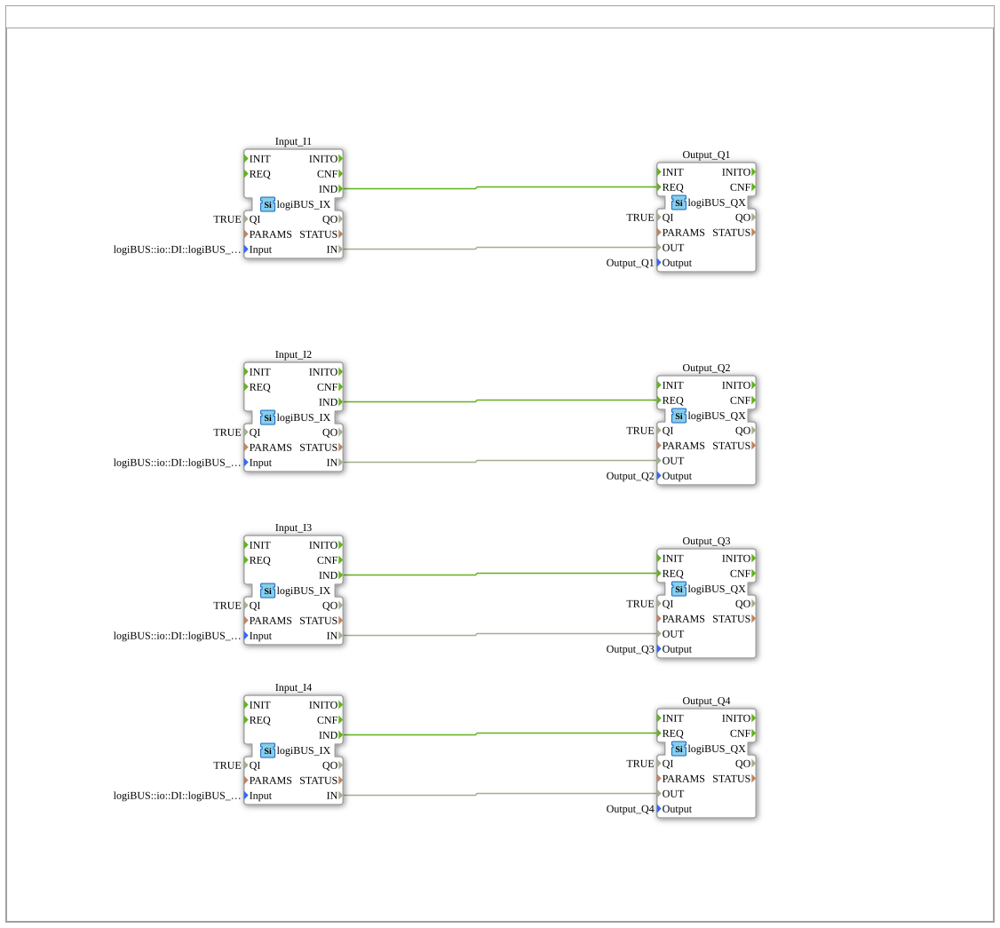

# Training_02_CLIENT_SERVER2: Reduziertes Request/Reply mit einfachem I/O

* * * * * * * * * *

## Einleitung

`Training_02_CLIENT_SERVER2` ist eine reduzierte Variante von
`Training_01_CLIENT_SERVER`: dieselbe Vier-Kanal-Request/Reply-Struktur
(`CLIENT_1`/`SERVER_1`), aber mit einfachen digitalen Ein-/Ausgängen
(`logiBUS_IX`/`logiBUS_QX`) statt Tastern mit blinkenden LED-Streifen, und
ohne Aktivierungszähler auf der Server-Seite — die Antwort ist hier ein
fester Platzhalterwert (`DINT#0`), nicht der echte Zählerstand aus
`Training_01_CLIENT_SERVER`. Zeigt damit das Request/Reply-Protokoll in
seiner minimalen Form, ohne die zusätzliche Zähler-Logik.

## Verwendete Funktionsbausteine (FBs)

| Instanz | Ort | Typ | Zweck |
|---|---|---|---|
| `Input_I1`…`_I4` | Application (`App_CLIENT_SERVER`) | `logiBUS::io::DI::logiBUS_IX` | Liest `Input_I1`…`I4` |
| `Output_Q1`…`_Q4` | Application | `logiBUS::io::DQ::logiBUS_QX` | Schaltet `Output_Q1`…`Q4` |
| `CLIENT_BUTTON_*` | Resource `EMB_RES_CLIENT` (`FORTE_PC_CLIENT`) | `iec61499::net::CLIENT_1` | Sendet die Anfrage samt Eingangszustand |
| `UINT2UINT_0`…`_3` | Resource `EMB_RES_CLIENT` | `iec61131::selection::F_MOVE` (UINT) | Nimmt die Antwort entgegen — Endpunkt ohne weitere Verwendung |
| `SERVER_BUTTON_*` | Resource `EMB_RES_SERVER` (`FORTE_PC_SERVER`) | `iec61499::net::SERVER_1` | Empfängt die Anfrage, schaltet den Ausgang direkt, antwortet mit `DINT#0` |

## Programmablauf und Verbindungen

1. **Application**: vier unabhängige `Input_I*`→`Output_Q*`-Paare, ohne
   Zähler oder Blinklogik — das einfachste I/O-Grundmuster.
2. **Mapping**: alle vier `Input_I*` → `FORTE_PC_CLIENT.EMB_RES_CLIENT`,
   alle vier `Output_Q*` → `FORTE_PC_SERVER.EMB_RES_SERVER`.
3. **Resource `EMB_RES_CLIENT`**: `Input_I*.IND`/`.IN` (dotted-path) →
   `CLIENT_BUTTON_*.REQ`/`.SD_1`, je Kanal ein eigener Port
   (`PORT_B0`…`PORT_B3`). Die Antwort läuft wie in `Training_01_CLIENT_SERVER`
   in `UINT2UINT_*` — unverändert übernommenes Muster, weiterhin ein
   Endpunkt ohne Weiterverarbeitung.
4. **Resource `EMB_RES_SERVER`**: `SERVER_BUTTON_*.IND`/`.RD_1` →
   `Output_Q*.REQ`/`.OUT` — **direkt**, ohne Zähler oder Umweg über eine
   Bestätigung. `SERVER_BUTTON_*` hat als `SD_1`-Parameter fest `DINT#0`
   gesetzt: die Antwort trägt immer denselben Platzhalterwert, unabhängig
   vom tatsächlichen Schaltvorgang.

## Technische Besonderheiten

- **Statische statt gezählte Antwort**: der Parameter `SD_1="DINT#0"` an
  `SERVER_BUTTON_*` ersetzt das `E_CTU`-Zählmuster aus
  `Training_01_CLIENT_SERVER` — die Antwort trägt keine echte Information
  mehr, nur noch die Protokoll-Bestätigung selbst zählt.
- **Keine Bestätigungskette**: anders als in `Training_01_CLIENT_SERVER`
  (Antwort erst nach `LED.CNF`) löst hier `SERVER_BUTTON_*.IND` die Antwort
  indirekt gar nicht erst aus — der Ausgang wird sofort geschaltet, ohne
  Zwischenschritt.
- **Gleiches Client-seitiges Muster wie in `Training_01_CLIENT_SERVER`**:
  die `UINT2UINT_*`-Blöcke (dead-end-Antwortempfang) sind identisch
  übernommen — die Vereinfachung betrifft ausschließlich die Server-Seite
  und die I/O-Bausteine.

## Lernziele

- Request/Reply-Protokoll (`CLIENT_1`/`SERVER_1`) in seiner minimalen Form,
  ohne zusätzliche Zustands-/Zähllogik.
- Unterschied zwischen einer inhaltlich bedeutungsvollen Antwort
  (`Training_01_CLIENT_SERVER`) und einer reinen Protokoll-Bestätigung mit
  Platzhalterwert.

**Schwierigkeitsgrad**: Einfach
**Vorkenntnisse**: `Training_01_CLIENT_SERVER` (vollständiges Request/Reply-
Muster mit Zähler) als Vergleichspunkt.

## Zusammenfassung

`Training_02_CLIENT_SERVER2` reduziert `Training_01_CLIENT_SERVER` auf das
Nötigste: einfache digitale I/O-Kanäle, direkte Ausgangsschaltung ohne
Umweg, und eine Antwort, die nur noch als Platzhalter dient statt einen
echten Zählerstand zu tragen.

---

### 🌐 Passende Themen-Unterseiten auf ms-muc-docs.de

- [🌐 Eclipse 4diac IDE & Farb-Referenz auf ms-muc-docs.de](https://www.ms-muc-docs.de/iec-61499/eclipse-4diac/)
