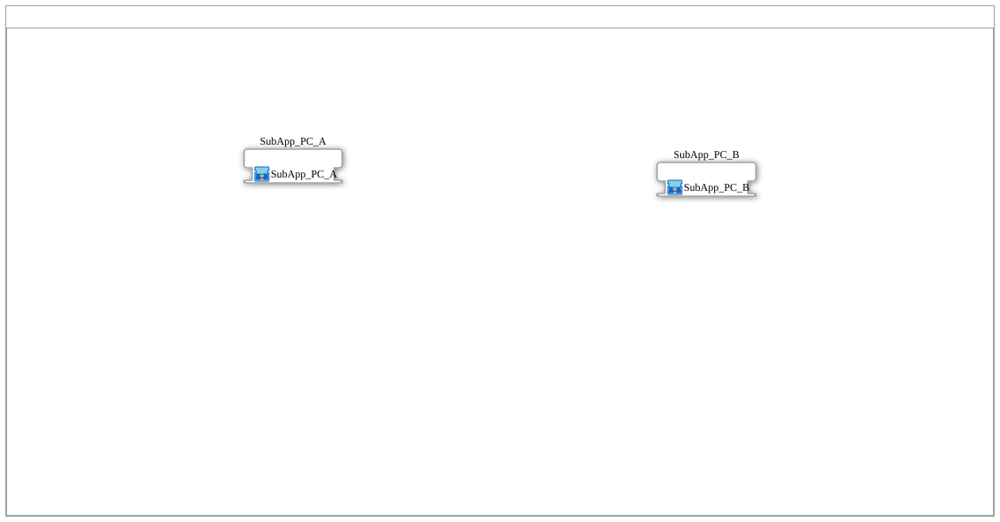

# Training_01_OPC_UA_SUB: Verteiltes I1→Q1 über OPC-UA ("SUB style")

* * * * * * * * * *

## Einleitung

`Training_01_OPC_UA_SUB` zeigt denselben Anwendungsfall wie
`Training_02_OPC_UA_RES` (`Input_I1` auf Gerät A → `Output_Q1` auf Gerät B,
über OPC-UA verteilt) — aber als **Gegenentwurf**: den **"SUB style"**.
Statt die Kommunikationsbausteine in der `<Resource>` jedes Geräts zu
platzieren, steckt das OPC-UA-Protokoll hier direkt in einem
wiederverwendbaren `MyLib::sys`-Composite. Namensgebend ist "SUB" für
`subapp::Training_01_OPC_UA_SUB`, das Package, in dem beide
Geräte-Composites liegen. Laut Kommentar in den Quellbausteinen entspricht
dieses Muster einem **echten Produktivmuster** ("Krauternter") aus der
Praxis.

## Verwendete Funktionsbausteine (FBs)

| Instanz | Ort | Typ | Zweck |
|---|---|---|---|
| `SubApp_PC_A` | Application (`App_OPC_UA_SUB`) | `subapp::Training_01_OPC_UA_SUB::SubApp_PC_A` | Kapselt Gerät-A-seitige Logik komplett |
| `SubApp_PC_B` | Application | `subapp::Training_01_OPC_UA_SUB::SubApp_PC_B` | Kapselt Gerät-B-seitige Logik komplett |
| `INPUT_I1` (in `SubApp_PC_A`) | — | `MyLib::sys::logiBUS_IXA_TO_CLIENT_OPC` | Liest `Input_I1` **und** schreibt aktiv per OPC-UA (`CLIENT_1_0`) in einem Baustein |
| `OUTPUT_Q1` (in `SubApp_PC_B`) | — | `MyLib::sys::logiBUS_QXA_FROM_SUBSCRIBE_OPC` | Schaltet `Output_Q1` basierend auf einem lokal überwachten OPC-UA-Knoten (`SUBSCRIBE_1`) in einem Baustein |

Beide Geräte-Resources (`EMB_RES_A`, `EMB_RES_B`) enthalten **nichts**
außer einem generischen `E_TRIG` (`EVENTTYPE='EInit'`) — anders als bei
`Training_02_OPC_UA_RES`, wo `CLIENT_Q1`/`SUBSCRIBE_Q1` explizit in der
Resource stehen. Das gesamte Protokollwissen ist hier in
`logiBUS_IXA_TO_CLIENT_OPC`/`logiBUS_QXA_FROM_SUBSCRIBE_OPC` gekapselt.

## OPC-UA-Adressraum

Dieselben Konstanten wie in `Training_02_OPC_UA_RES`, aus
`VV::const::OPC_UA::myOpcUaAddresses`:

| Konstante | Verwendet von |
|---|---|
| `Q1_REMOTE_WRITE` | `SubApp_PC_A.INPUT_I1` (`ID`-Parameter) |
| `Q1_LOCAL_READ` | `SubApp_PC_B.OUTPUT_Q1` (`ID`-Parameter) |

## Programmablauf und Verbindungen

1. **Application** (`App_OPC_UA_SUB`): instanziiert `SubApp_PC_A` und
   `SubApp_PC_B` direkt, **ohne** jede Verbindung zwischen ihnen — die
   gesamte Kopplung läuft ausschließlich als OPC-UA-Kommunikation zur
   Laufzeit, es gibt keine Modellverbindung zwischen den beiden Composites.
2. **`SubApp_PC_A`**: eine einzige Instanz `INPUT_I1`
   (`logiBUS_IXA_TO_CLIENT_OPC`, `Input=Input_I1`, `ID=Q1_REMOTE_WRITE`) —
   liest den physischen Eingang und schreibt seinen Zustand aktiv per
   OPC-UA remote, alles in einem Composite-Baustein.
3. **`SubApp_PC_B`**: spiegelbildlich eine einzige Instanz `OUTPUT_Q1`
   (`logiBUS_QXA_FROM_SUBSCRIBE_OPC`, `Output=Output_Q1`,
   `ID=Q1_LOCAL_READ`) — überwacht lokal den von Gerät A beschriebenen
   Knoten und schaltet den physischen Ausgang, ebenfalls in einem
   Composite-Baustein.
4. **Mapping**: `SubApp_PC_A` → `FORTE_PC_A.EMB_RES_A`, `SubApp_PC_B` →
   `FORTE_PC_B.EMB_RES_B`. Die Resources selbst tragen keine fachliche
   Logik — nur der generische `EInit`-Trigger, den 4diac ohnehin für jede
   Resource vorsieht.

## Technische Besonderheiten

- **Protokoll im Composite statt in der Resource**: der komplette
  Unterschied zu `Training_02_OPC_UA_RES` liegt darin, WO das OPC-UA-Wissen
  steckt — hier in einem einzigen wiederverwendbaren `MyLib::sys`-Baustein
  pro Geräteseite, dort verteilt auf Application-FB + separaten
  Resource-Adapterbaustein. Funktional identisch, aber die "SUB style"-
  Variante ist als fertiger Baustein direkt wiederverwendbar, ohne dass
  jedes neue Projekt die Resource-Verdrahtung erneut nachbauen muss.
- **Reales Produktivmuster**: laut Kommentar in `SubApp_PC_A`/`SubApp_PC_B`
  ist dies kein Lehrbeispiel, sondern ein in der Praxis eingesetztes Muster
  ("Krauternter").
- **Leere Resources**: da die gesamte Logik im Composite steckt, bleibt in
  beiden Resources nur der obligatorische `EInit`-Trigger übrig — ein
  deutlicher struktureller Kontrast zur RES-Variante.

## Lernziele

- Zwei gleichwertige Architekturmuster für dieselbe verteilte OPC-UA-
  Aufgabe: Protokoll in der Resource ("RES style") vs. Protokoll im
  wiederverwendbaren Composite ("SUB style").
- Vor-/Nachteile der Kapselung: Wiederverwendbarkeit des fertigen
  Composite-Bausteins gegen Transparenz der einzelnen Protokollschritte in
  der Resource.
- Bezug zu einem echten Produktivmuster statt eines rein didaktischen
  Beispiels.

**Schwierigkeitsgrad**: Mittel
**Vorkenntnisse**: `Training_02_OPC_UA_RES` (Gegenstück im "RES style"),
Grundlagen der OPC-UA-Adapterbausteine.

## Zusammenfassung

`Training_01_OPC_UA_SUB` löst dieselbe Verteilungsaufgabe wie
`Training_02_OPC_UA_RES`, verlagert das OPC-UA-Protokollwissen aber
komplett in wiederverwendbare `MyLib::sys`-Composites statt es in der
Resource jedes Geräts zu verdrahten — ein reales, in der Praxis
eingesetztes Architekturmuster.

---

### 🌐 Passende Themen-Unterseiten auf ms-muc-docs.de

- [🌐 Eclipse 4diac IDE & Farb-Referenz auf ms-muc-docs.de](https://www.ms-muc-docs.de/iec-61499/eclipse-4diac/)
