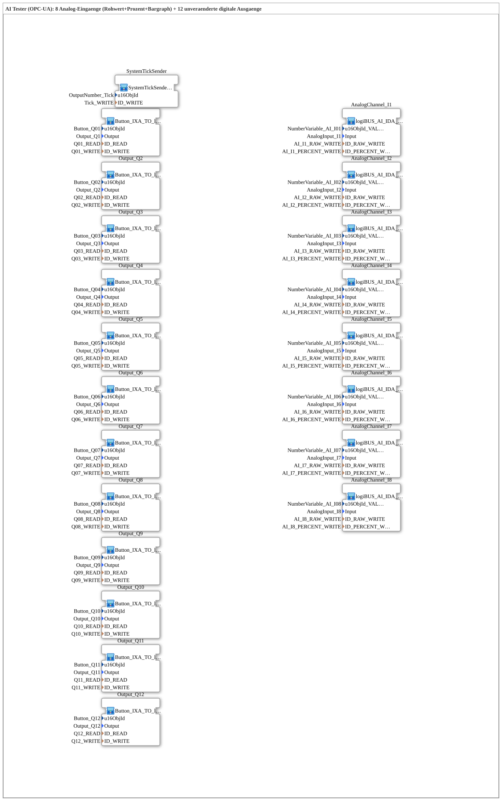

# InputOutputTesterButton_AI_OPC_UA: AI Tester (OPC-UA, no calibration)

* * * * * * * * * *

## Introduction

`InputOutputTesterButton_AI_OPC_UA` is the training example for **8 analog inputs (raw value + percent + bargraph)**, controllable both via the ISOBUS Virtual Terminal and via OPC-UA. The 12 digital outputs are unchanged from [`InputOutputTesterButton_DIDO_OPC_UA`](../Button_DIDO_OPC_UA/InputOutputTesterButton_DIDO_OPC_UA.md).

This exercise is the **simpler precursor** to [`InputOutputTesterButton_AI_Calibrate_OPC_UA`](../Button_AI_Calibrate_OPC_UA/InputOutputTesterButton_AI_Calibrate_OPC_UA.md): it shows the raw value and a (linearly converted) percent value of an analog input, but **without** the later 2-point calibration logic (no `CALIBRATE` adapter, no CO/CS buttons, no INI-persisted offset/scale values, no remotely settable ZERO/SPAN references). Comparing these two exercises directly is the best way to see what the calibration extension actually adds to the FB network.

## Function Blocks (FBs) Used

| SubApp instance | Type | Purpose |
|---|---|---|
| `AnalogChannel_I1` … `AnalogChannel_I8` | `MyLib::sys::logiBUS_AI_IDA_OPC` | Analog input with raw-value and percent display (VT number fields + bargraph) + OPC-UA, **no** calibration |
| `Output_Q1` … `Output_Q12` | `MyLib::sys::Button_IXA_TO_logiBUS_QXA_BG_OPC` | Digital output, unchanged from the DIDO example |

### Sub-block: `logiBUS_AI_IDA_OPC` (analog inputs)

- **Type**: SubAppType (`MyLib::sys`)
- **Functionality**: The physical analog input (`logiBUS_AI_IDA`) feeds the raw value and a linearly converted percent value directly to a VT number field with bargraph, as well as publishing both via OPC-UA (`ID_RAW_WRITE`, `ID_PERCENT_WRITE`) to the web client. Unlike the Calibrate variant, there is no adaptive calibration chain (`AR_CALIBRATE_SQ_REF`), no reference values, and no remotely-triggerable calibration steps - the block is a pure publish path with no write-back capability.

### Sub-block: [Button_IXA_TO_logiBUS_QXA_BG_OPC](https://meisterschulen-am-ostbahnhof-munchen-docs.readthedocs.io/projects/4diac-library-reference-docs-en/en/latest/ExternalLibraries/MyLib_AX/sys/Button_IXA_TO_logiBUS_QXA_BG_OPC/) (outputs)

Unchanged from the DIDO example - see its description there.

## OPC-UA Address Space

| Node path | Node ID | Meaning |
|---|---|---|
| `/Objects/Analog/In/RAW` | `s=AI_In_RAW` | Raw value input n (n=1–8), publish only |
| `/Objects/Analog/In/PERCENT` | `s=AI_In_PERCENT` | Percent value input n (n=1–8), publish only |
| `/Objects/DigitalOutput/Qnn` | `s=Qnn` | Output nn (nn=01–12), read (subscribe) + write (publish/echo), same as the DIDO example |

A flat address space separated by channel, not a nested path like the PWM example - analogous to the DIDO address space.

## Program Flow and Connections

The exercise itself contains **no connections** (`SubAppNetwork` consists only of SubApp instances with parameters):

1. **8 analog channels**: `AnalogChannel_I1`…`AnalogChannel_I8` read `AnalogInput_I1`…`AnalogInput_I8` and publish raw value + percent value via OPC-UA.
2. **12 digital outputs**: `Output_Q1`…`Output_Q12`, unchanged from the DIDO example.

**Registration in the training system**: As with all exercises in this system, no dedicated `Application` element is needed - selected via "Change Type" in the 4diac IDE on the system's single `Control` slot.

## Learning Objectives

- Basic pattern for a pure-publish analog input (raw value + percent) with both VT and OPC-UA connectivity, without the complexity of a calibration chain.
- Direct comparison with [`InputOutputTesterButton_AI_Calibrate_OPC_UA`](../Button_AI_Calibrate_OPC_UA/InputOutputTesterButton_AI_Calibrate_OPC_UA.md) shows exactly what additional blocks (CALIBRATE adapter, INI persistence, reference-value buttons) a 2-point calibration requires.

**Difficulty**: Beginner to intermediate
**Prerequisites**: [`InputOutputTesterButton_DIDO_OPC_UA`](../Button_DIDO_OPC_UA/InputOutputTesterButton_DIDO_OPC_UA.md) (base pattern VT+OPC-UA).

## Summary

`InputOutputTesterButton_AI_OPC_UA` demonstrates the simplest form of an analog OPC-UA input: raw value and percent value, purely via publish, without any calibration logic. Forms the didactic bridge between the purely digital DIDO example and the much more complex 2-point calibration.

---

### 🌐 Related topic subpages on ms-muc-docs.de

- [🌐 Eclipse 4diac IDE & color reference on ms-muc-docs.de](https://www.ms-muc-docs.de/iec-61499/eclipse-4diac/)
