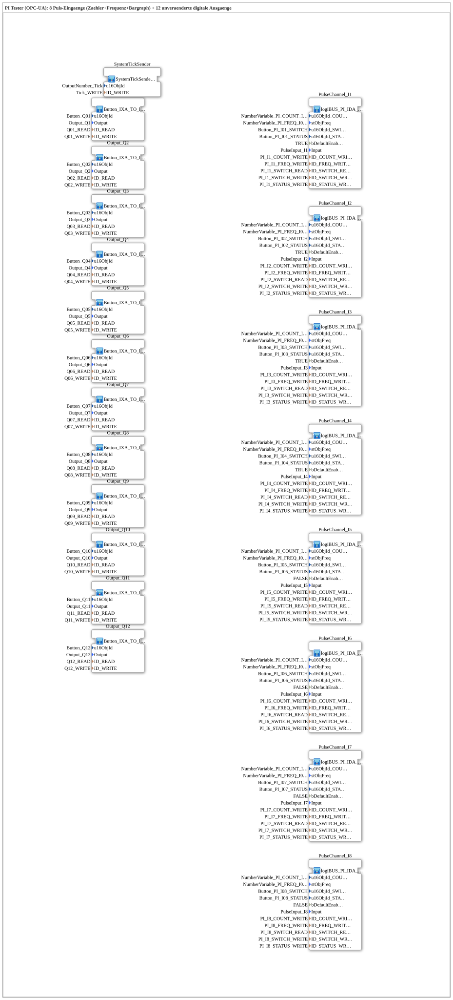

# InputOutputTesterButton_PI_OPC_UA: PI Tester (OPC-UA)

* * * * * * * * * *

## Introduction

`InputOutputTesterButton_PI_OPC_UA` is the training example for **8 pulse inputs (count + frequency + bargraph)**, controllable both via the ISOBUS Virtual Terminal and via OPC-UA. The 12 digital outputs are unchanged from [`InputOutputTesterButton_DIDO_OPC_UA`](../Button_DIDO_OPC_UA/InputOutputTesterButton_DIDO_OPC_UA.md) ("PI" = **P**ulse **I**nput, a pulse input for frequency measurement - not to be confused with the analog `AI` channels).

Each pulse channel additionally has its **own enable switch with a status LED** - unlike DIDO/AI/AI_Calibrate, not just the measured value but the channel's own activation state is bidirectionally settable from VT and web.

## Function Blocks (FBs) Used

| SubApp instance | Type | Purpose |
|---|---|---|
| `PulseChannel_I1` … `PulseChannel_I8` | `MyLib::sys::logiBUS_PI_IDA_OPC` | Pulse input with count and frequency display (VT number fields + bargraph), enable switch with status LED, + OPC-UA |
| `Output_Q1` … `Output_Q12` | `MyLib::sys::Button_IXA_TO_logiBUS_QXA_BG_OPC` | Digital output, unchanged from the DIDO example |

### Sub-block: `logiBUS_PI_IDA_OPC` (pulse inputs)

- **Type**: SubAppType (`MyLib::sys`)
- **Functionality**: The physical pulse input (`logiBUS_PI`) feeds both a running pulse counter (`COUNTVAR`, VT number field) and the frequency derived from it (`stObjFreq`, VT number field with bargraph) - both additionally published via OPC-UA (`ID_COUNT_WRITE`, `ID_FREQ_WRITE`).
- **Enable switch with status feedback**: Each channel has its own enable switch (`u16ObjId_SWITCH`, switchable both via a VT button and via OPC-UA through `ID_SWITCH_READ`/`ID_SWITCH_WRITE`) and a status LED (`u16ObjId_STATUS`, published via OPC-UA through `ID_STATUS_WRITE`) reporting the channel's actual activation state back - the same set/reset-plus-echo pattern used by the bidirectionally switchable outputs in the other examples, here applied to an input enable switch instead.
- **Per-channel default activation**: `bDefaultEnabled` is preset to `TRUE` for channels 1-4 and `FALSE` for channels 5-8 - the second channel group must be switched on explicitly on startup before it starts counting.

### Sub-block: [Button_IXA_TO_logiBUS_QXA_BG_OPC](https://docs.ms-muc-docs.de/projects/4diac-library-reference-docs/en/latest/ExternalLibraries/MyLib_AX/sys/Button_IXA_TO_logiBUS_QXA_BG_OPC/) (outputs)

Unchanged from the DIDO example - see its description there.

## OPC-UA Address Space

| Node path | Node ID | Meaning |
|---|---|---|
| `/Objects/Pulse/In/COUNT` | `s=PI_In_COUNT` | Pulse counter input n (n=1–8), publish only |
| `/Objects/Pulse/In/FREQ` | `s=PI_In_FREQ` | Frequency input n (n=1–8), publish only |
| `/Objects/Pulse/In/SWITCH` | `s=PI_In_SWITCH` | Enable switch input n, read (subscribe) + write (publish/echo) |
| `/Objects/Pulse/In/STATUS` | `s=PI_In_STATUS` | Status LED input n, publish only |
| `/Objects/DigitalOutput/Qnn` | `s=Qnn` | Output nn (nn=01–12), same as the DIDO example |

## Program Flow and Connections

The exercise itself contains **no connections** (`SubAppNetwork` consists only of SubApp instances with parameters):

1. **8 pulse channels**: `PulseChannel_I1`…`PulseChannel_I8` read `PulseInput_I1`…`PulseInput_I8`, count and measure their frequency, publish both via OPC-UA, and can each be enabled/disabled individually via VT button or OPC-UA (channels 1-4 active initially, 5-8 inactive initially).
2. **12 digital outputs**: `Output_Q1`…`Output_Q12`, unchanged from the DIDO example.

**Registration in the training system**: As with all exercises in this system, no dedicated `Application` element is needed - selected via "Change Type" in the 4diac IDE on the system's single `Control` slot.

## Learning Objectives

- Pulse counting and frequency measurement as its own analog-input type, distinct from the voltage-based `AI` channels.
- A bidirectionally switchable channel enable with status feedback (enable/status pair) as a reusable pattern for making a channel switchable on/off via both VT and OPC-UA at once.

**Difficulty**: Intermediate
**Prerequisites**: [`InputOutputTesterButton_DIDO_OPC_UA`](../Button_DIDO_OPC_UA/InputOutputTesterButton_DIDO_OPC_UA.md) (base pattern VT+OPC-UA), [`InputOutputTesterButton_AI_OPC_UA`](../Button_AI_OPC_UA/InputOutputTesterButton_AI_OPC_UA.md) (comparison to a simpler analog input without an enable switch).

## Summary

`InputOutputTesterButton_PI_OPC_UA` demonstrates pulse counting with frequency measurement plus an additional, bidirectionally switchable enable/status pair per channel - an extension of the simple publish pattern (as seen with AI) with real feedback logic on the input side.

---

### 🌐 Related topic subpages on ms-muc-docs.de

- [🌐 Eclipse 4diac IDE & color reference on ms-muc-docs.de](https://www.ms-muc-docs.de/iec-61499/eclipse-4diac/)
