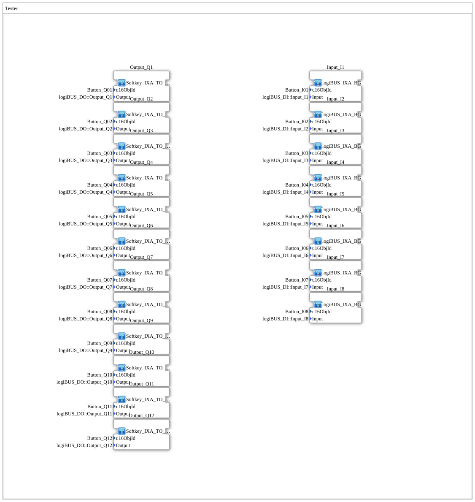

# InputOutputTesterSk: DIDO Tester (VT, SoftKey outputs)

* * * * * * * * * *

## Introduction

`InputOutputTesterSk` is structurally identical to [`InputOutputTesterBt`](../Button/InputOutputTesterBt.md) (8 digital inputs, 12 digital outputs, purely VT-based, no OPC-UA connectivity) - the only difference is the output block: the 12 outputs are switched here via fixed VT **SoftKeys** (physical buttons next to the screen) instead of on-screen buttons embedded in the DataMask (`Button_IXA`).

## Function Blocks (FBs) Used

| SubApp instance | Type | Purpose |
|---|---|---|
| `Input_I1` … `Input_I8` | `MyLib::sys::logiBUS_IXA_BG` | Digital input with VT status display (green/white) - unchanged from `InputOutputTesterBt` |
| `Output_Q1` … `Output_Q12` | `MyLib::sys::Softkey_IXA_TO_logiBUS_QXA_BG` | Digital output, switchable via a **VT SoftKey** instead of an on-screen button |

### Sub-block: `Softkey_IXA_TO_logiBUS_QXA_BG` (outputs)

- **Type**: SubAppType (`MyLib::sys`)
- **Functionality**: Like `Button_IXA_TO_logiBUS_QXA_BG` (an AX_SR flip-flop switches the physical output + VT status color), but triggered via a `Softkey_IXA` connection (VT SoftKeyMask button) instead of a `Button_IXA` connection (VT DataMask button). Didactically relevant difference: SoftKeys stay in a fixed position across masks (physical buttons on the VT device), whereas DataMask buttons are part of whatever screen content is currently displayed.

## Program Flow and Connections

The exercise itself contains **no connections** (`SubAppNetwork` consists only of SubApp instances with parameters) - identical to `InputOutputTesterBt`:

1. **8 inputs**: `Input_I1`…`Input_I8` read `Input_I1`…`Input_I8` and mirror them via VT status color.
2. **12 outputs**: `Output_Q1`…`Output_Q12` each connect one physical output to a VT SoftKey and VT status color.

**Registration in the training system**: As with all exercises in this system, no dedicated `Application` element is needed - selected via "Change Type" in the 4diac IDE on the system's single `Control` slot.

## Learning Objectives

- Difference between SoftKey and DataMask-button operation on the exact same base pattern (digital I/O), without changing anything else about the logic.
- SoftKeys as an alternative for controls that need to stay reachable independent of the currently displayed mask content.

**Difficulty**: Beginner
**Prerequisites**: [`InputOutputTesterBt`](../Button/InputOutputTesterBt.md) (identical base pattern with DataMask buttons), basics of ISOBUS VT SoftKeyMasks.

## Summary

`InputOutputTesterSk` shows the same digital 8+12 I/O base pattern as `InputOutputTesterBt`, controlled via fixed VT SoftKeys instead of on-screen buttons - a pure operating-concept variant with no change to the underlying FB logic.

---

### 🌐 Related topic subpages on ms-muc-docs.de

- [🌐 Eclipse 4diac IDE & color reference on ms-muc-docs.de](https://www.ms-muc-docs.de/iec-61499/eclipse-4diac/)
