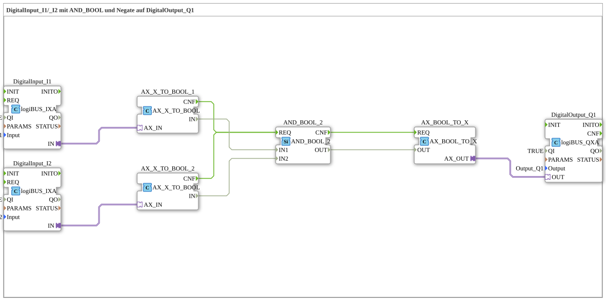

# Uebung_002a4b_AX: DigitalInput_I1/_I2 mit AND_BOOL und Negate auf DigitalOutput_Q1

This article describes the 4diac IDE sub-application Uebung_002a4b_AX (DigitalInput_I1/_I2 mit AND_BOOL und Negate auf DigitalOutput_Q1).

----

## Objective of the Exercise

The main objective of this exercise is to implement the following requirement: **DigitalInput_I1/_I2 mit AND_BOOL und Negate auf DigitalOutput_Q1**

-----

## Description and Components

The exercise consists of the sub-application Uebung_002a4b_AX.SUB, which uses the following function block structure:

### Instantiated Function Blocks (FBs)

- **DigitalOutput_Q1**: Instance of type logiBUS::io::DQ::logiBUS_QXA.
  - Parameter QI = TRUE
  - Parameter Output = Output_Q1
- **DigitalInput_I1**: Instance of type logiBUS::io::DI::logiBUS_IXA.
  - Parameter QI = TRUE
  - Parameter Input = Input_I1
- **DigitalInput_I2**: Instance of type logiBUS::io::DI::logiBUS_IXA.
  - Parameter QI = TRUE
  - Parameter Input = Input_I2
- **AX_X_TO_BOOL_1**: Instance of type adapter::conversion::unidirectional::AX_X_TO_BOOL.
- **AX_X_TO_BOOL_2**: Instance of type adapter::conversion::unidirectional::AX_X_TO_BOOL.
- **AND_BOOL_2**: Instance of type iec61131::booleanOperators::AND_BOOL_2.
- **AX_BOOL_TO_X**: Instance of type adapter::conversion::unidirectional::AX_BOOL_TO_X.

### Connections and Interfaces

**Adapter Connections:**

- DigitalInput_I1.IN -> AX_X_TO_BOOL_1.AX_IN
- DigitalInput_I2.IN -> AX_X_TO_BOOL_2.AX_IN
- AX_BOOL_TO_X.AX_OUT -> DigitalOutput_Q1.OUT

**Event Connections:**

- AX_X_TO_BOOL_1.CNF -> AND_BOOL_2.REQ
- AX_X_TO_BOOL_2.CNF -> AND_BOOL_2.REQ
- AND_BOOL_2.CNF -> AX_BOOL_TO_X.REQ

**Data Connections:**

- AX_X_TO_BOOL_1.IN -> AND_BOOL_2.IN1
- AX_X_TO_BOOL_2.IN -> AND_BOOL_2.IN2
- AND_BOOL_2.OUT -> AX_BOOL_TO_X.OUT

### Notes from the Model

> "Negate Connection" mach ein NOT am Eingang; das geht nur bei BOOL.

-----

## Sequence and Operation

1. **Initialization**: Upon system startup, all participating function blocks are initialized.
2. **Event and Signal Processing**: State changes at the inputs trigger events that are forwarded to downstream function blocks across the defined connections.
3. **Output Update**: The receiving function blocks process incoming events and data values to update physical and logical outputs accordingly.

-----

## Summary

Exercise Uebung_002a4b_AX provides a clear demonstration of modular IEC 61499 application design in 4diac IDE.
