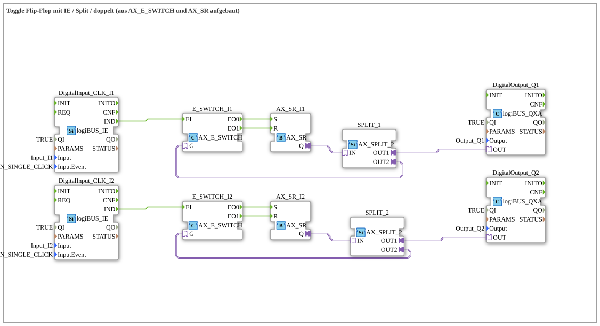

# Uebung_004b2_AX: Toggle Flip-Flop mit IE / Split / doppelt (aus AX_E_SWITCH und AX_SR aufgebaut)

This article describes the 4diac IDE sub-application Uebung_004b2_AX (Toggle Flip-Flop mit IE / Split / doppelt (aus AX_E_SWITCH und AX_SR aufgebaut)).

----

## Objective of the Exercise

The main objective of this exercise is to implement the following requirement: **Toggle Flip-Flop mit IE / Split / doppelt (aus AX_E_SWITCH und AX_SR aufgebaut)**

-----

## Description and Components

The exercise consists of the sub-application Uebung_004b2_AX.SUB, which uses the following function block structure:

### Instantiated Function Blocks (FBs)

- **DigitalOutput_Q1**: Instance of type logiBUS::io::DQ::logiBUS_QXA.
  - Parameter QI = TRUE
  - Parameter Output = Output_Q1
- **DigitalInput_CLK_I1**: Instance of type logiBUS::io::DI::logiBUS_IE.
  - Parameter QI = TRUE
  - Parameter Input = Input_I1
  - Parameter InputEvent = BUTTON_SINGLE_CLICK
- **E_SWITCH_I1**: Instance of type adapter::events::unidirectional::AX_E_SWITCH.
- **AX_SR_I1**: Instance of type adapter::events::unidirectional::AX_SR.
- **DigitalOutput_Q2**: Instance of type logiBUS::io::DQ::logiBUS_QXA.
  - Parameter QI = TRUE
  - Parameter Output = Output_Q2
- **DigitalInput_CLK_I2**: Instance of type logiBUS::io::DI::logiBUS_IE.
  - Parameter QI = TRUE
  - Parameter Input = Input_I2
  - Parameter InputEvent = BUTTON_SINGLE_CLICK
- **E_SWITCH_I2**: Instance of type adapter::events::unidirectional::AX_E_SWITCH.
- **AX_SR_I2**: Instance of type adapter::events::unidirectional::AX_SR.
- **SPLIT_1**: Instance of type adapter::events::unidirectional::AX_SPLIT_2.
- **SPLIT_2**: Instance of type adapter::events::unidirectional::AX_SPLIT_2.

### Connections and Interfaces

**Adapter Connections:**

- AX_SR_I1.Q -> SPLIT_1.IN
- SPLIT_1.OUT2 -> E_SWITCH_I1.G
- SPLIT_2.OUT2 -> E_SWITCH_I2.G
- AX_SR_I2.Q -> SPLIT_2.IN
- SPLIT_2.OUT1 -> DigitalOutput_Q2.OUT
- SPLIT_1.OUT1 -> DigitalOutput_Q1.OUT

**Event Connections:**

- DigitalInput_CLK_I1.IND -> E_SWITCH_I1.EI
- E_SWITCH_I1.EO0 -> AX_SR_I1.S
- E_SWITCH_I1.EO1 -> AX_SR_I1.R
- DigitalInput_CLK_I2.IND -> E_SWITCH_I2.EI
- E_SWITCH_I2.EO0 -> AX_SR_I2.S
- E_SWITCH_I2.EO1 -> AX_SR_I2.R

-----

## Sequence and Operation

1. **Initialization**: Upon system startup, all participating function blocks are initialized.
2. **Event and Signal Processing**: State changes at the inputs trigger events that are forwarded to downstream function blocks across the defined connections.
3. **Output Update**: The receiving function blocks process incoming events and data values to update physical and logical outputs accordingly.

-----

## Summary

Exercise Uebung_004b2_AX provides a clear demonstration of modular IEC 61499 application design in 4diac IDE.
