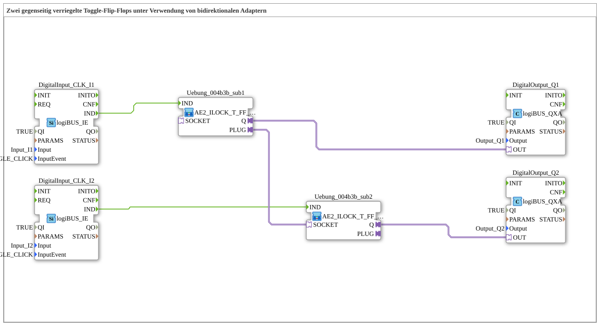

# Uebung_004b3c_AX: Zwei gegenseitig verriegelte Toggle-Flip-Flops unter Verwendung von bidirektionalen Adaptern

This article describes the 4diac IDE sub-application Uebung_004b3c_AX (Zwei gegenseitig verriegelte Toggle-Flip-Flops unter Verwendung von bidirektionalen Adaptern).

----

## Objective of the Exercise

The main objective of this exercise is to implement the following requirement: **Zwei gegenseitig verriegelte Toggle-Flip-Flops unter Verwendung von bidirektionalen Adaptern**

-----

## Description and Components

The exercise consists of the sub-application Uebung_004b3c_AX.SUB, which uses the following function block structure:

### Instantiated Function Blocks (FBs)

- **DigitalOutput_Q1**: Instance of type logiBUS::io::DQ::logiBUS_QXA.
  - Parameter QI = TRUE
  - Parameter Output = Output_Q1
- **DigitalInput_CLK_I1**: Instance of type logiBUS::io::DI::logiBUS_IE.
  - Parameter QI = TRUE
  - Parameter Input = Input_I1
  - Parameter InputEvent = BUTTON_SINGLE_CLICK
- **DigitalOutput_Q2**: Instance of type logiBUS::io::DQ::logiBUS_QXA.
  - Parameter QI = TRUE
  - Parameter Output = Output_Q2
- **DigitalInput_CLK_I2**: Instance of type logiBUS::io::DI::logiBUS_IE.
  - Parameter QI = TRUE
  - Parameter Input = Input_I2
  - Parameter InputEvent = BUTTON_SINGLE_CLICK

### Connections and Interfaces

**Adapter Connections:**
- Uebung_004b3b_sub1.PLUG -> Uebung_004b3b_sub2.SOCKET
- Uebung_004b3b_sub1.Q -> DigitalOutput_Q1.OUT
- Uebung_004b3b_sub2.Q -> DigitalOutput_Q2.OUT

**Event Connections:**
- DigitalInput_CLK_I2.IND -> Uebung_004b3b_sub2.IND
- DigitalInput_CLK_I1.IND -> Uebung_004b3b_sub1.IND

### Notes from the Model

> durch den Einsatz eines Bidirektionalen Adapters: 1 Verbindung REICHT !

-----

## Sequence and Operation

1. **Initialization**: Upon system startup, all participating function blocks are initialized.
2. **Event and Signal Processing**: State changes at the inputs trigger events that are forwarded to downstream function blocks across the defined connections.
3. **Output Update**: The receiving function blocks process incoming events and data values to update physical and logical outputs accordingly.

-----

## Summary

Exercise Uebung_004b3c_AX provides a clear demonstration of modular IEC 61499 application design in 4diac IDE.
