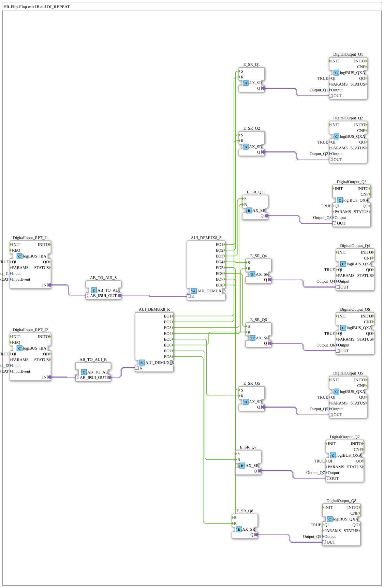

# Uebung_006c_AX: SR-Flip-Flop mit IB auf DI_REPEAT

This article describes the 4diac IDE sub-application Uebung_006c_AX (SR-Flip-Flop mit IB auf DI_REPEAT).

----

## Objective of the Exercise

The main objective of this exercise is to implement the following requirement: **SR-Flip-Flop mit IB auf DI_REPEAT**

-----

## Description and Components

The exercise consists of the sub-application Uebung_006c_AX.SUB, which uses the following function block structure:

### Instantiated Function Blocks (FBs)

- **DigitalOutput_Q1**: Instance of type logiBUS::io::DQ::logiBUS_QXA.
  - Parameter QI = TRUE
  - Parameter Output = Output_Q1
- **DigitalInput_RPT_I1**: Instance of type logiBUS::io::DI::logiBUS_IBA.
  - Parameter QI = TRUE
  - Parameter Input = Input_I1
  - Parameter InputEvent = BUTTON_PRESS_REPEAT
- **DigitalInput_RPT_I2**: Instance of type logiBUS::io::DI::logiBUS_IBA.
  - Parameter QI = TRUE
  - Parameter Input = Input_I2
  - Parameter InputEvent = BUTTON_PRESS_REPEAT
- **E_SR_Q1**: Instance of type adapter::events::unidirectional::AX_SR.
- **E_SR_Q2**: Instance of type adapter::events::unidirectional::AX_SR.
- **DigitalOutput_Q2**: Instance of type logiBUS::io::DQ::logiBUS_QXA.
  - Parameter QI = TRUE
  - Parameter Output = Output_Q2
- **DigitalOutput_Q3**: Instance of type logiBUS::io::DQ::logiBUS_QXA.
  - Parameter QI = TRUE
  - Parameter Output = Output_Q3
- **DigitalOutput_Q4**: Instance of type logiBUS::io::DQ::logiBUS_QXA.
  - Parameter QI = TRUE
  - Parameter Output = Output_Q4
- **E_SR_Q5**: Instance of type adapter::events::unidirectional::AX_SR.
- **E_SR_Q6**: Instance of type adapter::events::unidirectional::AX_SR.
- **DigitalOutput_Q5**: Instance of type logiBUS::io::DQ::logiBUS_QXA.
  - Parameter QI = TRUE
  - Parameter Output = Output_Q5
- **DigitalOutput_Q6**: Instance of type logiBUS::io::DQ::logiBUS_QXA.
  - Parameter QI = TRUE
  - Parameter Output = Output_Q6
- **DigitalOutput_Q7**: Instance of type logiBUS::io::DQ::logiBUS_QXA.
  - Parameter QI = TRUE
  - Parameter Output = Output_Q7
- **DigitalOutput_Q8**: Instance of type logiBUS::io::DQ::logiBUS_QXA.
  - Parameter QI = TRUE
  - Parameter Output = Output_Q8
- **AUI_DEMUX8_S**: Instance of type adapter::events::unidirectional::AUI_DEMUX_8.
- **AUI_DEMUX8_R**: Instance of type adapter::events::unidirectional::AUI_DEMUX_8.
- **E_SR_Q3**: Instance of type adapter::events::unidirectional::AX_SR.
- **E_SR_Q4**: Instance of type adapter::events::unidirectional::AX_SR.
- **E_SR_Q7**: Instance of type adapter::events::unidirectional::AX_SR.
- **E_SR_Q8**: Instance of type adapter::events::unidirectional::AX_SR.
- **AB_TO_AUI_S**: Instance of type adapter::conversion::unidirectional::AB_TO_AUI.
- **AB_TO_AUI_R**: Instance of type adapter::conversion::unidirectional::AB_TO_AUI.

### Connections and Interfaces

**Adapter Connections:**
- DigitalInput_RPT_I1.IN -> AB_TO_AUI_S.AB_IN
- AB_TO_AUI_S.AUI_OUT -> AUI_DEMUX8_S.K
- DigitalInput_RPT_I2.IN -> AB_TO_AUI_R.AB_IN
- AB_TO_AUI_R.AUI_OUT -> AUI_DEMUX8_R.K
- E_SR_Q1.Q -> DigitalOutput_Q1.OUT
- E_SR_Q2.Q -> DigitalOutput_Q2.OUT
- E_SR_Q3.Q -> DigitalOutput_Q3.OUT
- E_SR_Q4.Q -> DigitalOutput_Q4.OUT
- E_SR_Q5.Q -> DigitalOutput_Q5.OUT
- E_SR_Q6.Q -> DigitalOutput_Q6.OUT
- E_SR_Q7.Q -> DigitalOutput_Q7.OUT
- E_SR_Q8.Q -> DigitalOutput_Q8.OUT

**Event Connections:**
- AUI_DEMUX8_S.EO1 -> E_SR_Q1.S
- AUI_DEMUX8_S.EO2 -> E_SR_Q2.S
- AUI_DEMUX8_S.EO3 -> E_SR_Q3.S
- AUI_DEMUX8_S.EO4 -> E_SR_Q4.S
- AUI_DEMUX8_S.EO5 -> E_SR_Q5.S
- AUI_DEMUX8_S.EO6 -> E_SR_Q6.S
- AUI_DEMUX8_S.EO7 -> E_SR_Q7.S
- AUI_DEMUX8_S.EO8 -> E_SR_Q8.S
- AUI_DEMUX8_R.EO1 -> E_SR_Q1.R
- AUI_DEMUX8_R.EO2 -> E_SR_Q2.R
- AUI_DEMUX8_R.EO3 -> E_SR_Q3.R
- AUI_DEMUX8_R.EO4 -> E_SR_Q4.R
- AUI_DEMUX8_R.EO5 -> E_SR_Q5.R
- AUI_DEMUX8_R.EO6 -> E_SR_Q6.R
- AUI_DEMUX8_R.EO7 -> E_SR_Q7.R
- AUI_DEMUX8_R.EO8 -> E_SR_Q8.R

-----

## Sequence and Operation

1. **Initialization**: Upon system startup, all participating function blocks are initialized.
2. **Event and Signal Processing**: State changes at the inputs trigger events that are forwarded to downstream function blocks across the defined connections.
3. **Output Update**: The receiving function blocks process incoming events and data values to update physical and logical outputs accordingly.

-----

## Summary

Exercise Uebung_006c_AX provides a clear demonstration of modular IEC 61499 application design in 4diac IDE.
