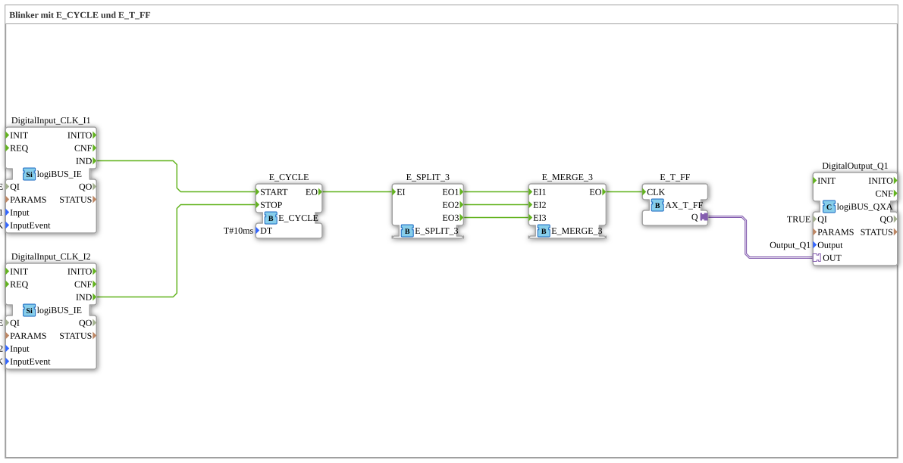

# Uebung_007c_AX: Blinker mit E_CYCLE und E_T_FF

This article describes the 4diac IDE sub-application Uebung_007c_AX (Blinker mit E_CYCLE und E_T_FF).

----

## Objective of the Exercise

The main objective of this exercise is to implement the following requirement: **Blinker mit E_CYCLE und E_T_FF**

-----

## Description and Components

The exercise consists of the sub-application Uebung_007c_AX.SUB, which uses the following function block structure:

### Instantiated Function Blocks (FBs)

- **DigitalOutput_Q1**: Instance of type logiBUS::io::DQ::logiBUS_QXA.
  - Parameter QI = TRUE
  - Parameter Output = Output_Q1
- **E_CYCLE**: Instance of type iec61499::events::E_CYCLE.
  - Parameter DT = T#10ms
- **E_T_FF**: Instance of type adapter::events::unidirectional::AX_T_FF.
- **E_SPLIT_3**: Instance of type iec61499::events::E_SPLIT_3.
- **E_MERGE_3**: Instance of type iec61499::events::E_MERGE_3.
- **DigitalInput_CLK_I2**: Instance of type logiBUS::io::DI::logiBUS_IE.
  - Parameter QI = TRUE
  - Parameter Input = Input_I2
  - Parameter InputEvent = BUTTON_SINGLE_CLICK
- **DigitalInput_CLK_I1**: Instance of type logiBUS::io::DI::logiBUS_IE.
  - Parameter QI = TRUE
  - Parameter Input = Input_I1
  - Parameter InputEvent = BUTTON_SINGLE_CLICK

### Connections and Interfaces

**Adapter Connections:**
- E_T_FF.Q -> DigitalOutput_Q1.OUT

**Event Connections:**
- E_MERGE_3.EO -> E_T_FF.CLK
- E_SPLIT_3.EO1 -> E_MERGE_3.EI1
- E_SPLIT_3.EO2 -> E_MERGE_3.EI2
- E_SPLIT_3.EO3 -> E_MERGE_3.EI3
- E_CYCLE.EO -> E_SPLIT_3.EI
- DigitalInput_CLK_I1.IND -> E_CYCLE.START
- DigitalInput_CLK_I2.IND -> E_CYCLE.STOP

-----

## Sequence and Operation

1. **Initialization**: Upon system startup, all participating function blocks are initialized.
2. **Event and Signal Processing**: State changes at the inputs trigger events that are forwarded to downstream function blocks across the defined connections.
3. **Output Update**: The receiving function blocks process incoming events and data values to update physical and logical outputs accordingly.

-----

## Summary

Exercise Uebung_007c_AX provides a clear demonstration of modular IEC 61499 application design in 4diac IDE.
