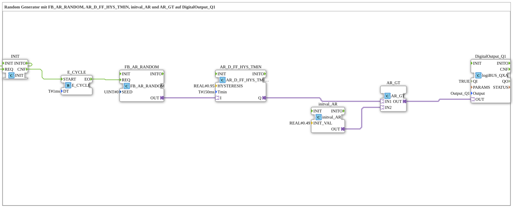

# Uebung_007d4_AX: Random Generator mit FB_AR_RANDOM, AR_D_FF_HYS_TMIN, initval_AR und AR_GT auf DigitalOutput_Q1

This article describes the 4diac IDE sub-application Uebung_007d4_AX (Random Generator mit FB_AR_RANDOM, AR_D_FF_HYS_TMIN, initval_AR und AR_GT auf DigitalOutput_Q1).

----

## Objective of the Exercise

The main objective of this exercise is to implement the following requirement: **Random Generator mit FB_AR_RANDOM, AR_D_FF_HYS_TMIN, initval_AR und AR_GT auf DigitalOutput_Q1**

-----

## Description and Components

The exercise consists of the sub-application Uebung_007d4_AX.SUB, which uses the following function block structure:

### Instantiated Function Blocks (FBs)

- **DigitalOutput_Q1**: Instance of type logiBUS::io::DQ::logiBUS_QXA.
  - Parameter QI = TRUE
  - Parameter Output = Output_Q1
- **E_CYCLE**: Instance of type iec61499::events::E_CYCLE.
  - Parameter DT = T#1ms
- **FB_AR_RANDOM**: Instance of type adapter::utils::FB_AR_RANDOM.
  - Parameter SEED = 0
- **AR_D_FF_HYS_TMIN**: Instance of type adapter::events::unidirectional::AR_D_FF_HYS_TMIN.
  - Parameter HYSTERESIS = REAL#0.95
  - Parameter Tmin = T#150ms
- **initval_AR**: Instance of type adapter::types::unidirectional::AR::initval::initval_AR.
  - Parameter INIT_VAL = REAL#0.49
- **AR_GT**: Instance of type adapter::iec61131::comparison::AR_GT.
- **INIT**: Instance of type iec61131::booleanOperators::INIT.

### Connections and Interfaces

**Adapter Connections:**

- FB_AR_RANDOM.OUT -> AR_D_FF_HYS_TMIN.I
- AR_D_FF_HYS_TMIN.Q -> AR_GT.IN1
- initval_AR.OUT -> AR_GT.IN2
- AR_GT.OUT -> DigitalOutput_Q1.OUT

**Event Connections:**

- INIT.INITO -> INIT.REQ
- INIT.CNF -> E_CYCLE.START
- E_CYCLE.EO -> FB_AR_RANDOM.REQ

-----

## Sequence and Operation

1. **Initialization**: Upon system startup, all participating function blocks are initialized.
2. **Event and Signal Processing**: State changes at the inputs trigger events that are forwarded to downstream function blocks across the defined connections.
3. **Output Update**: The receiving function blocks process incoming events and data values to update physical and logical outputs accordingly.

-----

## Summary

Exercise Uebung_007d4_AX provides a clear demonstration of modular IEC 61499 application design in 4diac IDE.
