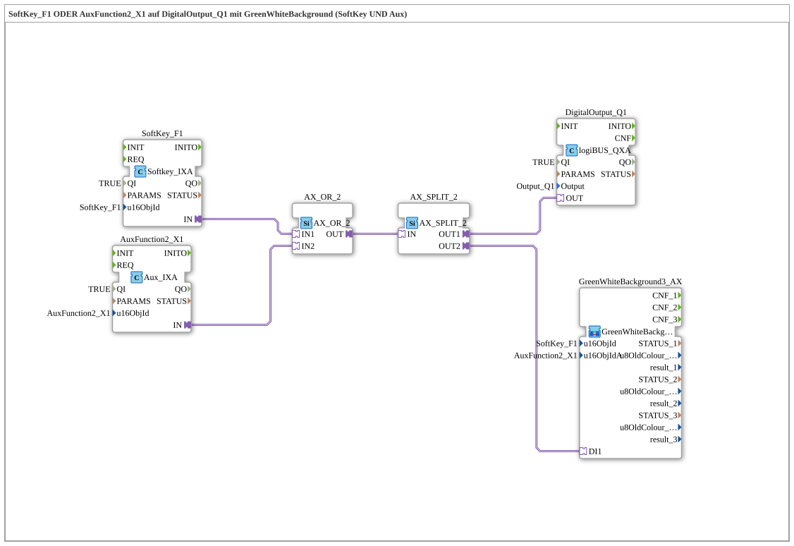

# Exercise_010f3_AX: SoftKey_F1 OR AuxFunction2_X1 on DigitalOutput_Q1 with GreenWhiteBackground

* * * * * * * * * *

## Introduction

This exercise combines `Uebung_010c_AX` (SoftKey with background color) and `Uebung_010f_AX` (Aux with background color) to a common output: the same function can be operated via both the VT softkey and the physical aux button/joystick. It demonstrates the correct, idiomatic solution for this combined case – for contrast, see the intentional negative solution `Uebung_010f4_AX`.

## Function Blocks (FBs) Used

- **SoftKey_F1**: VT SoftKey input (Type: `isobus::UT::io::Softkey::Softkey_IXA`)

- **Parameters**: `QI = TRUE`, `u16ObjId = SoftKey_F1`

- **Explanation**: Returns the Boolean state of the SoftKey as an AX adapter output `IN`.

**Function Blocks (FBs) Used
** - **AuxFunction2_X1**: Auxiliary input (Type: `isobus::UT::io::Auxiliary::IN::Aux_IXA`)

- **Parameters**: `QI = TRUE`, `u16ObjId = AuxFunction2_X1`

- **Explanation**: Returns the Boolean state of the assigned physical aux button/joystick as the AX adapter output `IN`.

- **AX_OR_2**: Adapter OR gate (Type: `adapter::booleanOperators::AX_OR_2`)

- **Parameters**: None

- **Explanation**: Combines the two AX signals from the soft key and aux button using OR to create a single signal for `DigitalOutput_Q1`.

- **AX_SPLIT_2**: Adapter signal distributor (Type: `adapter::events::unidirectional::AX_SPLIT_2`)

- **Parameters**: None

- **Description**: Distributes the OR-connected signal to two destinations: the physical output and the combined background color.

- **DigitalOutput_Q1**: logiBUS digital output (Type: `logiBUS::io::DQ::logiBUS_QXA`)

- **Parameters**: `QI = TRUE`, `Output = Output_Q1`

- **Description**: Switches the physical output `Q1` as soon as the SoftKey or Aux button is active.

### Sub-modules: GreenWhiteBackground3_AX

- **GreenWhiteBackground3_AX** (Type: `MyLib::sys::GreenWhiteBackground3_AX`)

- **Parameters**: `u16ObjId = SoftKey_F1`, `u16ObjIdA = AuxFunction2_X1`

- **Explanation**: Accepts exactly one normal VT object parameter (`u16ObjId` = SoftKey) AND one Aux object parameter (`u16ObjIdA` = Aux) simultaneously and sets both backgrounds from a single `DI1` input. Internally, it sends three commands (`Q_BackgroundColour` for the soft key, `Q_BackgroundColour` AND `Q_BackgroundColourAux` for the auxiliary function), so externally, a split to two destinations is sufficient instead of three.

## Program Flow and Connections

1. `SoftKey_F1.IN` → `AX_OR_2.IN1` and `AuxFunction2_X1.IN` → `AX_OR_2.IN2`: both controls each send an AX signal to the OR gate.

2. `AX_OR_2.OUT` → `AX_SPLIT_2.IN`: the combined signal is duplicated to two devices.

3. `AX_SPLIT_2.OUT1` → `DigitalOutput_Q1.OUT`: The physical output `Q1` switches ON as soon as the SoftKey OR Aux button is active.

4. `AX_SPLIT_2.OUT2` → `GreenWhiteBackground3_AX.DI1`: The same combined state simultaneously controls both background colors (SoftKey on the VT, Aux on the VT, and Aux handle).

## Summary

This exercise demonstrates how two different control element types (SoftKey and Aux) can control the same output using a common OR gate, and how the corresponding function block `GreenWhiteBackground3_AX` handles both feedback signals from a single `DI1` input and with a single `AX_SPLIT_2` – the resource-efficient and correct solution compared to the intentionally incorrect `Uebung_010f4_AX`.

---

### 🌐 Related topic subpages on ms-muc-docs.de

- [🌐 Eclipse 4diac IDE & color reference on ms-muc-docs.de ](https://www.ms-muc-docs.de/iec-61499/eclipse-4diac/)
