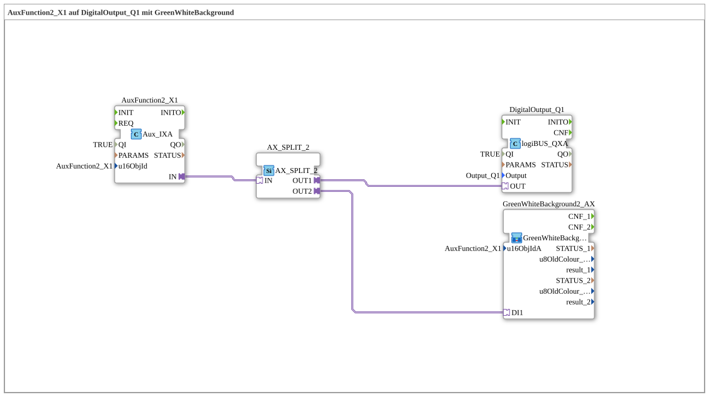

# Exercise_010f_AX: AuxFunction2_X1 on DigitalOutput_Q1 with GreenWhiteBackground

* * * * * * * * * *

## Introduction

This exercise extends `Uebung_010b1_AX`: In addition to controlling `DigitalOutput_Q1`, the state of `AuxFunction2_X1` is reported back as a background color (green = ON, white = OFF). It demonstrates how a single Aux adapter signal is distributed to two loads via `AX_SPLIT_2` and why the special function block `GreenWhiteBackground2_AX` is required for an Auxiliary Function Type 2 object.

## Function Blocks (FBs) Used

- **AuxFunction2_X1**: Auxiliary input (Type: `isobus::UT::io::Auxiliary::IN::Aux_IXA`)

- **Parameters**: `QI = TRUE`, `u16ObjId = AuxFunction2_X1`

- **Explanation**: Returns the Boolean state of the assigned physical aux button/joystick as the AX adapter output `IN`.

- **AX_SPLIT_2**: Adapter signal distributor (Type: `adapter::events::unidirectional::AX_SPLIT_2`)

- **Parameters**: None

- **Explanation**: Duplicates the single AX signal from `AuxFunction2_X1` losslessly to two destinations, since an adapter plug cannot be directly connected to multiple sockets.

- **DigitalOutput_Q1**: logiBUS digital output (Type: `logiBUS::io::DQ::logiBUS_QXA`)

- **Parameters**: `QI = TRUE`, `Output = Output_Q1`

- **Explanation**: Switches the physical output `Q1` according to the Aux signal.

### Sub-modules: GreenWhiteBackground2_AX

- **GreenWhiteBackground2_AX** (Type: `MyLib::sys::GreenWhiteBackground2_AX`)

- **Parameters**: `u16ObjIdA = AuxFunction2_X1`

- **Explanation**: Sets the background color (green/white) on both the VT screen and the aux handle (joystick). `GreenWhiteBackground2_AX` (not `GreenWhiteBackground1_AX`) is mandatory here because `AuxFunction2_X1` is an Auxiliary Function Type 2 object: its assignment is displayed in two separate locations and therefore must internally send both `Q_BackgroundColour` (VT screen) and `Q_BackgroundColourAux` (aux handle).

## Program Flow and Connections

1. `AuxFunction2_X1.IN` outputs an AX adapter signal every time the Aux button changes state.

2. This signal is received via `AX_SPLIT_2.IN` and duplicated on `OUT1`/`OUT2`.

3. `AX_SPLIT_2.OUT1` → `DigitalOutput_Q1.OUT`: the physical output `Q1` directly follows the Aux state.

4. `AX_SPLIT_2.OUT2` → `GreenWhiteBackground2_AX.DI1`: the same information simultaneously controls the background color on the VT screen and the Aux handle.

**Note from the network comment:** `AuxFunction2_X1` must be specified twice (once to `Aux_IXA.u16ObjId`, once to `GreenWhiteBackground2_AX.u16ObjIdA`) – this drawback is resolved in `Uebung_010f2_AX` by encapsulating it in its own sub-app.

## Summary

This exercise demonstrates the combination of the aux input, adapter signal distribution (`AX_SPLIT_2`), and the Auxiliary Function Type 2-specific background color feedback (`GreenWhiteBackground2_AX`), which simultaneously controls the VT screen and the aux handle. It forms the basis for the encapsulated version `Uebung_010f2_AX`.

---

### 🌐 Related topic subpages on ms-muc-docs.de

- [🌐 Eclipse 4diac IDE & Color Reference on ms-muc-docs.de](https://www.ms-muc-docs.de/iec-61499/eclipse-4diac/)
