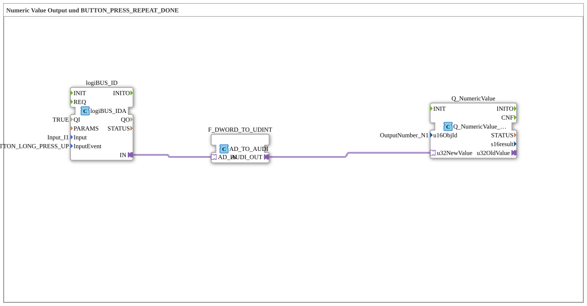

# Uebung_011a2_AX: Numeric Value Output und BUTTON_PRESS_REPEAT_DONE

This article describes the 4diac IDE sub-application Uebung_011a2_AX (Numeric Value Output und BUTTON_PRESS_REPEAT_DONE).

----

## Objective of the Exercise

The main objective of this exercise is to implement the following requirement: **Numeric Value Output und BUTTON_PRESS_REPEAT_DONE**

-----

## Description and Components

The exercise consists of the sub-application Uebung_011a2_AX.SUB, which uses the following function block structure:

### Instantiated Function Blocks (FBs)

- **Q_NumericValue**: Instance of type isobus::UT::Q::Q_NumericValue_AUDI.
  - Parameter u16ObjId = OutputNumber_N1
- **logiBUS_ID**: Instance of type logiBUS::io::DI::logiBUS_IDA.
  - Parameter QI = TRUE
  - Parameter Input = Input_I1
  - Parameter InputEvent = BUTTON_LONG_PRESS_UP
- **F_DWORD_TO_UDINT**: Instance of type adapter::conversion::unidirectional::AD_TO_AUDI.

### Connections and Interfaces

**Adapter Connections:**
- logiBUS_ID.IN -> F_DWORD_TO_UDINT.AD_IN
- F_DWORD_TO_UDINT.AUDI_OUT -> Q_NumericValue.u32NewValue

### Notes from the Model

> BUTTON_PRESS_UP
BUTTON_LONG_PRESS_HOLD
BUTTON_LONG_PRESS_UP

-----

## Sequence and Operation

1. **Initialization**: Upon system startup, all participating function blocks are initialized.
2. **Event and Signal Processing**: State changes at the inputs trigger events that are forwarded to downstream function blocks across the defined connections.
3. **Output Update**: The receiving function blocks process incoming events and data values to update physical and logical outputs accordingly.

-----

## Summary

Exercise Uebung_011a2_AX provides a clear demonstration of modular IEC 61499 application design in 4diac IDE.
