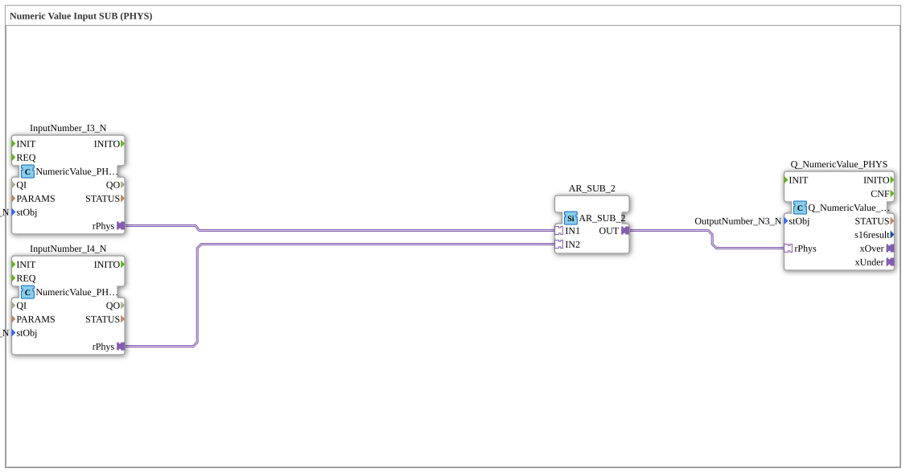

# Uebung_011b3_PHYS_AX: Numeric Value Input SUB (PHYS)

This article describes the 4diac IDE sub-application Uebung_011b3_PHYS_AX (Numeric Value Input SUB (PHYS)).

----

## Objective of the Exercise

The main objective of this exercise is to implement the following requirement: **Numeric Value Input SUB (PHYS)**

-----

## Description and Components

The exercise consists of the sub-application Uebung_011b3_PHYS_AX.SUB, which uses the following function block structure:

### Instantiated Function Blocks (FBs)

- **InputNumber_I3_N**: Instance of type isobus::UT::io::NumericValue::NumericValue_PHYSA.
  - Parameter stObj = InputNumber_I3_N
- **InputNumber_I4_N**: Instance of type isobus::UT::io::NumericValue::NumericValue_PHYSA.
  - Parameter stObj = InputNumber_I4_N
- **AR_SUB_2**: Instance of type adapter::iec61131::arithmetic::AR_SUB_2.
- **Q_NumericValue_PHYS**: Instance of type isobus::UT::Q::Q_NumericValue_PHYSA.
  - Parameter stObj = OutputNumber_N3_N

### Connections and Interfaces

**Adapter Connections:**

- InputNumber_I3_N.rPhys -> AR_SUB_2.IN1
- InputNumber_I4_N.rPhys -> AR_SUB_2.IN2
- AR_SUB_2.OUT -> Q_NumericValue_PHYS.rPhys

-----

## Sequence and Operation

1. **Initialization**: Upon system startup, all participating function blocks are initialized.
2. **Event and Signal Processing**: State changes at the inputs trigger events that are forwarded to downstream function blocks across the defined connections.
3. **Output Update**: The receiving function blocks process incoming events and data values to update physical and logical outputs accordingly.

-----

## Summary

Exercise Uebung_011b3_PHYS_AX provides a clear demonstration of modular IEC 61499 application design in 4diac IDE.
