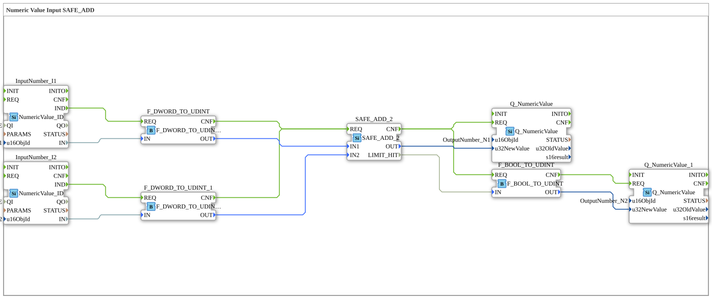

# Uebung_011b4_AX: Numeric Value Input SAFE_ADD

This article describes the 4diac IDE sub-application Uebung_011b4_AX (Numeric Value Input SAFE_ADD).

----

## Objective of the Exercise

The main objective of this exercise is to implement the following requirement: **Numeric Value Input SAFE_ADD**

-----

## Description and Components

The exercise consists of the sub-application Uebung_011b4_AX.SUB, which uses the following function block structure:

### Instantiated Function Blocks (FBs)

- **InputNumber_I1**: Instance of type isobus::UT::io::NumericValue::NumericValue_ID.
  - Parameter QI = TRUE
  - Parameter u16ObjId = InputNumber_I1
- **InputNumber_I2**: Instance of type isobus::UT::io::NumericValue::NumericValue_ID.
  - Parameter QI = TRUE
  - Parameter u16ObjId = InputNumber_I2
- **F_DWORD_TO_UDINT**: Instance of type iec61131::conversion::F_DWORD_TO_UDINT.
- **F_DWORD_TO_UDINT_1**: Instance of type iec61131::conversion::F_DWORD_TO_UDINT.
- **SAFE_ADD_2**: Instance of type SafeArithmetic::arithmetic::SAFE_ADD_2.
- **Q_NumericValue**: Instance of type isobus::UT::Q::Q_NumericValue.
  - Parameter u16ObjId = OutputNumber_N1
- **F_BOOL_TO_UDINT**: Instance of type iec61131::conversion::F_BOOL_TO_UDINT.
- **Q_NumericValue_1**: Instance of type isobus::UT::Q::Q_NumericValue.
  - Parameter u16ObjId = OutputNumber_N2

### Connections and Interfaces

**Event Connections:**
- InputNumber_I1.IND -> F_DWORD_TO_UDINT.REQ
- InputNumber_I2.IND -> F_DWORD_TO_UDINT_1.REQ
- F_DWORD_TO_UDINT.CNF -> SAFE_ADD_2.REQ
- F_DWORD_TO_UDINT_1.CNF -> SAFE_ADD_2.REQ
- SAFE_ADD_2.CNF -> Q_NumericValue.REQ
- SAFE_ADD_2.CNF -> F_BOOL_TO_UDINT.REQ
- F_BOOL_TO_UDINT.CNF -> Q_NumericValue_1.REQ

**Data Connections:**
- InputNumber_I1.IN -> F_DWORD_TO_UDINT.IN
- InputNumber_I2.IN -> F_DWORD_TO_UDINT_1.IN
- F_DWORD_TO_UDINT.OUT -> SAFE_ADD_2.IN1
- F_DWORD_TO_UDINT_1.OUT -> SAFE_ADD_2.IN2
- SAFE_ADD_2.OUT -> Q_NumericValue.u32NewValue
- SAFE_ADD_2.LIMIT_HIT -> F_BOOL_TO_UDINT.IN
- F_BOOL_TO_UDINT.OUT -> Q_NumericValue_1.u32NewValue

-----

## Sequence and Operation

1. **Initialization**: Upon system startup, all participating function blocks are initialized.
2. **Event and Signal Processing**: State changes at the inputs trigger events that are forwarded to downstream function blocks across the defined connections.
3. **Output Update**: The receiving function blocks process incoming events and data values to update physical and logical outputs accordingly.

-----

## Summary

Exercise Uebung_011b4_AX provides a clear demonstration of modular IEC 61499 application design in 4diac IDE.
