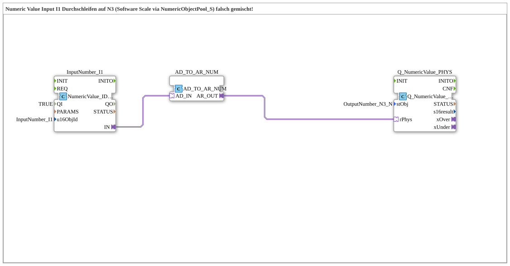

# Uebung_011e_MIX_AX: Numeric Value Input I1 Durchschleifen auf N3 (Software Scale via NumericObjectPool_S) falsch gemischt!

This article describes the 4diac IDE sub-application Uebung_011e_MIX_AX (Numeric Value Input I1 Durchschleifen auf N3 (Software Scale via NumericObjectPool_S) falsch gemischt!).

----

## Objective of the Exercise

The main objective of this exercise is to implement the following requirement: **Numeric Value Input I1 Durchschleifen auf N3 (Software Scale via NumericObjectPool_S) falsch gemischt!**

-----

## Description and Components

The exercise consists of the sub-application Uebung_011e_MIX_AX.SUB, which uses the following function block structure:

### Instantiated Function Blocks (FBs)

- **InputNumber_I1**: Instance of type isobus::UT::io::NumericValue::NumericValue_IDA.
  - Parameter QI = TRUE
  - Parameter u16ObjId = InputNumber_I1
- **AD_TO_AR_NUM**: Instance of type adapter::conversion::unidirectional::AD_TO_AR_NUM.
- **Q_NumericValue_PHYS**: Instance of type isobus::UT::Q::Q_NumericValue_PHYSA.
  - Parameter stObj = OutputNumber_N3_N

### Connections and Interfaces

**Adapter Connections:**
- InputNumber_I1.IN -> AD_TO_AR_NUM.AD_IN
- AD_TO_AR_NUM.AR_OUT -> Q_NumericValue_PHYS.rPhys

### Notes from the Model

> Beispiel: I1-Eingabe 10 → F_RAW_TO_PHYS(I1) → 10.0 → Q_NumericValue_PHYS(N3) → N3 zeigt 10.00.

die beiden Namespaces sind INKOMPATIBEL !!!
> Uebungen::const::UT::DefaultPool::InputNumber_I1
> Uebungen::const::UT::DefaultPool_Numeric::OutputNumber_N3_N

-----

## Sequence and Operation

1. **Initialization**: Upon system startup, all participating function blocks are initialized.
2. **Event and Signal Processing**: State changes at the inputs trigger events that are forwarded to downstream function blocks across the defined connections.
3. **Output Update**: The receiving function blocks process incoming events and data values to update physical and logical outputs accordingly.

-----

## Summary

Exercise Uebung_011e_MIX_AX provides a clear demonstration of modular IEC 61499 application design in 4diac IDE.
