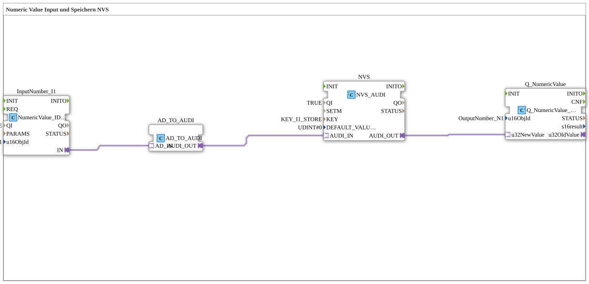

# Uebung_012_AX: Numeric Value Input und Speichern NVS

This article describes the 4diac IDE sub-application Uebung_012_AX (Numeric Value Input und Speichern NVS).

----

## Objective of the Exercise

The main objective of this exercise is to implement the following requirement: **Numeric Value Input und Speichern NVS**

-----

## Description and Components

The exercise consists of the sub-application Uebung_012_AX.SUB, which uses the following function block structure:

### Instantiated Function Blocks (FBs)

- **InputNumber_I1**: Instance of type isobus::UT::io::NumericValue::NumericValue_IDA.
  - Parameter QI = TRUE
  - Parameter u16ObjId = InputNumber_I1
- **AD_TO_AUDI**: Instance of type adapter::conversion::unidirectional::AD_TO_AUDI.
- **NVS**: Instance of type logiBUS::storage::esp32_nvs::NVS_AUDI.
  - Parameter QI = TRUE
  - Parameter KEY = KEY_I1_STORE
  - Parameter DEFAULT_VALUE = UDINT#0
- **Q_NumericValue**: Instance of type isobus::UT::Q::Q_NumericValue_AUDI.
  - Parameter u16ObjId = OutputNumber_N1

### Connections and Interfaces

**Adapter Connections:**

- InputNumber_I1.IN -> AD_TO_AUDI.AD_IN
- AD_TO_AUDI.AUDI_OUT -> NVS.AUDI_IN
- NVS.AUDI_OUT -> Q_NumericValue.u32NewValue

-----

## Sequence and Operation

1. **Initialization**: Upon system startup, all participating function blocks are initialized.
2. **Event and Signal Processing**: State changes at the inputs trigger events that are forwarded to downstream function blocks across the defined connections.
3. **Output Update**: The receiving function blocks process incoming events and data values to update physical and logical outputs accordingly.

-----

## Summary

Exercise Uebung_012_AX provides a clear demonstration of modular IEC 61499 application design in 4diac IDE.
