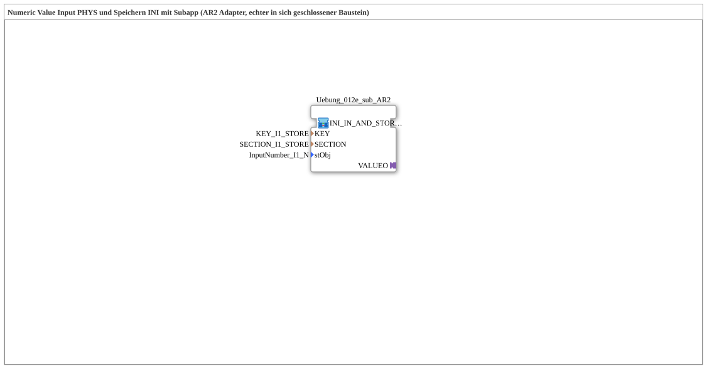

# Uebung_012e_AR2: Numeric Value Input via VT, Persisted to INI via AR2 via Subapp

This article describes the logiBUS® exercise `Uebung_012e_AR2`. Part of a series of exercises (`Uebung_012d_AR2` through `Uebung_012o_AR2`) demonstrating different combinations of input source (VT field, OPC-UA, or both) and storage target (NVS flash or INI file) via the bidirectional `AR2` adapter.

----

## Goal of the Exercise

Accept a numeric value from a VT numeric field (`NumericValue_TO_AR2`) and persist it an INI file - using the bidirectional AR2 adapter (as a ready-made encapsulated subapp).

-----

## Description and Components

- **`INI_IN_AND_STORE_AR2 (Subapp)`**: encapsulates VT/OPC-UA input, the AR2 adapter, and persistence an INI file as a single, self-contained block - the internal wiring isn't visible as a separate FB network, it's fully encapsulated inside the block itself.

-----

## Behavior

The numeric value, coming from a VT numeric field (`NumericValue_TO_AR2`), is processed internally by `INI_IN_AND_STORE_AR2 (Subapp)` and persisted an INI file, without the individual processing steps appearing as separate FB instances in this subapplication.
