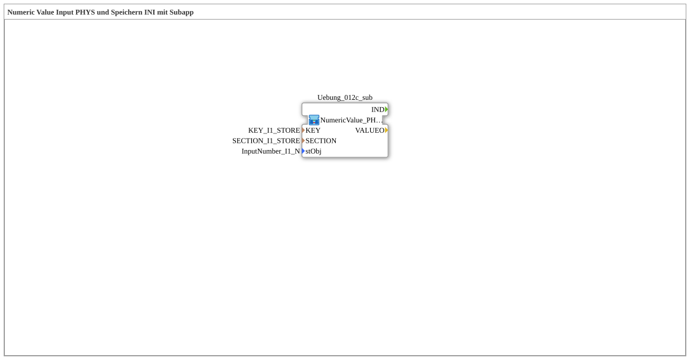

# Uebung_012e_AX: Numeric Value Input PHYS und Speichern INI mit Subapp

This article describes the 4diac IDE sub-application Uebung_012e_AX (Numeric Value Input PHYS und Speichern INI mit Subapp).

----

## Objective of the Exercise

The main objective of this exercise is to implement the following requirement: **Numeric Value Input PHYS und Speichern INI mit Subapp**

-----

## Description and Components

The exercise consists of the sub-application Uebung_012e_AX.SUB, which uses the following function block structure:

-----

## Sequence and Operation

1. **Initialization**: Upon system startup, all participating function blocks are initialized.
2. **Signal Forwarding**: Function blocks process control and data signals according to their configuration.

-----

## Summary

Exercise Uebung_012e_AX provides a clear demonstration of modular IEC 61499 application design in 4diac IDE.
