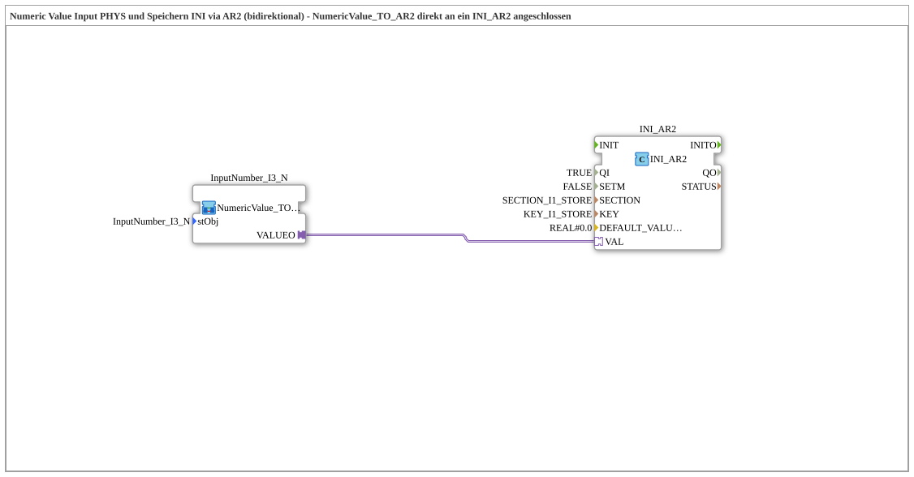

# Uebung_012g_AR2: Numeric Value Input via VT, Persisted to INI via AR2 (bidirectional, direct)

This article describes the logiBUS® exercise `Uebung_012g_AR2`. Part of a series of exercises (`Uebung_012d_AR2` through `Uebung_012o_AR2`) demonstrating different combinations of input source (VT field, OPC-UA, or both) and storage target (NVS flash or INI file) via the bidirectional `AR2` adapter.

----

## Goal of the Exercise

Accept a numeric value from a VT numeric field (`NumericValue_TO_AR2`) and persist it an INI file - using the bidirectional AR2 adapter (wired directly, no subapp encapsulation).

-----

## Description and Components

- **`INI_AR2`**: `eclipse4diac::storage::INI_AR2`, bidirectional AR2 adapter block that persists the value directly.

-----

## Behavior

The numeric value, coming from a VT numeric field (`NumericValue_TO_AR2`), is passed directly through the bidirectional `AR2` adapter to `INI_AR2`, which persists it an INI file - with no intermediate subapp.
