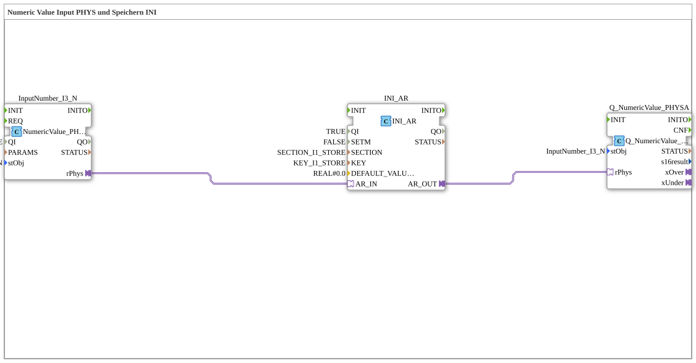

# Uebung_012g_AX: Numeric Value Input PHYS und Speichern INI

This article describes the 4diac IDE sub-application Uebung_012g_AX (Numeric Value Input PHYS und Speichern INI).

----

## Objective of the Exercise

The main objective of this exercise is to implement the following requirement: **Numeric Value Input PHYS und Speichern INI**

-----

## Description and Components

The exercise consists of the sub-application Uebung_012g_AX.SUB, which uses the following function block structure:

### Instantiated Function Blocks (FBs)

- **InputNumber_I3_N**: Instance of type isobus::UT::io::NumericValue::NumericValue_PHYSA.
  - Parameter QI = TRUE
  - Parameter stObj = InputNumber_I3_N
- **INI_AR**: Instance of type eclipse4diac::storage::INI_AR.
  - Parameter QI = TRUE
  - Parameter SETM = FALSE
  - Parameter SECTION = SECTION_I1_STORE
  - Parameter KEY = KEY_I1_STORE
  - Parameter DEFAULT_VALUE = REAL#0.0
- **Q_NumericValue_PHYSA**: Instance of type isobus::UT::Q::Q_NumericValue_PHYSA.
  - Parameter stObj = InputNumber_I3_N

### Connections and Interfaces

**Adapter Connections:**

- INI_AR.AR_OUT -> Q_NumericValue_PHYSA.rPhys
- InputNumber_I3_N.rPhys -> INI_AR.AR_IN

-----

## Sequence and Operation

1. **Initialization**: Upon system startup, all participating function blocks are initialized.
2. **Event and Signal Processing**: State changes at the inputs trigger events that are forwarded to downstream function blocks across the defined connections.
3. **Output Update**: The receiving function blocks process incoming events and data values to update physical and logical outputs accordingly.

-----

## Summary

Exercise Uebung_012g_AX provides a clear demonstration of modular IEC 61499 application design in 4diac IDE.
