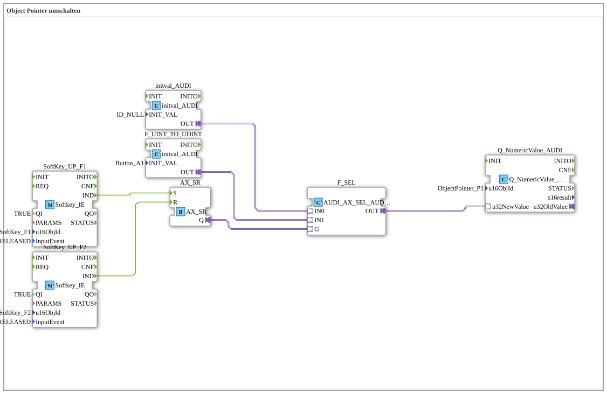

# Uebung_015_AX: Object Pointer umschalten

This article describes the 4diac IDE sub-application Uebung_015_AX (Object Pointer umschalten).

----

## Objective of the Exercise

The main objective of this exercise is to implement the following requirement: **Object Pointer umschalten**

-----

## Description and Components

The exercise consists of the sub-application Uebung_015_AX.SUB, which uses the following function block structure:

### Instantiated Function Blocks (FBs)

- **SoftKey_UP_F1**: Instance of type isobus::UT::io::Softkey::Softkey_IE.
  - Parameter QI = TRUE
  - Parameter u16ObjId = SoftKey_F1
  - Parameter InputEvent = SK_RELEASED
- **SoftKey_UP_F2**: Instance of type isobus::UT::io::Softkey::Softkey_IE.
  - Parameter QI = TRUE
  - Parameter u16ObjId = SoftKey_F2
  - Parameter InputEvent = SK_RELEASED
- **AX_SR**: Instance of type adapter::events::unidirectional::AX_SR.
- **F_UINT_TO_UDINT**: Instance of type adapter::types::unidirectional::AUDI::initval::initval_AUDI.
  - Parameter INIT_VAL = Button_A1
- **F_SEL**: Instance of type adapter::iec61131::selection::AUDI_AX_SEL_AUDI.
- **Q_NumericValue_AUDI**: Instance of type isobus::UT::Q::Q_NumericValue_AUDI.
  - Parameter u16ObjId = ObjectPointer_P1
- **initval_AUDI**: Instance of type adapter::types::unidirectional::AUDI::initval::initval_AUDI.
  - Parameter INIT_VAL = ID_NULL

### Connections and Interfaces

**Adapter Connections:**
- F_UINT_TO_UDINT.OUT -> F_SEL.IN1
- AX_SR.Q -> F_SEL.G
- initval_AUDI.OUT -> F_SEL.IN0
- F_SEL.OUT -> Q_NumericValue_AUDI.u32NewValue

**Event Connections:**
- SoftKey_UP_F1.IND -> AX_SR.S
- SoftKey_UP_F2.IND -> AX_SR.R

-----

## Sequence and Operation

1. **Initialization**: Upon system startup, all participating function blocks are initialized.
2. **Event and Signal Processing**: State changes at the inputs trigger events that are forwarded to downstream function blocks across the defined connections.
3. **Output Update**: The receiving function blocks process incoming events and data values to update physical and logical outputs accordingly.

-----

## Summary

Exercise Uebung_015_AX provides a clear demonstration of modular IEC 61499 application design in 4diac IDE.
