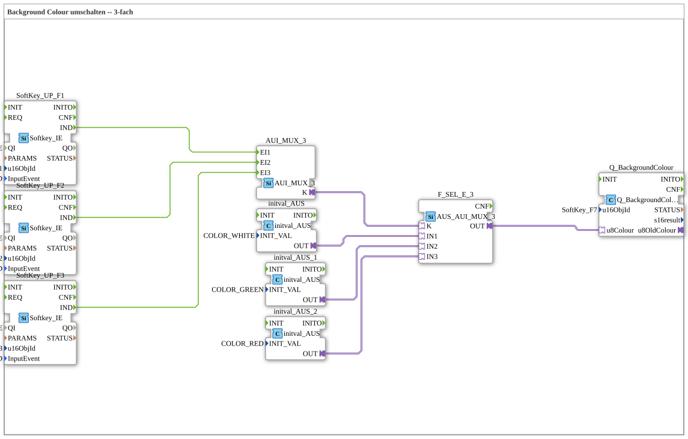

# Uebung_016a_AX: Background Colour umschalten -- 3-fach

This article describes the 4diac IDE sub-application Uebung_016a_AX (Background Colour umschalten -- 3-fach).

----

## Objective of the Exercise

The main objective of this exercise is to implement the following requirement: **Background Colour umschalten -- 3-fach**

-----

## Description and Components

The exercise consists of the sub-application Uebung_016a_AX.SUB, which uses the following function block structure:

### Instantiated Function Blocks (FBs)

- **SoftKey_UP_F1**: Instance of type isobus::UT::io::Softkey::Softkey_IE.
  - Parameter QI = TRUE
  - Parameter u16ObjId = SoftKey_F1
  - Parameter InputEvent = SK_RELEASED
- **SoftKey_UP_F2**: Instance of type isobus::UT::io::Softkey::Softkey_IE.
  - Parameter QI = TRUE
  - Parameter u16ObjId = SoftKey_F2
  - Parameter InputEvent = SK_RELEASED
- **SoftKey_UP_F3**: Instance of type isobus::UT::io::Softkey::Softkey_IE.
  - Parameter QI = TRUE
  - Parameter u16ObjId = SoftKey_F3
  - Parameter InputEvent = SK_RELEASED
- **F_SEL_E_3**: Instance of type adapter::selection::unidirectional::AUS_AUI_MUX_3.
- **Q_BackgroundColour**: Instance of type isobus::UT::Q::Q_BackgroundColour_AUS.
  - Parameter u16ObjId = SoftKey_F7
- **initval_AUS**: Instance of type adapter::types::unidirectional::AUS::initval::initval_AUS.
  - Parameter INIT_VAL = COLOR_WHITE
- **initval_AUS_1**: Instance of type adapter::types::unidirectional::AUS::initval::initval_AUS.
  - Parameter INIT_VAL = COLOR_GREEN
- **initval_AUS_2**: Instance of type adapter::types::unidirectional::AUS::initval::initval_AUS.
  - Parameter INIT_VAL = COLOR_RED
- **AUI_MUX_3**: Instance of type adapter::events::unidirectional::AUI_MUX_3.

### Connections and Interfaces

**Adapter Connections:**
- F_SEL_E_3.OUT -> Q_BackgroundColour.u8Colour
- initval_AUS.OUT -> F_SEL_E_3.IN1
- initval_AUS_1.OUT -> F_SEL_E_3.IN2
- initval_AUS_2.OUT -> F_SEL_E_3.IN3
- AUI_MUX_3.K -> F_SEL_E_3.K

**Event Connections:**
- SoftKey_UP_F1.IND -> AUI_MUX_3.EI1
- SoftKey_UP_F2.IND -> AUI_MUX_3.EI2
- SoftKey_UP_F3.IND -> AUI_MUX_3.EI3

-----

## Sequence and Operation

1. **Initialization**: Upon system startup, all participating function blocks are initialized.
2. **Event and Signal Processing**: State changes at the inputs trigger events that are forwarded to downstream function blocks across the defined connections.
3. **Output Update**: The receiving function blocks process incoming events and data values to update physical and logical outputs accordingly.

-----

## Summary

Exercise Uebung_016a_AX provides a clear demonstration of modular IEC 61499 application design in 4diac IDE.
