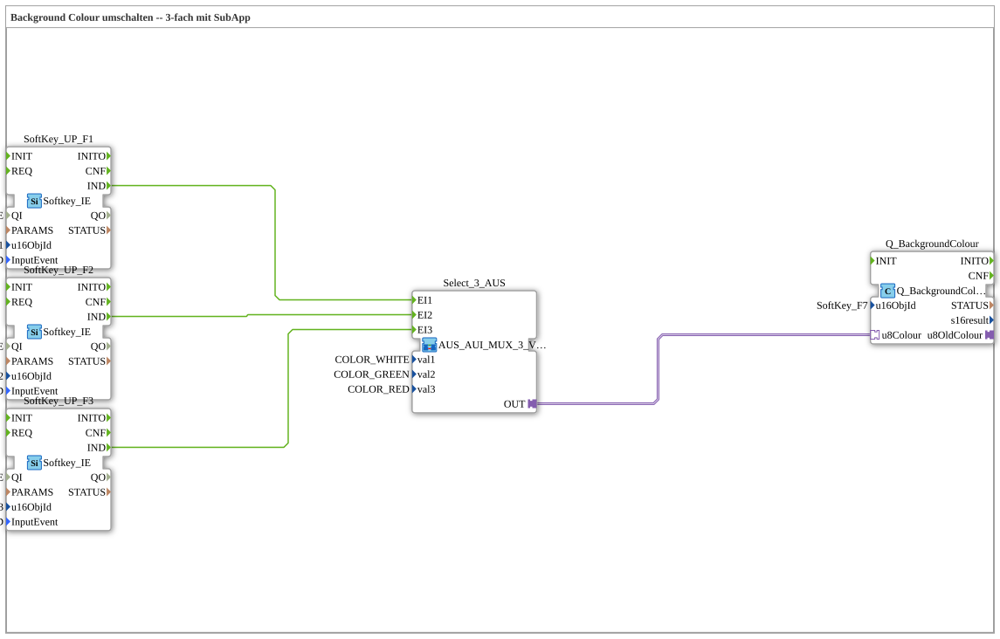

# Uebung_016b_AX: Background Colour umschalten -- 3-fach mit SubApp

This article describes the 4diac IDE sub-application Uebung_016b_AX (Background Colour umschalten -- 3-fach mit SubApp).

----

## Objective of the Exercise

The main objective of this exercise is to implement the following requirement: **Background Colour umschalten -- 3-fach mit SubApp**

-----

## Description and Components

The exercise consists of the sub-application Uebung_016b_AX.SUB, which uses the following function block structure:

### Instantiated Function Blocks (FBs)

- **SoftKey_UP_F1**: Instance of type isobus::UT::io::Softkey::Softkey_IE.
  - Parameter QI = TRUE
  - Parameter u16ObjId = SoftKey_F1
  - Parameter InputEvent = SK_RELEASED
- **SoftKey_UP_F2**: Instance of type isobus::UT::io::Softkey::Softkey_IE.
  - Parameter QI = TRUE
  - Parameter u16ObjId = SoftKey_F2
  - Parameter InputEvent = SK_RELEASED
- **SoftKey_UP_F3**: Instance of type isobus::UT::io::Softkey::Softkey_IE.
  - Parameter QI = TRUE
  - Parameter u16ObjId = SoftKey_F3
  - Parameter InputEvent = SK_RELEASED
- **Q_BackgroundColour**: Instance of type isobus::UT::Q::Q_BackgroundColour_AUS.
  - Parameter u16ObjId = SoftKey_F7

### Connections and Interfaces

**Adapter Connections:**
- Select_3_AUS.OUT -> Q_BackgroundColour.u8Colour

**Event Connections:**
- SoftKey_UP_F1.IND -> Select_3_AUS.EI1
- SoftKey_UP_F2.IND -> Select_3_AUS.EI2
- SoftKey_UP_F3.IND -> Select_3_AUS.EI3

-----

## Sequence and Operation

1. **Initialization**: Upon system startup, all participating function blocks are initialized.
2. **Event and Signal Processing**: State changes at the inputs trigger events that are forwarded to downstream function blocks across the defined connections.
3. **Output Update**: The receiving function blocks process incoming events and data values to update physical and logical outputs accordingly.

-----

## Summary

Exercise Uebung_016b_AX provides a clear demonstration of modular IEC 61499 application design in 4diac IDE.
