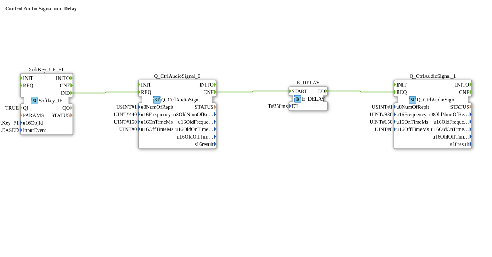

# Uebung_018_AX: Control Audio Signal und Delay

This article describes the 4diac IDE sub-application Uebung_018_AX (Control Audio Signal und Delay).

----

## Objective of the Exercise

The main objective of this exercise is to implement the following requirement: **Control Audio Signal und Delay**

-----

## Description and Components

The exercise consists of the sub-application Uebung_018_AX.SUB, which uses the following function block structure:

### Instantiated Function Blocks (FBs)

- **SoftKey_UP_F1**: Instance of type isobus::UT::io::Softkey::Softkey_IE.
  - Parameter QI = TRUE
  - Parameter u16ObjId = SoftKey_F1
  - Parameter InputEvent = SK_RELEASED
- **Q_CtrlAudioSignal_0**: Instance of type isobus::UT::Q::Q_CtrlAudioSignal.
  - Parameter u8NumOfRepit = 1
  - Parameter u16Frequency = 440
  - Parameter u16OnTimeMs = 150
  - Parameter u16OffTimeMs = 0
- **Q_CtrlAudioSignal_1**: Instance of type isobus::UT::Q::Q_CtrlAudioSignal.
  - Parameter u8NumOfRepit = 1
  - Parameter u16Frequency = 880
  - Parameter u16OnTimeMs = 150
  - Parameter u16OffTimeMs = 0
- **E_DELAY**: Instance of type iec61499::events::E_DELAY.
  - Parameter DT = T#250ms

### Connections and Interfaces

**Event Connections:**

- SoftKey_UP_F1.IND -> Q_CtrlAudioSignal_0.REQ
- E_DELAY.EO -> Q_CtrlAudioSignal_1.REQ
- Q_CtrlAudioSignal_0.CNF -> E_DELAY.START

-----

## Sequence and Operation

1. **Initialization**: Upon system startup, all participating function blocks are initialized.
2. **Event and Signal Processing**: State changes at the inputs trigger events that are forwarded to downstream function blocks across the defined connections.
3. **Output Update**: The receiving function blocks process incoming events and data values to update physical and logical outputs accordingly.

-----

## Summary

Exercise Uebung_018_AX provides a clear demonstration of modular IEC 61499 application design in 4diac IDE.
