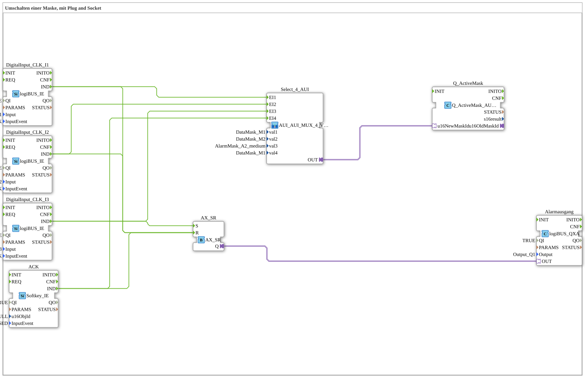

# Uebung_019b_AX: Umschalten einer Maske, mit Plug and Socket

This article describes the 4diac IDE sub-application Uebung_019b_AX (Umschalten einer Maske, mit Plug and Socket).

----

## Objective of the Exercise

The main objective of this exercise is to implement the following requirement: **Umschalten einer Maske, mit Plug and Socket**

-----

## Description and Components

The exercise consists of the sub-application Uebung_019b_AX.SUB, which uses the following function block structure:

### Instantiated Function Blocks (FBs)

- **DigitalInput_CLK_I1**: Instance of type logiBUS::io::DI::logiBUS_IE.
  - Parameter QI = TRUE
  - Parameter Input = Input_I1
  - Parameter InputEvent = BUTTON_SINGLE_CLICK
- **DigitalInput_CLK_I2**: Instance of type logiBUS::io::DI::logiBUS_IE.
  - Parameter QI = TRUE
  - Parameter Input = Input_I2
  - Parameter InputEvent = BUTTON_SINGLE_CLICK
- **DigitalInput_CLK_I3**: Instance of type logiBUS::io::DI::logiBUS_IE.
  - Parameter QI = TRUE
  - Parameter Input = Input_I3
  - Parameter InputEvent = BUTTON_SINGLE_CLICK
- **ACK**: Instance of type isobus::UT::io::Softkey::Softkey_IE.
  - Parameter QI = TRUE
  - Parameter u16ObjId = ID_NULL
  - Parameter InputEvent = SK_PRESSED
- **Q_ActiveMask**: Instance of type isobus::UT::Q::Q_ActiveMask_AUI.
- **AX_SR**: Instance of type adapter::events::unidirectional::AX_SR.
- **Alarmausgang**: Instance of type logiBUS::io::DQ::logiBUS_QXA.
  - Parameter QI = TRUE
  - Parameter Output = Output_Q1

### Connections and Interfaces

**Adapter Connections:**
- Select_4_AUI.OUT -> Q_ActiveMask.u16NewMaskId
- AX_SR.Q -> Alarmausgang.OUT

**Event Connections:**
- DigitalInput_CLK_I1.IND -> Select_4_AUI.EI1
- DigitalInput_CLK_I2.IND -> Select_4_AUI.EI2
- DigitalInput_CLK_I3.IND -> Select_4_AUI.EI3
- ACK.IND -> Select_4_AUI.EI4
- DigitalInput_CLK_I3.IND -> AX_SR.S
- DigitalInput_CLK_I2.IND -> AX_SR.R
- DigitalInput_CLK_I1.IND -> AX_SR.R
- ACK.IND -> AX_SR.R

-----

## Sequence and Operation

1. **Initialization**: Upon system startup, all participating function blocks are initialized.
2. **Event and Signal Processing**: State changes at the inputs trigger events that are forwarded to downstream function blocks across the defined connections.
3. **Output Update**: The receiving function blocks process incoming events and data values to update physical and logical outputs accordingly.

-----

## Summary

Exercise Uebung_019b_AX provides a clear demonstration of modular IEC 61499 application design in 4diac IDE.
