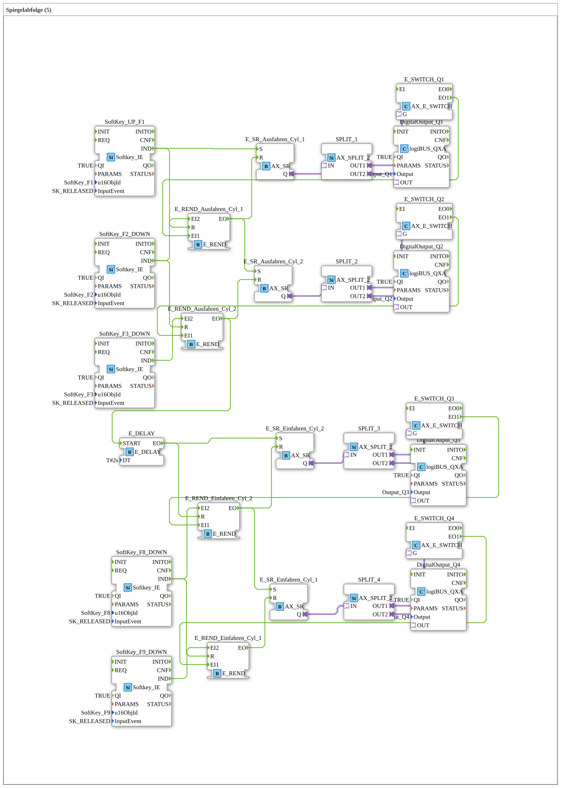

# Uebung_025_AX: Spiegelabfolge (5)

This article describes the 4diac IDE sub-application Uebung_025_AX (Spiegelabfolge (5)).

----

## Objective of the Exercise

The main objective of this exercise is to implement the following requirement: **Spiegelabfolge (5)**

-----

## Description and Components

The exercise consists of the sub-application Uebung_025_AX.SUB, which uses the following function block structure:

### Instantiated Function Blocks (FBs)

- **DigitalOutput_Q1**: Instance of type logiBUS::io::DQ::logiBUS_QXA.
  - Parameter QI = TRUE
  - Parameter Output = Output_Q1
- **SoftKey_UP_F1**: Instance of type isobus::UT::io::Softkey::Softkey_IE.
  - Parameter QI = TRUE
  - Parameter u16ObjId = SoftKey_F1
  - Parameter InputEvent = SK_RELEASED
- **E_SR_Ausfahren_Cyl_1**: Instance of type adapter::events::unidirectional::AX_SR.
- **SoftKey_F2_DOWN**: Instance of type isobus::UT::io::Softkey::Softkey_IE.
  - Parameter QI = TRUE
  - Parameter u16ObjId = SoftKey_F2
  - Parameter InputEvent = SK_RELEASED
- **DigitalOutput_Q2**: Instance of type logiBUS::io::DQ::logiBUS_QXA.
  - Parameter QI = TRUE
  - Parameter Output = Output_Q2
- **E_SR_Ausfahren_Cyl_2**: Instance of type adapter::events::unidirectional::AX_SR.
- **SoftKey_F3_DOWN**: Instance of type isobus::UT::io::Softkey::Softkey_IE.
  - Parameter QI = TRUE
  - Parameter u16ObjId = SoftKey_F3
  - Parameter InputEvent = SK_RELEASED
- **SoftKey_F9_DOWN**: Instance of type isobus::UT::io::Softkey::Softkey_IE.
  - Parameter QI = TRUE
  - Parameter u16ObjId = SoftKey_F9
  - Parameter InputEvent = SK_RELEASED
- **E_SR_Einfahren_Cyl_2**: Instance of type adapter::events::unidirectional::AX_SR.
- **DigitalOutput_Q3**: Instance of type logiBUS::io::DQ::logiBUS_QXA.
  - Parameter QI = TRUE
  - Parameter Output = Output_Q3
- **DigitalOutput_Q4**: Instance of type logiBUS::io::DQ::logiBUS_QXA.
  - Parameter QI = TRUE
  - Parameter Output = Output_Q4
- **E_SR_Einfahren_Cyl_1**: Instance of type adapter::events::unidirectional::AX_SR.
- **SoftKey_F8_DOWN**: Instance of type isobus::UT::io::Softkey::Softkey_IE.
  - Parameter QI = TRUE
  - Parameter u16ObjId = SoftKey_F8
  - Parameter InputEvent = SK_RELEASED
- **E_DELAY**: Instance of type iec61499::events::E_DELAY.
  - Parameter DT = T#2s
- **E_REND_Ausfahren_Cyl_1**: Instance of type iec61499::events::E_REND.
- **E_REND_Ausfahren_Cyl_2**: Instance of type iec61499::events::E_REND.
- **E_REND_Einfahren_Cyl_2**: Instance of type iec61499::events::E_REND.
- **E_REND_Einfahren_Cyl_1**: Instance of type iec61499::events::E_REND.
- **E_SWITCH_Q1**: Instance of type adapter::events::unidirectional::AX_E_SWITCH.
- **E_SWITCH_Q2**: Instance of type adapter::events::unidirectional::AX_E_SWITCH.
- **E_SWITCH_Q3**: Instance of type adapter::events::unidirectional::AX_E_SWITCH.
- **E_SWITCH_Q4**: Instance of type adapter::events::unidirectional::AX_E_SWITCH.
- **SPLIT_1**: Instance of type adapter::events::unidirectional::AX_SPLIT_2.
- **SPLIT_2**: Instance of type adapter::events::unidirectional::AX_SPLIT_2.
- **SPLIT_3**: Instance of type adapter::events::unidirectional::AX_SPLIT_2.
- **SPLIT_4**: Instance of type adapter::events::unidirectional::AX_SPLIT_2.

### Connections and Interfaces

**Adapter Connections:**
- E_SR_Ausfahren_Cyl_1.Q -> SPLIT_1.IN
- SPLIT_1.OUT1 -> DigitalOutput_Q1.OUT
- SPLIT_1.OUT2 -> E_SWITCH_Q1.G
- E_SR_Ausfahren_Cyl_2.Q -> SPLIT_2.IN
- SPLIT_2.OUT1 -> DigitalOutput_Q2.OUT
- SPLIT_2.OUT2 -> E_SWITCH_Q2.G
- E_SR_Einfahren_Cyl_2.Q -> SPLIT_3.IN
- SPLIT_3.OUT1 -> DigitalOutput_Q3.OUT
- SPLIT_3.OUT2 -> E_SWITCH_Q3.G
- E_SR_Einfahren_Cyl_1.Q -> SPLIT_4.IN
- SPLIT_4.OUT1 -> DigitalOutput_Q4.OUT
- SPLIT_4.OUT2 -> E_SWITCH_Q4.G

**Event Connections:**
- SoftKey_UP_F1.IND -> E_SR_Ausfahren_Cyl_1.S
- E_DELAY.EO -> E_SR_Einfahren_Cyl_2.S
- E_REND_Ausfahren_Cyl_1.EO -> E_SR_Ausfahren_Cyl_1.R
- E_REND_Ausfahren_Cyl_1.EO -> E_SR_Ausfahren_Cyl_2.S
- SoftKey_F2_DOWN.IND -> E_REND_Ausfahren_Cyl_1.EI2
- SoftKey_F3_DOWN.IND -> E_REND_Ausfahren_Cyl_2.EI2
- E_REND_Ausfahren_Cyl_2.EO -> E_SR_Ausfahren_Cyl_2.R
- E_REND_Einfahren_Cyl_1.EO -> E_SR_Einfahren_Cyl_1.R
- SoftKey_F9_DOWN.IND -> E_REND_Einfahren_Cyl_1.EI2
- E_REND_Einfahren_Cyl_2.EO -> E_SR_Einfahren_Cyl_1.S
- E_REND_Einfahren_Cyl_2.EO -> E_SR_Einfahren_Cyl_2.R
- SoftKey_F8_DOWN.IND -> E_REND_Einfahren_Cyl_2.EI2
- E_REND_Ausfahren_Cyl_2.EO -> E_DELAY.START
- SoftKey_UP_F1.IND -> E_REND_Ausfahren_Cyl_1.R
- SoftKey_F2_DOWN.IND -> E_REND_Ausfahren_Cyl_2.R
- E_DELAY.EO -> E_REND_Einfahren_Cyl_2.R
- SoftKey_F8_DOWN.IND -> E_REND_Einfahren_Cyl_1.R
- E_SWITCH_Q1.EO1 -> E_REND_Ausfahren_Cyl_1.EI1
- E_SWITCH_Q2.EO1 -> E_REND_Ausfahren_Cyl_2.EI1
- E_SWITCH_Q3.EO1 -> E_REND_Einfahren_Cyl_2.EI1
- E_SWITCH_Q4.EO1 -> E_REND_Einfahren_Cyl_1.EI1

### Notes from the Model

> START-Knopf Ausfahren
> Endlage Ausfahren_Cyl_1
> Endlage Ausfahren_Cyl_2
> Ausfahren_Cyl_1
> Ausfahren_Cyl_2
> Einfahren Zeit gesteuert
> Endlage Einfahren_Cyl_1
> Einfahren_Cyl_2
> Endlage Einfahren_Cyl_2
> Einfahren_Cyl_1

-----

## Sequence and Operation

1. **Initialization**: Upon system startup, all participating function blocks are initialized.
2. **Event and Signal Processing**: State changes at the inputs trigger events that are forwarded to downstream function blocks across the defined connections.
3. **Output Update**: The receiving function blocks process incoming events and data values to update physical and logical outputs accordingly.

-----

## Summary

Exercise Uebung_025_AX provides a clear demonstration of modular IEC 61499 application design in 4diac IDE.
