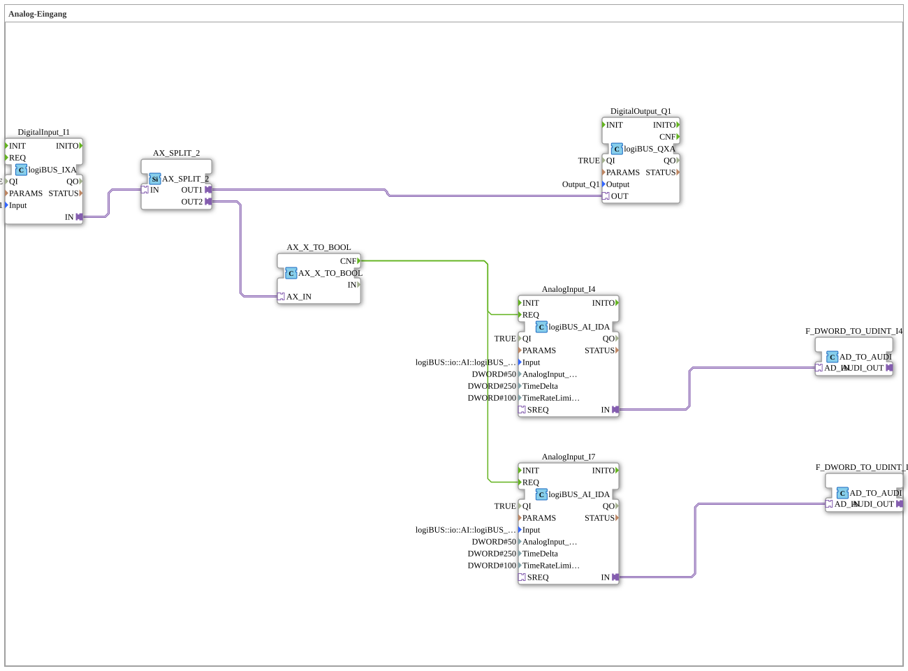

# Uebung_028_AX: Analog-Eingang

This article describes the 4diac IDE sub-application Uebung_028_AX (Analog-Eingang).

----

## Objective of the Exercise

The main objective of this exercise is to implement the following requirement: **Analog-Eingang**

-----

## Description and Components

The exercise consists of the sub-application Uebung_028_AX.SUB, which uses the following function block structure:

### Instantiated Function Blocks (FBs)

- **DigitalOutput_Q1**: Instance of type logiBUS::io::DQ::logiBUS_QXA.
  - Parameter QI = TRUE
  - Parameter PARAMS = 
  - Parameter Output = Output_Q1
- **DigitalInput_I1**: Instance of type logiBUS::io::DI::logiBUS_IXA.
  - Parameter QI = TRUE
  - Parameter PARAMS = 
  - Parameter Input = Input_I1
- **AnalogInput_I4**: Instance of type logiBUS::io::AI::logiBUS_AI_IDA.
  - Parameter QI = TRUE
  - Parameter Input = logiBUS::io::AI::logiBUS_AI::AnalogInput_I4
  - Parameter AnalogInput_hysteresis = 50
  - Parameter TimeDelta = 250
  - Parameter TimeRateLimit = 100
- **AnalogInput_I7**: Instance of type logiBUS::io::AI::logiBUS_AI_IDA.
  - Parameter QI = TRUE
  - Parameter Input = logiBUS::io::AI::logiBUS_AI::AnalogInput_I7
  - Parameter AnalogInput_hysteresis = 50
  - Parameter TimeDelta = 250
  - Parameter TimeRateLimit = 100
- **F_DWORD_TO_UDINT_I7**: Instance of type adapter::conversion::unidirectional::AD_TO_AUDI.
- **F_DWORD_TO_UDINT_I4**: Instance of type adapter::conversion::unidirectional::AD_TO_AUDI.
- **AX_X_TO_BOOL**: Instance of type adapter::conversion::unidirectional::AX_X_TO_BOOL.
- **AX_SPLIT_2**: Instance of type adapter::events::unidirectional::AX_SPLIT_2.

### Connections and Interfaces

**Adapter Connections:**
- AnalogInput_I7.IN -> F_DWORD_TO_UDINT_I7.AD_IN
- AX_SPLIT_2.OUT1 -> DigitalOutput_Q1.OUT
- AnalogInput_I4.IN -> F_DWORD_TO_UDINT_I4.AD_IN
- DigitalInput_I1.IN -> AX_SPLIT_2.IN
- AX_SPLIT_2.OUT2 -> AX_X_TO_BOOL.AX_IN

**Event Connections:**
- AX_X_TO_BOOL.CNF -> AnalogInput_I4.REQ
- AX_X_TO_BOOL.CNF -> AnalogInput_I7.REQ

-----

## Sequence and Operation

1. **Initialization**: Upon system startup, all participating function blocks are initialized.
2. **Event and Signal Processing**: State changes at the inputs trigger events that are forwarded to downstream function blocks across the defined connections.
3. **Output Update**: The receiving function blocks process incoming events and data values to update physical and logical outputs accordingly.

-----

## Summary

Exercise Uebung_028_AX provides a clear demonstration of modular IEC 61499 application design in 4diac IDE.
