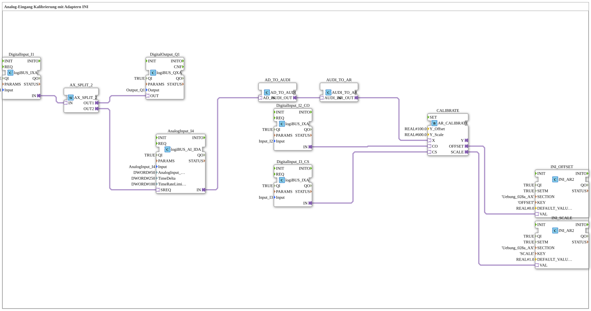

# Uebung_028a_AX: Analog-Eingang Kalibrierung mit Adaptern INI

This article describes the 4diac IDE sub-application Uebung_028a_AX (Analog-Eingang Kalibrierung mit Adaptern INI).

----

## Objective of the Exercise

The main objective of this exercise is to implement the following requirement: **Analog-Eingang Kalibrierung mit Adaptern INI**

-----

## Description and Components

The exercise consists of the sub-application Uebung_028a_AX.SUB, which uses the following function block structure:

### Instantiated Function Blocks (FBs)

- **DigitalInput_I1**: Instance of type logiBUS::io::DI::logiBUS_IXA.
  - Parameter QI = TRUE
  - Parameter Input = Input_I1
- **DigitalOutput_Q1**: Instance of type logiBUS::io::DQ::logiBUS_QXA.
  - Parameter QI = TRUE
  - Parameter Output = Output_Q1
- **AnalogInput_I4**: Instance of type logiBUS::io::AI::logiBUS_AI_IDA.
  - Parameter QI = TRUE
  - Parameter Input = AnalogInput_I4
  - Parameter AnalogInput_hysteresis = 50
  - Parameter TimeDelta = 250
  - Parameter TimeRateLimit = 100
- **CALIBRATE**: Instance of type adapter::Engineering::measurements::AR_CALIBRATE.
  - Parameter Y_Offset = 100.0
  - Parameter Y_Scale = 600.0
- **INI_OFFSET**: Instance of type eclipse4diac::storage::INI_AR2.
  - Parameter QI = TRUE
  - Parameter SETM = TRUE
  - Parameter SECTION = 'Uebung_028a_AX'
  - Parameter KEY = 'OFFSET'
  - Parameter DEFAULT_VALUE = 0.0
- **INI_SCALE**: Instance of type eclipse4diac::storage::INI_AR2.
  - Parameter QI = TRUE
  - Parameter SETM = TRUE
  - Parameter SECTION = 'Uebung_028a_AX'
  - Parameter KEY = 'SCALE'
  - Parameter DEFAULT_VALUE = 1.0
- **DigitalInput_I2_CO**: Instance of type logiBUS::io::DI::logiBUS_IXA.
  - Parameter QI = TRUE
  - Parameter Input = Input_I2
- **DigitalInput_I3_CS**: Instance of type logiBUS::io::DI::logiBUS_IXA.
  - Parameter QI = TRUE
  - Parameter Input = Input_I3
- **AX_SPLIT_2**: Instance of type adapter::events::unidirectional::AX_SPLIT_2.
- **AD_TO_AUDI**: Instance of type adapter::conversion::unidirectional::AD_TO_AUDI.
- **AUDI_TO_AR**: Instance of type adapter::conversion::unidirectional::AUDI_TO_AR.

### Connections and Interfaces

**Adapter Connections:**

- DigitalInput_I1.IN -> AX_SPLIT_2.IN
- AnalogInput_I4.IN -> AD_TO_AUDI.AD_IN
- AUDI_TO_AR.AR_OUT -> CALIBRATE.X
- DigitalInput_I2_CO.IN -> CALIBRATE.CO
- DigitalInput_I3_CS.IN -> CALIBRATE.CS
- AX_SPLIT_2.OUT1 -> DigitalOutput_Q1.OUT
- AX_SPLIT_2.OUT2 -> AnalogInput_I4.SREQ
- CALIBRATE.OFFSET -> INI_OFFSET.VAL
- CALIBRATE.SCALE -> INI_SCALE.VAL
- AD_TO_AUDI.AUDI_OUT -> AUDI_TO_AR.AUDI_IN

### Notes from the Model

> WICHTIG ! Doppelte Konvertierung. ein AD_TO_AR wäre wie ein "reinterpret_cast"

-----

## Sequence and Operation

1. **Initialization**: Upon system startup, all participating function blocks are initialized.
2. **Event and Signal Processing**: State changes at the inputs trigger events that are forwarded to downstream function blocks across the defined connections.
3. **Output Update**: The receiving function blocks process incoming events and data values to update physical and logical outputs accordingly.

-----

## Summary

Exercise Uebung_028a_AX provides a clear demonstration of modular IEC 61499 application design in 4diac IDE.
