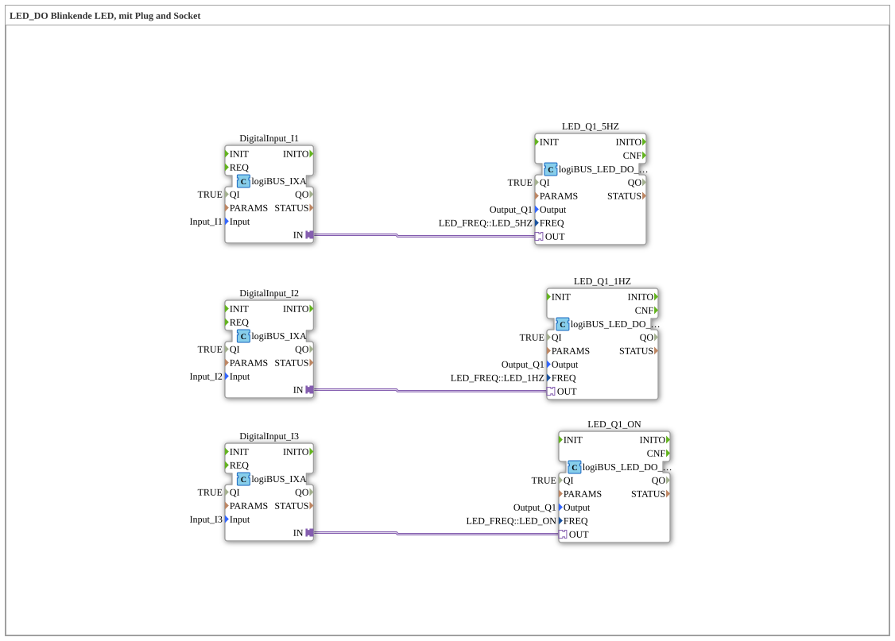

# Uebung_029_AX: LED_DO Blinkende LED, mit Plug and Socket

This article describes the 4diac IDE sub-application Uebung_029_AX (LED_DO Blinkende LED, mit Plug and Socket).

----

## Objective of the Exercise

The main objective of this exercise is to implement the following requirement: **LED_DO Blinkende LED, mit Plug and Socket**

-----

## Description and Components

The exercise consists of the sub-application Uebung_029_AX.SUB, which uses the following function block structure:

### Instantiated Function Blocks (FBs)

- **LED_Q1_5HZ**: Instance of type logiBUS::io::DO_LED::logiBUS_LED_DO_QXA.
  - Parameter QI = TRUE
  - Parameter Output = Output_Q1
  - Parameter FREQ = LED_FREQ::LED_5HZ
- **DigitalInput_I1**: Instance of type logiBUS::io::DI::logiBUS_IXA.
  - Parameter QI = TRUE
  - Parameter Input = Input_I1
- **LED_Q1_1HZ**: Instance of type logiBUS::io::DO_LED::logiBUS_LED_DO_QXA.
  - Parameter QI = TRUE
  - Parameter Output = Output_Q1
  - Parameter FREQ = LED_FREQ::LED_1HZ
- **DigitalInput_I2**: Instance of type logiBUS::io::DI::logiBUS_IXA.
  - Parameter QI = TRUE
  - Parameter Input = Input_I2
- **LED_Q1_ON**: Instance of type logiBUS::io::DO_LED::logiBUS_LED_DO_QXA.
  - Parameter QI = TRUE
  - Parameter Output = Output_Q1
  - Parameter FREQ = LED_FREQ::LED_ON
- **DigitalInput_I3**: Instance of type logiBUS::io::DI::logiBUS_IXA.
  - Parameter QI = TRUE
  - Parameter Input = Input_I3

### Connections and Interfaces

**Adapter Connections:**
- DigitalInput_I1.IN -> LED_Q1_5HZ.OUT
- DigitalInput_I2.IN -> LED_Q1_1HZ.OUT
- DigitalInput_I3.IN -> LED_Q1_ON.OUT

-----

## Sequence and Operation

1. **Initialization**: Upon system startup, all participating function blocks are initialized.
2. **Event and Signal Processing**: State changes at the inputs trigger events that are forwarded to downstream function blocks across the defined connections.
3. **Output Update**: The receiving function blocks process incoming events and data values to update physical and logical outputs accordingly.

-----

## Summary

Exercise Uebung_029_AX provides a clear demonstration of modular IEC 61499 application design in 4diac IDE.
