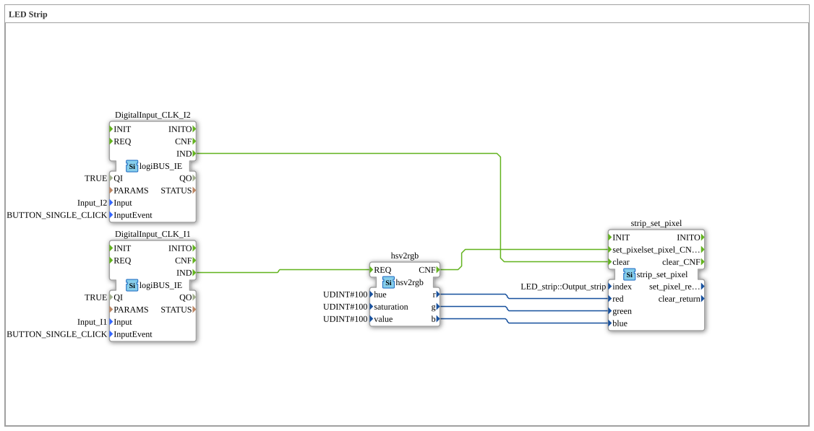

# Uebung_031_AX: LED Strip

This article describes the 4diac IDE sub-application Uebung_031_AX (LED Strip).

----

## Objective of the Exercise

The main objective of this exercise is to implement the following requirement: **LED Strip**

-----

## Description and Components

The exercise consists of the sub-application Uebung_031_AX.SUB, which uses the following function block structure:

### Instantiated Function Blocks (FBs)

- **DigitalInput_CLK_I1**: Instance of type logiBUS::io::DI::logiBUS_IE.
  - Parameter QI = TRUE
  - Parameter Input = Input_I1
  - Parameter InputEvent = BUTTON_SINGLE_CLICK
- **DigitalInput_CLK_I2**: Instance of type logiBUS::io::DI::logiBUS_IE.
  - Parameter QI = TRUE
  - Parameter Input = Input_I2
  - Parameter InputEvent = BUTTON_SINGLE_CLICK
- **strip_set_pixel**: Instance of type logiBUS::esp32::rgb::strip_set_pixel.
  - Parameter index = LED_strip::Output_strip
- **hsv2rgb**: Instance of type logiBUS::esp32::rgb::hsv2rgb.
  - Parameter hue = 100
  - Parameter saturation = 100
  - Parameter value = 100

### Connections and Interfaces

**Event Connections:**

- DigitalInput_CLK_I2.IND -> strip_set_pixel.clear
- hsv2rgb.CNF -> strip_set_pixel.set_pixel
- DigitalInput_CLK_I1.IND -> hsv2rgb.REQ

**Data Connections:**

- hsv2rgb.r -> strip_set_pixel.red
- hsv2rgb.g -> strip_set_pixel.green
- hsv2rgb.b -> strip_set_pixel.blue

-----

## Sequence and Operation

1. **Initialization**: Upon system startup, all participating function blocks are initialized.
2. **Event and Signal Processing**: State changes at the inputs trigger events that are forwarded to downstream function blocks across the defined connections.
3. **Output Update**: The receiving function blocks process incoming events and data values to update physical and logical outputs accordingly.

-----

## Summary

Exercise Uebung_031_AX provides a clear demonstration of modular IEC 61499 application design in 4diac IDE.
