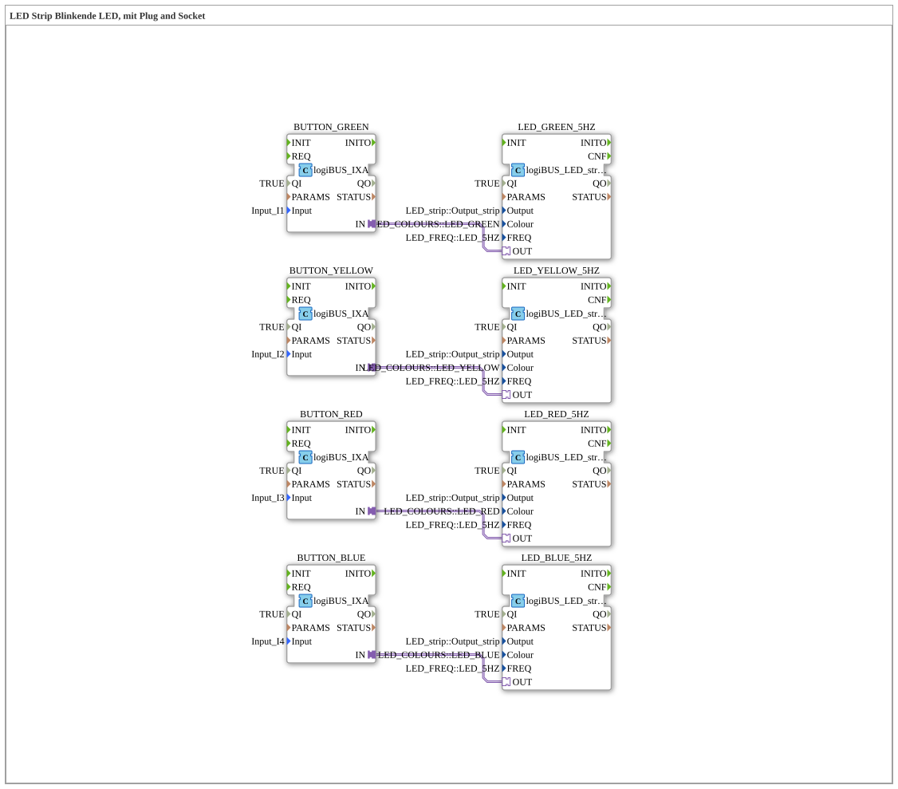

# Uebung_032_AX: LED Strip Blinkende LED, mit Plug and Socket

This article describes the 4diac IDE sub-application Uebung_032_AX (LED Strip Blinkende LED, mit Plug and Socket).

----

## Objective of the Exercise

The main objective of this exercise is to implement the following requirement: **LED Strip Blinkende LED, mit Plug and Socket**

-----

## Description and Components

The exercise consists of the sub-application Uebung_032_AX.SUB, which uses the following function block structure:

### Instantiated Function Blocks (FBs)

- **LED_GREEN_5HZ**: Instance of type logiBUS::io::DO_LED::logiBUS_LED_strip_QXA.
  - Parameter QI = TRUE
  - Parameter Output = LED_strip::Output_strip
  - Parameter Colour = LED_COLOURS::LED_GREEN
  - Parameter FREQ = LED_FREQ::LED_5HZ
- **BUTTON_GREEN**: Instance of type logiBUS::io::DI::logiBUS_IXA.
  - Parameter QI = TRUE
  - Parameter Input = Input_I1
- **BUTTON_YELLOW**: Instance of type logiBUS::io::DI::logiBUS_IXA.
  - Parameter QI = TRUE
  - Parameter Input = Input_I2
- **LED_YELLOW_5HZ**: Instance of type logiBUS::io::DO_LED::logiBUS_LED_strip_QXA.
  - Parameter QI = TRUE
  - Parameter Output = LED_strip::Output_strip
  - Parameter Colour = LED_COLOURS::LED_YELLOW
  - Parameter FREQ = LED_FREQ::LED_5HZ
- **BUTTON_RED**: Instance of type logiBUS::io::DI::logiBUS_IXA.
  - Parameter QI = TRUE
  - Parameter Input = Input_I3
- **LED_RED_5HZ**: Instance of type logiBUS::io::DO_LED::logiBUS_LED_strip_QXA.
  - Parameter QI = TRUE
  - Parameter Output = LED_strip::Output_strip
  - Parameter Colour = LED_COLOURS::LED_RED
  - Parameter FREQ = LED_FREQ::LED_5HZ
- **BUTTON_BLUE**: Instance of type logiBUS::io::DI::logiBUS_IXA.
  - Parameter QI = TRUE
  - Parameter Input = Input_I4
- **LED_BLUE_5HZ**: Instance of type logiBUS::io::DO_LED::logiBUS_LED_strip_QXA.
  - Parameter QI = TRUE
  - Parameter Output = LED_strip::Output_strip
  - Parameter Colour = LED_COLOURS::LED_BLUE
  - Parameter FREQ = LED_FREQ::LED_5HZ

### Connections and Interfaces

**Adapter Connections:**
- BUTTON_GREEN.IN -> LED_GREEN_5HZ.OUT
- BUTTON_YELLOW.IN -> LED_YELLOW_5HZ.OUT
- BUTTON_RED.IN -> LED_RED_5HZ.OUT
- BUTTON_BLUE.IN -> LED_BLUE_5HZ.OUT

-----

## Sequence and Operation

1. **Initialization**: Upon system startup, all participating function blocks are initialized.
2. **Event and Signal Processing**: State changes at the inputs trigger events that are forwarded to downstream function blocks across the defined connections.
3. **Output Update**: The receiving function blocks process incoming events and data values to update physical and logical outputs accordingly.

-----

## Summary

Exercise Uebung_032_AX provides a clear demonstration of modular IEC 61499 application design in 4diac IDE.
