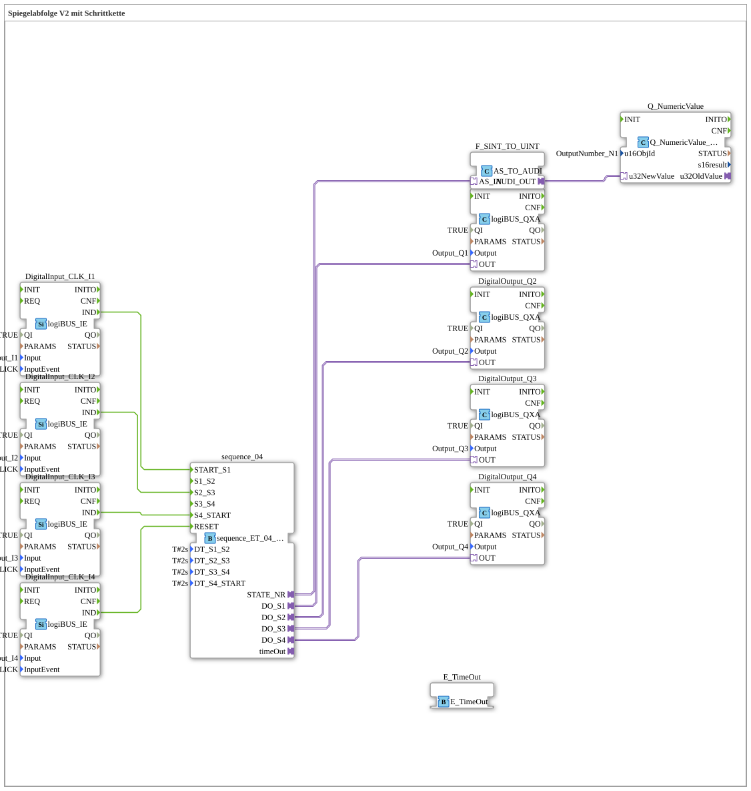

# Uebung_035_AX: Spiegelabfolge V2 mit Schrittkette

This article describes the 4diac IDE sub-application Uebung_035_AX (Spiegelabfolge V2 mit Schrittkette).

----

## Objective of the Exercise

The main objective of this exercise is to implement the following requirement: **Spiegelabfolge V2 mit Schrittkette**

-----

## Description and Components

The exercise consists of the sub-application Uebung_035_AX.SUB, which uses the following function block structure:

### Instantiated Function Blocks (FBs)

- **DigitalOutput_Q1**: Instance of type logiBUS::io::DQ::logiBUS_QXA.
  - Parameter QI = TRUE
  - Parameter Output = Output_Q1
- **E_TimeOut**: Instance of type iec61499::events::E_TimeOut.
- **DigitalOutput_Q2**: Instance of type logiBUS::io::DQ::logiBUS_QXA.
  - Parameter QI = TRUE
  - Parameter Output = Output_Q2
- **DigitalOutput_Q3**: Instance of type logiBUS::io::DQ::logiBUS_QXA.
  - Parameter QI = TRUE
  - Parameter Output = Output_Q3
- **DigitalOutput_Q4**: Instance of type logiBUS::io::DQ::logiBUS_QXA.
  - Parameter QI = TRUE
  - Parameter Output = Output_Q4
- **DigitalInput_CLK_I1**: Instance of type logiBUS::io::DI::logiBUS_IE.
  - Parameter QI = TRUE
  - Parameter Input = Input_I1
  - Parameter InputEvent = BUTTON_SINGLE_CLICK
- **DigitalInput_CLK_I2**: Instance of type logiBUS::io::DI::logiBUS_IE.
  - Parameter QI = TRUE
  - Parameter Input = Input_I2
  - Parameter InputEvent = BUTTON_SINGLE_CLICK
- **DigitalInput_CLK_I3**: Instance of type logiBUS::io::DI::logiBUS_IE.
  - Parameter QI = TRUE
  - Parameter Input = Input_I3
  - Parameter InputEvent = BUTTON_SINGLE_CLICK
- **DigitalInput_CLK_I4**: Instance of type logiBUS::io::DI::logiBUS_IE.
  - Parameter QI = TRUE
  - Parameter Input = Input_I4
  - Parameter InputEvent = BUTTON_SINGLE_CLICK
- **Q_NumericValue**: Instance of type isobus::UT::Q::Q_NumericValue_AUDI.
  - Parameter u16ObjId = OutputNumber_N1
- **F_SINT_TO_UINT**: Instance of type adapter::conversion::unidirectional::AS_TO_AUDI.
- **sequence_04**: Instance of type logiBUS::utils::sequence::combi::sequence_ET_04_AX.
  - Parameter DT_S1_S2 = T#2s
  - Parameter DT_S2_S3 = T#2s
  - Parameter DT_S3_S4 = T#2s
  - Parameter DT_S4_START = T#2s

### Connections and Interfaces

**Adapter Connections:**

- sequence_04.timeOut -> E_TimeOut.TimeOutSocket
- sequence_04.STATE_NR -> F_SINT_TO_UINT.AS_IN
- sequence_04.DO_S1 -> DigitalOutput_Q1.OUT
- sequence_04.DO_S2 -> DigitalOutput_Q2.OUT
- sequence_04.DO_S3 -> DigitalOutput_Q3.OUT
- sequence_04.DO_S4 -> DigitalOutput_Q4.OUT
- F_SINT_TO_UINT.AUDI_OUT -> Q_NumericValue.u32NewValue

**Event Connections:**

- DigitalInput_CLK_I1.IND -> sequence_04.START_S1
- DigitalInput_CLK_I2.IND -> sequence_04.S2_S3
- DigitalInput_CLK_I3.IND -> sequence_04.S4_START
- DigitalInput_CLK_I4.IND -> sequence_04.RESET

-----

## Sequence and Operation

1. **Initialization**: Upon system startup, all participating function blocks are initialized.
2. **Event and Signal Processing**: State changes at the inputs trigger events that are forwarded to downstream function blocks across the defined connections.
3. **Output Update**: The receiving function blocks process incoming events and data values to update physical and logical outputs accordingly.

-----

## Summary

Exercise Uebung_035_AX provides a clear demonstration of modular IEC 61499 application design in 4diac IDE.
