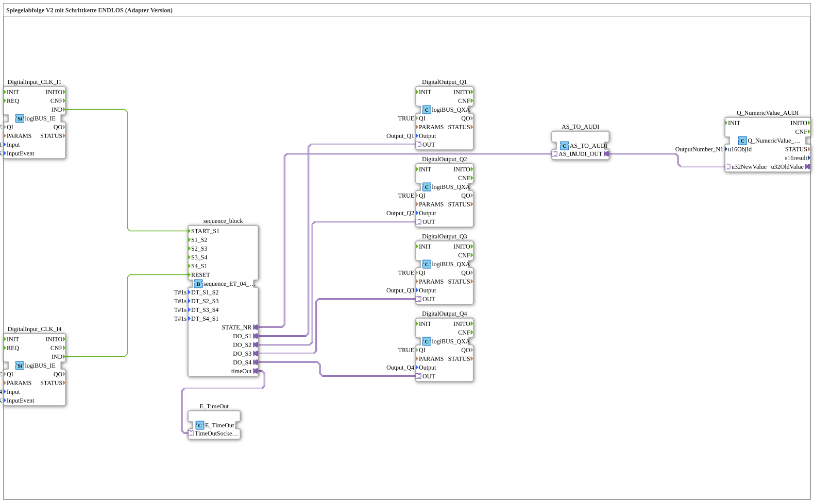

# Uebung_037_AX: Combined Event/Time Sequence Control, 4 Channels (Loop) (Adapter Version)

This article describes the logiBUS® exercise `Uebung_037_AX`. We build a combined event- and time-driven step chain using AX adapter technology.

----

## Goal of the Exercise

Realize a sequence across 4 outputs (Q1, Q2, Q3, Q4), started and reset via events (buttons), while the individual steps advance further via fixed dwell times (`DT_Sx_Sy`, each `T#1s`) - a combination of button-driven start/reset and automatic timed advancement between steps.

-----

## Description and Components

The subapplication `Uebung_037_AX` uses the combined sequencer `sequence_ET_04_loop_AX`.

- **`sequence_ET_04_loop_AX`**: Starts on an event (`I1`), then advances the 4 steps on elapsed time.
- **`Q_NumericValue_AUDI`**: Displays the current step number on the ISOBUS terminal.

-----

## Behavior

1. Start via button `I1` -> the sequence jumps to `S1`.
2. Each output (`Q1, Q2, Q3, Q4`) is switched active for the configured time before automatically advancing to the next step.
3. After the last step, the sequence automatically returns to S1 (loop).
4. Reset via button `I4` -> everything off.
